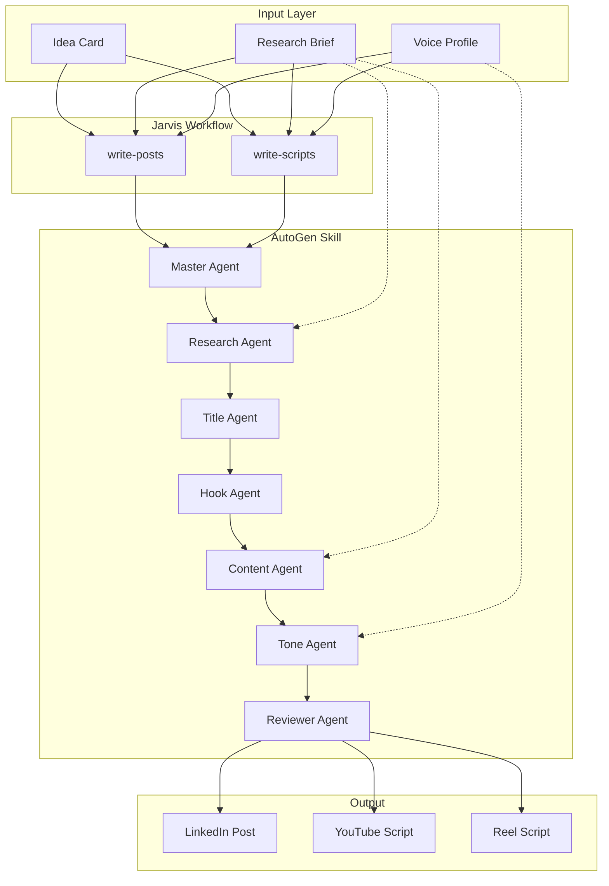

# AutoGen Multi-Agent Script Generator - Implementation Plan

**Based on:** Your AutoGen code + Claude Skills pattern (slack-gif-creator)
**Estimated Time:** 2-3 hours
**Outcome:** Proven multi-agent script generation as a Claude Skill

---

## 🔍 PROJECT CONTEXT

**Current State:**

- ✅ Jarvis agent built (content intelligence)
- ✅ Research workflows functional (research-topic, analyze-profile)
- ✅ 4 MCP Skills with reference/ docs
- ⏸️ write-posts, write-scripts workflows need script generation
- ❌ social-media-mcp create_post (works but Q&A overhead, "require" errors)
- ✅ **You have proven AutoGen multi-agent code** (from your system)

**Goal:**
Package AutoGen as a Claude Skill for deterministic, high-quality script generation

---

## 📦 WHAT YOU PROVIDED (AutoGen Code Analysis)

### Agent Architecture (8+ Agents):

**1. Master_Agent**

- Determines: Reel vs Video (based on duration)
- Logic: ≤60s = reel, >60s = video

**2. Research_Agent**

- Uses: search_tool (Tavily)
- Gets: Background info on topic

**3. Title_Agent**

- Creates: Clickbait titles (8-12 words)
- Style: Curiosity-inducing, viral potential

**4. Intro_Hook_Agent** (Videos)

- Creates: 150-word compelling hook
- Pattern: Thought-provoking → curiosity trigger

**5. Intro_Hook_Agent_Reel** (Reels/Shorts)

- Creates: 8-word maximum hook
- Pattern: Attention-grabbing, urgent

**6. Content_Agent** (Videos)

- Creates: Main content with facts, examples
- Uses: Research data, quotes, statistics
- Structure: Logical flow, step-by-step

**7. Content_Agent_Reel** (Reels/Shorts)

- Creates: Fast-paced content for short duration
- Style: Concise, punchy, value-packed

**8. Tone_Agent** (Videos)

- Applies: MKBHD conversational style
- Adds: Natural speech patterns

**9. Tone_Agent_Reel** (Reels/Shorts)

- Combines: Hook + Content
- Style: Fast-paced, engaging
- Adds: Spoken English patterns (um, like, pauses)

**10. Formatter_Agent**

- Converts: To spoken English
- Adds: Filler words, pauses, natural imperfections

**11. Spoken_English_Agent**

- Refines: Natural conversational delivery
- Maintains: Core content, improves flow

**12. Outro_Agent**

- Creates: Engagement prompts
- CTAs: Questions, subscribe requests

**13. Reviewer_Agent**

- Validates: Facts against research
- Corrects: Errors, adjusts sentences
- Returns: Final polished script

**14. Script_Writer_Agent**

- Final pass: 200-word professional script
- Removes: Timestamps, technical directions

### Orchestration:

**RoundRobinGroupChat:**

```python
team = RoundRobinGroupChat([
    Research_Agent,
    Intro_Hook_Agent_Reel,
    Content_Agent_Reel,
    Tone_Agent_Reel,
    Reviewer_Agent
], termination_condition=MaxMessageTermination(10))
```

**Process:** Each agent speaks in order, builds on previous output

---

## 🏗️ IMPLEMENTATION DESIGN

### Skill Structure (Following slack-gif-creator):

```
.claude/skills/jarvis/autogen-script-generator/
├── SKILL.md (when to invoke, parameters)
├── scripts/
│   ├── generate_script.py (main entry point)
│   ├── agents.py (all agent definitions)
│   ├── prompts.py (all system messages)
│   ├── config.py (OpenAI key, model settings)
│   └── utils.py (helpers)
├── requirements.txt (autogen-agentchat, etc.)
└── reference/
    ├── agent-roles.md (what each agent does)
    ├── usage-examples.md (how to call)
    └── workflow-integration.md (how workflows use this)
```

---

## 📋 IMPLEMENTATION TASKS

### Phase 1: Create Skill Structure (30 min)

**Task 1.1:** Create directory structure

```bash
mkdir -p ~/.claude/skills/jarvis/autogen-script-generator/{scripts,reference}
```

**Task 1.2:** Create requirements.txt

```
autogen-agentchat>=0.2.0
autogen-core>=0.2.0
autogen-ext>=0.2.0
openai>=1.0.0
tavily-python>=0.1.0  # For search_tool
```

**Task 1.3:** Extract agents.py from your code

- Copy all agent definitions (Master_Agent, Research_Agent, etc.)
- Update model to gpt-5
- Make configurable (accept parameters)

**Task 1.4:** Extract prompts.py from your code

- All the system messages you provided
- TITLE_AGENT_PROMPT
- INTRO_HOOK_AGENT_PROMPT
- CONTENT_AGENT_PROMPT
- TONE_AGENT_PROMPT
- etc.

**Task 1.5:** Create generate_script.py (main entry point)

```python
#!/usr/bin/env python3
import asyncio
import sys
import json

async def generate_script(
    topic: str,
    duration: str,  # "60s" or "5min"
    platform: str,  # "youtube", "reels", "tiktok"
    tone: str = "MKBHD",
    research_data: dict = None,
    voice_profile: dict = None
):
    # Your AutoGen team logic
    # Returns: script text
    pass

if __name__ == "__main__":
    # Parse args from command line
    # Run async generation
    # Print result as JSON
    pass
```

---

### Phase 2: Adapt Code for Skill Usage (45 min)

**Task 2.1:** Add Research Integration

```python
# Load research brief if provided
if research_data:
    Research_Agent.system_message += f"""

    Use this research data:
    - Facts: {research_data['facts']}
    - Quotes: {research_data['quotes']}
    - Examples: {research_data['examples']}
    """
```

**Task 2.2:** Add Voice Profile Integration

```python
# Apply user's voice to Tone_Agent
if voice_profile:
    Tone_Agent.system_message += f"""

    CRITICAL: Match user's voice:
    - Vocabulary: {voice_profile['vocab_level']}
    - Sentences: {voice_profile['sentence_pattern']}
    - Tone: {voice_profile['tone_score']}/10
    - Signature phrases: {voice_profile['phrases']}
    - Emoji: {voice_profile['emoji_pattern']}
    """
```

**Task 2.3:** Add Platform-Specific Logic

```python
# Route to appropriate agents
if platform in ["reels", "tiktok"] or duration_seconds <= 90:
    team = RoundRobinGroupChat([
        Research_Agent,
        Intro_Hook_Agent_Reel,  # 8-word hook
        Content_Agent_Reel,      # Fast-paced
        Tone_Agent_Reel,         # Engaging
        Reviewer_Agent
    ])
else:  # YouTube, long-form
    team = RoundRobinGroupChat([
        Research_Agent,
        Title_Agent,
        Intro_Hook_Agent,  # 150-word hook
        Content_Agent,     # Comprehensive
        Tone_Agent,        # MKBHD style
        Outro_Agent,
        Reviewer_Agent
    ])
```

---

### Phase 3: Create SKILL.md (20 min)

```yaml
---
name: autogen-script-generator
description: Generate video scripts and social media posts using multi-agent system. Specialized agents for title, hook, content, tone, and review collaborate to create polished scripts. Handles YouTube videos (3-10 min), Reels/TikTok (30-90s), and social posts. Applies MKBHD conversational style and user voice profile. Use when user needs script for video, reel, or polished social post.
---

# AutoGen Script Generator

## Purpose

Professional script generation using multi-agent collaboration with fact-checking, tone consistency, and voice matching.

## Instructions

When user needs a script or polished post:

1. **Execute Python script:**
```

python scripts/generate_script.py \
 --topic "{topic}" \
 --duration "{duration}" \
 --platform "{platform}" \
 --research-file "{research_brief_path}" \
 --voice-profile "{voice_profile_path}"

```

2. **AutoGen agents collaborate:**
- Research_Agent: Loads research data
- Title_Agent: Creates compelling title
- Hook_Agent: Creates attention-grabbing opening
- Content_Agent: Main content with research evidence
- Tone_Agent: Applies style (MKBHD + user voice)
- Reviewer_Agent: Fact-checks against research

3. **Returns:** Polished script with:
- Timestamps (for videos)
- Natural spoken style
- Research citations
- Platform-appropriate formatting
- User's voice characteristics

**For agent roles, see:** `reference/agent-roles.md`
**For usage examples, see:** `reference/usage-examples.md`

## Example

**Input:**
```

topic: "AI Automation Tools"
duration: "90s"
platform: "youtube"
research: sessions/research-AI_automation-2025-10-27.md
voice: memories.md voice profile

```

**Output:**
```

[0:00-0:05] HOOK
"Did you know 73% of developers automate less than 20% of their workflows?"

[0:05-0:15] INTRO
Let me show you the 5 AI tools that changed this for me...

[0:15-1:15] CONTENT
[Main points with research data, natural delivery]

[1:15-1:30] OUTRO
Which tool are you trying first? Drop a comment...

```

**See reference/usage-examples.md for complete examples.**
```

---

### Phase 4: Create Reference Docs (30 min)

**reference/agent-roles.md:**

- Explains each agent's purpose
- Shows collaboration flow
- Documents prompts

**reference/usage-examples.md:**

- Example 1: YouTube video script
- Example 2: Reel script
- Example 3: LinkedIn post
- Shows input/output for each

**reference/workflow-integration.md:**

- How write-posts uses this
- How write-scripts uses this
- Parameter mappings

---

### Phase 5: Install Dependencies (15 min)

```bash
# Create virtual environment
python3 -m venv ~/.claude/skills/jarvis/autogen-script-generator/venv

# Activate
source ~/.claude/skills/jarvis/autogen-script-generator/venv/bin/activate

# Install
pip install autogen-agentchat autogen-core autogen-ext openai tavily-python
```

---

### Phase 6: Test (30 min)

**Test 1: Direct Python execution**

```bash
python scripts/generate_script.py \
  --topic "AI automation" \
  --duration "60s" \
  --platform "reels"
```

**Test 2: Via Claude Skill**

```
Ask Claude: "Generate a 60s reel script about AI automation"
Should invoke autogen-script-generator Skill automatically
```

**Test 3: From Jarvis workflow**

```
/jarvis:jarvis1 → write-scripts
Idea: #1
Platform: reels
Duration: 60s
```

---

### Phase 7: Integrate with Workflows (30 min)

**Update write-scripts/instructions.md:**

```xml
<step n="3" goal="Generate script using AutoGen">
  <action>Generate {platform} script for {duration} about {idea_card.title} using multi-agent collaboration. Include research evidence from {research_brief} and apply voice profile from memories.md.</action>
  <!-- Claude invokes autogen-script-generator Skill -->

  <action>Skill will use specialized agents (Research, Title, Hook, Content, Tone, Reviewer) to create polished script with:
    - Compelling hook
    - Main content with research data
    - Natural conversational style
    - Fact-checked accuracy
    - User's voice characteristics
  </action>
</step>
```

---

## 🎯 HOW POSTS VS SCRIPTS DIFFER

### For Posts (LinkedIn, Twitter, Instagram):

**Use AutoGen with post-specific config:**

```python
generate_script(
    topic=idea_card.title,
    duration="post",  # Special flag for posts
    platform="linkedin",
    content_type="post",  # Not "script"
    tone="professional",
    research_data=research_brief,
    voice_profile=user_voice
)
```

**AutoGen adjusts:**

- No Master_Agent (not video vs reel)
- No timestamps
- Text-only output
- Platform character limits
- Post structure: Hook → Body → CTA

### For Scripts (YouTube, Reels, TikTok):

```python
generate_script(
    topic=idea_card.title,
    duration="90s",
    platform="youtube",
    content_type="script",
    tone="MKBHD conversational",
    research_data=research_brief,
    voice_profile=user_voice
)
```

**AutoGen includes:**

- Master_Agent determines format
- Timestamps
- Visual cues
- B-roll suggestions
- Spoken style (um, like, pauses)

---

## 🔗 COMPLETE INTEGRATION

### Workflow → Skill → Research/Voice Data Flow:



---

## 💡 KEY ENHANCEMENTS TO YOUR CODE

### Enhancement 1: Research Data Loading

**Add to generate_script.py:**

```python
def load_research_brief(file_path):
    """Load research brief markdown and extract structured data"""
    with open(file_path, 'r') as f:
        content = f.read()

    # Parse markdown sections
    facts = extract_section(content, "## Data & Statistics")
    quotes = extract_section(content, "## Quotes & Expert Opinions")
    examples = extract_section(content, "## Examples & Case Studies")
    hashtags = extract_section(content, "## Hashtags")

    return {
        'facts': facts,
        'quotes': quotes,
        'examples': examples,
        'hashtags': hashtags
    }

# Pass to Research_Agent
Research_Agent.system_message += f"""
Research data provided:
{json.dumps(research_data, indent=2)}

Use these facts, quotes, and examples in the script.
"""
```

---

### Enhancement 2: Voice Profile Loading

**Add to generate_script.py:**

```python
def load_voice_profile(file_path):
    """Load voice profile from memories.md"""
    with open(file_path, 'r') as f:
        content = f.read()

    # Extract voice profile section
    voice_section = extract_section(content, "## Voice Profile")

    # Parse characteristics
    return {
        'vocab_level': parse_field(voice_section, "Vocabulary Level"),
        'sentence_pattern': parse_field(voice_section, "Sentence Structure"),
        'tone_score': parse_field(voice_section, "Tone Score"),
        'signature_phrases': parse_list(voice_section, "Most Used Phrases"),
        'emoji_pattern': parse_field(voice_section, "Emoji Usage")
    }

# Apply to Tone_Agent
Tone_Agent.system_message += f"""
Match user's writing voice:
- Use vocabulary: {voice_profile['vocab_level']}
- Sentence style: {voice_profile['sentence_pattern']}
- Tone: {voice_profile['tone_score']}/10
- Include phrases: {voice_profile['signature_phrases']}
- Emoji: {voice_profile['emoji_pattern']}
"""
```

---

### Enhancement 3: Platform-Specific Output

**Add routing logic:**

```python
# Different agent teams for different outputs
if content_type == "post":
    # Posts don't need timestamps, visual cues
    team = RoundRobinGroupChat([
        Research_Agent,
        Title_Agent,  # Becomes "hook" for posts
        Content_Agent,
        Tone_Agent,
        Reviewer_Agent
    ])

elif platform in ["reels", "tiktok"] or duration_seconds <= 90:
    # Reels: fast, engaging, 8-word hooks
    team = RoundRobinGroupChat([
        Research_Agent,
        Intro_Hook_Agent_Reel,
        Content_Agent_Reel,
        Tone_Agent_Reel,
        Reviewer_Agent
    ])

else:
    # YouTube: comprehensive, timestamps
    team = RoundRobinGroupChat([
        Research_Agent,
        Title_Agent,
        Intro_Hook_Agent,
        Content_Agent,
        Tone_Agent,
        Outro_Agent,
        Reviewer_Agent
    ])
```

---

## 📊 EXPECTED RESULTS

### For LinkedIn Post:

**Input:**

```
topic: "AI Automation Tools"
platform: "linkedin"
content_type: "post"
research: research-brief.md
voice: voice-profile
```

**AutoGen Process:**

```
Research_Agent: Loads research facts, quotes
Title_Agent: Creates hook "73% of developers..."
Content_Agent: Main points using research data
Tone_Agent: Applies professional tone + user voice
Reviewer_Agent: Validates facts
```

**Output:**

```
73% of developers automate less than 20% of their workflows.

Here's what's changing that:

Tool 1: Zapier
Connects 5000+ apps. Set it once, forget it.
Saved me 10 hours last week.

Tool 2: Make.com
Visual automation builder...

[etc - in user's voice with research evidence]

What's your go-to automation tool?

#AIAutomation #ProductivityTools
```

---

### For Reel Script:

**Input:**

```
topic: "AI Automation"
platform: "reels"
duration: "60s"
```

**AutoGen Process:**

```
Master_Agent: Detects reel (≤60s)
Intro_Hook_Agent_Reel: "Stop wasting 10 hours every week"
Content_Agent_Reel: Fast beats with tools
Tone_Agent_Reel: Adds um, like, pauses
```

**Output:**

```
[0:00-0:03] HOOK
Stop wasting 10 hours every week

[0:03-0:15] TOOL 1
Okay so, like, Zapier right?
It basically connects everything.
You set it up once and, um, it just runs forever.

[0:15-0:30] TOOL 2
[Fast-paced, engaging content]

[0:55-1:00] CTA
Which one are you trying? Comment below!
```

---

## 🎯 IMPLEMENTATION RECOMMENDATION

**Start with MVP (2 hours):**

1. ✅ Create Skill structure
2. ✅ Copy your AutoGen code as-is
3. ✅ Add command-line interface
4. ✅ Write basic SKILL.md
5. ✅ Test standalone

**Then enhance (1-2 hours):**

6. ⏳ Add research integration
7. ⏳ Add voice profile loading
8. ⏳ Add platform routing
9. ⏳ Test from workflows

**Total:** 3-4 hours for complete implementation

---

**Ready to start implementing?**

I'll create the autogen-script-generator Skill with your proven code! 🚀
