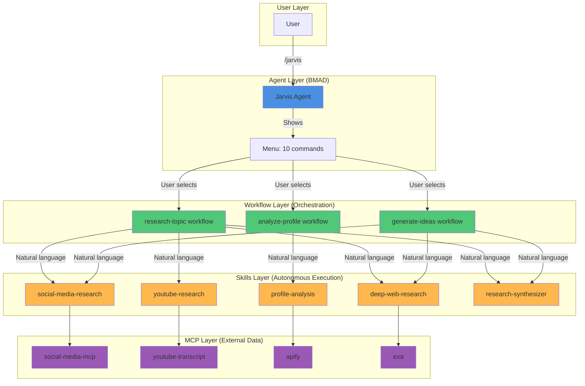

# Jarvis - Complete Architecture Plan & Strategy

**Created:** 2025-10-27
**Purpose:** ULTRATHINK analysis of Skills + Workflows + MCPs architecture

---

## 🎯 THE FUNDAMENTAL QUESTION

**"If we have Skills, why do we need Workflows?"**

This is THE key architectural question. Let me answer it completely.

---

## 🔄 HOW IT ALL WORKS TOGETHER

### The Complete Flow:

```
USER
  │
  │ Types: /jarvis
  ↓
AGENT (Jarvis persona)
  │
  │ Shows menu of commands
  │ User selects: "1" (research-topic)
  ↓
WORKFLOW (research-topic)
  │
  │ Loads: workflow.yaml + instructions.md
  │ Sets context: topic, depth, focus_areas
  │ Says: "Research {topic} comprehensively using all sources"
  ↓
CLAUDE (Autonomous Decision)
  │
  │ Reads workflow instruction
  │ Checks available Skills
  │ Matches: "research comprehensively" → multiple research Skills
  │
  ├─→ Invokes: social-media-research Skill
  │   └─→ Calls: social-media-mcp/research_topic
  │       └─→ Returns: {hashtags, facts, news, trends}
  │
  ├─→ Invokes: youtube-research Skill
  │   └─→ Calls: youtube-transcript/get_transcript
  │       └─→ Returns: {transcripts, quotes, structure}
  │
  ├─→ Invokes: deep-web-research Skill
  │   └─→ Calls: exa/web_search_exa
  │       └─→ Returns: {articles, insights, data}
  │
  └─→ Invokes: research-synthesizer Skill
      └─→ Organizes all findings
          └─→ Returns: {research brief}
          ↓
WORKFLOW (Continues)
  │
  │ Receives organized research
  │ Saves to: sessions/research-{topic}-{date}.md
  │ Presents summary to user
  ↓
USER
  │
  │ Gets: Complete research brief with all findings
```

---

## 💡 WHY WE NEED BOTH

### Workflows Provide:

1. **User Interface**
   - Commands user can select (/research-topic)
   - Menu structure (numbered list)
   - Parameter gathering (topic, depth, focus_areas)
   - User interaction (confirmations, choices)

2. **Orchestration**
   - Define WHAT needs to happen
   - Set context and parameters
   - Coordinate multiple Skills
   - Handle workflow state

3. **Guaranteed Structure**
   - Output format (research brief template)
   - File naming (sessions/research-{topic}-{date}.md)
   - Consistent results every time
   - Predictable behavior

4. **BMAD Agent Integration**
   - Part of agent menu system
   - Cost tracking
   - Error handling
   - User feedback

**Example:**

```xml
<workflow>
  <step n="1">Initialize session</step>
  <step n="2">Research {topic} comprehensively</step>  ← Skill invokes here
  <step n="3">Save to file</step>
  <step n="4">Present summary</step>
</workflow>
```

---

### Skills Provide:

1. **Autonomous Execution**
   - Claude decides WHEN to use them
   - No explicit calls needed
   - Invoked based on natural language

2. **MCP Expertise**
   - HOW to call social-media-mcp correctly
   - WHAT parameters to use
   - HOW to handle responses
   - Error handling

3. **Reusability**
   - social-media-research Skill can be used by:
     - research-topic workflow
     - generate-ideas workflow
     - ANY context where research is needed
   - Write once, use everywhere

4. **Composability**
   - Multiple Skills work together automatically
   - Claude picks which ones based on task
   - Combine for complex requests

**Example:**

```markdown
# social-media-research Skill

When user needs social media research:

1. Call social-media-mcp research_topic with full parameters
2. Extract hashtags, facts, news, trends
3. Organize and return
```

---

## 🔄 CONCRETE EXAMPLE

### User Action: `/jarvis → research-topic`

**What Happens:**

**Step 1: Workflow Loads**

```
research-topic/workflow.yaml:
- topic: {user input}
- depth: "standard"
- focus_areas: ["trends", "examples", "data"]
```

**Step 2: Workflow Executes**

```xml
<step n="2">
  <action>Research {topic} using all available sources.</action>

  <check if="'trends' in focus_areas">
    <action>Get trending topics and current facts.</action>
  </check>
</step>
```

**Step 3: Claude Reads Instruction**

- Sees: "Get trending topics and current facts"
- Thinks: "I need to research trends..."
- Checks: Available Skills
- Finds: social-media-research Skill (description matches "trending topics")

**Step 4: Skill Invokes**

```
social-media-research Skill:
1. Loads reference/social-media-mcp-reference.md
2. Reads how to call research_topic
3. Calls: social-media-mcp/research_topic(topic, includeHashtags=true, ...)
4. Returns organized findings
```

**Step 5: Workflow Continues**

```xml
<step n="3">
  <action>Save research brief to sessions/</action>
</step>
```

**Result:** User gets complete research brief in consistent format!

---

## 🎯 WHY NOT JUST SKILLS?

**Could user just ask: "Research AI agents"?**

**YES, but:**

**Without Workflows (Skills Only):**

```
User: "Research AI agents"
↓
Claude invokes Skills automatically
↓
Returns: Results in whatever format Skills provide
```

**Problems:**

- ❌ No guaranteed output format
- ❌ No file saved automatically
- ❌ No cost tracking integration
- ❌ No parameter control (depth, focus_areas)
- ❌ Unpredictable (Claude decides everything)
- ❌ No BMAD agent integration

**With Workflows + Skills:**

```
User: /jarvis → research-topic
↓
Workflow defines: parameters, output format, file location
↓
Workflow invokes Skills via natural language instructions
↓
Skills execute (MCP calls)
↓
Workflow packages results consistently
↓
Returns: Predictable, structured output every time
```

**Benefits:**

- ✅ Guaranteed output format
- ✅ Files saved to specific locations
- ✅ Cost tracking
- ✅ User can control parameters
- ✅ Predictable, consistent results
- ✅ BMAD agent integration

---

## 📊 THE ARCHITECTURE (Complete Picture)



---

## ✅ THE LAYERED ARCHITECTURE

### Layer 1: User → Agent (Interface)

**Purpose:** User activates Jarvis, sees menu
**Technology:** BMAD agent system
**File:** .claude/commands/jarvis/jarvis.md

### Layer 2: Agent → Workflows (Orchestration)

**Purpose:** User selects command, workflow orchestrates
**Technology:** BMAD workflow.xml engine
**Files:** jarvis-sidecar/workflows/\*/

### Layer 3: Workflows → Skills (Execution)

**Purpose:** Natural language instructions invoke Skills
**Technology:** Claude Code Skills (autonomous)
**Files:** .claude/skills/jarvis/\*/

### Layer 4: Skills → MCPs (Data)

**Purpose:** Skills call MCPs to get data
**Technology:** MCP protocol
**Servers:** apify, social-media-mcp, exa, youtube-transcript

---

## 📋 WHY THIS ARCHITECTURE?

**Each layer has a purpose:**

**Agent:** User interface (menu, persona, commands)
**Workflows:** Orchestration (parameters, structure, output)
**Skills:** Execution (MCP expertise, autonomous)
**MCPs:** Data sources (external platforms, APIs)

**Could we collapse layers?**

- Agent → MCPs directly? (Too rigid, no Skills reusability)
- Agent → Skills directly? (No workflow structure, unpredictable)
- Skills → MCPs only? (No user interface, no orchestration)

**All 4 layers serve distinct purposes!**

---

## 🎯 FINAL PLAN: Enhance Skills with Reference Docs

### Phase 1: Create reference/ Folders (Based on mcp-builder Pattern)

**For each MCP Skill:**

#### social-media-research/

```
├── SKILL.md (lightweight - when to invoke)
└── reference/
    ├── social-media-mcp-tools.md
    │   - get_trending_topics documentation
    │   - research_topic documentation
    │   - All parameters explained
    │   - Request/response formats
    │   - ~5KB (like mcp-builder's 26KB docs)
    │
    ├── usage-examples.md
    │   - Example 1: Get trends
    │   - Example 2: Full research
    │   - Example 3: Error handling
    │   - Real request/response pairs
    │   - ~3KB
    │
    └── workflow-integration.md
        - Used by: research-topic, generate-ideas workflows
        - When invoked: User asks about trends/research
        - Returns: Organized research data
        - ~2KB
```

#### profile-analysis/

```
└── reference/
    ├── apify-tools.md
    │   - search-actors, call-actor, get-actor-output docs
    │   - Platform-to-actor mapping
    │   - Cost calculation guide
    │
    ├── platform-guides.md
    │   - Instagram scraping guide
    │   - TikTok scraping guide
    │   - Twitter scraping guide
    │
    └── cost-examples.md
        - Cost calculation examples
        - Budget tracking
```

#### youtube-research/

```
└── reference/
    ├── youtube-transcript-tool.md
    │   - get_transcript documentation
    │   - Parameter options
    │   - Response format
    │
    └── analysis-patterns.md
        - How to extract hooks
        - How to identify structure
        - How to extract quotes with timestamps
```

#### deep-web-research/

```
└── reference/
    ├── exa-tools.md
    │   - web_search_exa documentation
    │   - deep_researcher_start/check documentation
    │   - company_research documentation
    │
    └── research-strategies.md
        - When to use deep vs quick
        - How to assess source credibility
        - Confidence scoring
```

---

### Phase 2: Update SKILL.md to Reference Docs (15 min)

**Each SKILL.md gets updated:**

```markdown
---
name: social-media-research
description: Research topics using social-media-mcp...
---

# Social Media Research

## Instructions

When user asks to research a topic for social media:

1. Use social-media-mcp research_topic tool with all parameters. **See reference/social-media-mcp-tools.md for complete tool documentation and parameters.**

2. Organize results showing hashtags, facts, news, and trends. **See reference/usage-examples.md for formatting patterns.**

3. Track sources and cite everything. **See reference/workflow-integration.md for how this integrates with research-topic workflow.**

## Reference Documentation

- `reference/social-media-mcp-tools.md` - Complete MCP tool reference
- `reference/usage-examples.md` - Request/response examples
- `reference/workflow-integration.md` - Workflow integration guide

**For complete workflow logic, see:** `bmad/agents/content-intelligence/jarvis-sidecar/workflows/research-topic/instructions.md`
```

---

### Phase 3: Extract Content from Workflows (1 hour)

**Source material:** jarvis-sidecar/workflows/\*/instructions.md

**Extract to:** Skills reference/ folders

**For social-media-research:**

- Extract MCP calling patterns from workflow
- Extract parameter usage
- Extract error handling
- Create comprehensive reference docs

---

### Phase 4: Test (20 min)

- Restart Claude Code
- Skills now have 10KB+ reference context (like mcp-builder)
- Test: `/jarvis → research-topic`
- Validate: Skills invoke correctly, MCPs called, no errors

---

## 📊 SKILLS vs WORKFLOWS (The Answer)

### What Workflows Do (Cannot Be Replaced by Skills):

**1. User Interface**

- Provide menu commands (/research-topic)
- User selects from numbered list
- Gather parameters interactively
- Show progress

**2. Structured Orchestration**

- Step-by-step execution (Step 1, Step 2, Step 3)
- Conditional logic (if depth == 'comprehensive')
- Required output format (save to sessions/ with specific filename)
- Template usage (fill research-brief.md template)

**3. BMAD Agent Integration**

- Part of agent menu system
- Cost approval process
- Progress tracking
- Error reporting to user

**4. Guaranteed Behavior**

- Always saves file to same location
- Always same output structure
- Predictable, repeatable
- User knows what to expect

**Example: research-topic workflow ALWAYS:**

- Asks for topic, depth, focus_areas
- Executes research based on parameters
- Saves to: sessions/research-{topic}-{date}.md
- Presents summary with file location

---

### What Skills Do (Cannot Replace Workflows):

**1. Autonomous Invocation**

- Claude decides when to use them
- No explicit calls needed
- Matches based on description

**2. MCP Expertise**

- HOW to call social-media-mcp correctly
- WHAT parameters to use
- HOW to handle responses

**3. Reusability**

- Used by multiple workflows
- Used in different contexts
- Write once, use everywhere

**4. Composability**

- Multiple Skills combine automatically
- Claude orchestrates them
- Dynamic based on task

**Example: social-media-research Skill CAN be invoked by:**

- research-topic workflow
- generate-ideas workflow
- User asking directly "what's trending?"
- ANY context where social media research is needed

---

## 🎯 THEY WORK TOGETHER (Not Redundant)

**Workflows = WHAT to do, WHEN, WHERE to save**
**Skills = HOW to do it (MCP invocation)**

**Analogy:**

- **Workflow** = Recipe (step 1: prepare ingredients, step 2: mix, step 3: bake at 350°F for 30 min)
- **Skill** = Cooking technique (HOW to properly mix ingredients, HOW to test if baked)

**You need both:**

- Recipe tells you WHAT steps and WHEN
- Technique tells you HOW to execute each step correctly

---

## ✅ FINAL ARCHITECTURE (All 4 Layers Justified)

### Layer 1: Agent (User Interface)

**File:** .claude/commands/jarvis/jarvis.md
**Purpose:** Menu, persona, command interface
**User sees:** Numbered list of commands

### Layer 2: Workflows (Orchestration)

**Files:** jarvis-sidecar/workflows/\*/
**Purpose:** Step-by-step orchestration, output structure
**User gets:** Predictable, structured results

### Layer 3: Skills (Execution)

**Files:** .claude/skills/jarvis/\*/
**Purpose:** MCP expertise, autonomous invocation
**Claude uses:** When workflow instructions trigger them

### Layer 4: MCPs (Data)

**Servers:** apify, social-media-mcp, exa, youtube-transcript
**Purpose:** External data sources
**Skills call:** To get actual data

**Each layer is ESSENTIAL and serves distinct purpose!**

---

## 🚀 IMPLEMENTATION PLAN

**Now that architecture is clear:**

### Step 1: Enhance Skills with reference/ (2 hours)

**Create for 4 MCP Skills:**

1. social-media-research (30 min)
2. profile-analysis (30 min)
3. youtube-research (20 min)
4. deep-web-research (30 min)

**Each gets:**

- reference/{mcp-name}-tools.md (comprehensive MCP documentation)
- reference/usage-examples.md (request/response examples)
- reference/workflow-integration.md (where/when/how used)

**Based on:**

- Official mcp-builder pattern (reference/ folder with detailed docs)
- Content extracted from our workflows (already have the details!)

### Step 2: Test (30 min)

- Restart Claude Code
- Run: /jarvis → research-topic
- Validate: Skills invoke MCPs correctly
- Check: "use_mcp_tool" error fixed

### Step 3: Iterate (1 hour)

- If works: Enhance remaining Skills
- If fails: Debug with more detailed examples
- Refine based on testing

---

## 📋 DELIVERABLES

**After implementation:**

- ✅ 4 Skills with comprehensive reference/ folders (~10KB each)
- ✅ Skills self-contained (like mcp-builder)
- ✅ Workflows remain orchestration layer
- ✅ Clear separation of concerns
- ✅ No duplication (Skills reference workflows when needed)
- ✅ All 4 layers working together

---

## 🎯 ANSWER TO YOUR QUESTION

**"Why do we need workflows if we have Skills?"**

**Because:**

1. **Workflows** = User interface + orchestration + guaranteed structure (WHAT, WHEN, WHERE)
2. **Skills** = Execution expertise + autonomous invocation + reusability (HOW)
3. **Together** = Structured, predictable user experience + intelligent, autonomous execution
4. **Separate** = Each has distinct, essential purpose

**It's like having:**

- **Workflows** = The chef's recipe
- **Skills** = The cooking techniques
- **MCPs** = The ingredients

**You need all three to cook a great meal!**

---

**Ready to create reference/ for social-media-research Skill?** (30 min)

This will complete the architecture and likely fix the MCP invocation errors!
