# Jarvis - Skills Implementation Plan & Architecture

**Created:** 2025-10-26
**Purpose:** Complete implementation plan for Skills-powered Jarvis agent
**Status:** Ready to Execute

---

## 📊 CURRENT STATE

**What We Have:**

- ✅ Jarvis agent compiled (jarvis.md)
- ✅ 7 workflows created (4,660 lines)
- ✅ 4 MCPs working (apify, social-media-mcp, exa, youtube-transcript)
- ✅ Voice-awareness system
- ✅ Cost tracking
- ❌ Workflows reference fictional script_generation_mcp

**Problem:**

- Workflows have explicit MCP calls (rigid)
- Reference fictional MCP (script_generation_mcp)
- Not using MCPs to full potential (social-media-mcp research capabilities)

**Solution:**

- Create specialized Claude Skills
- Each Skill = Expert at one MCP
- Claude autonomously picks Skills
- Skills orchestrate MCPs optimally

---

## 🎯 JARVIS ARCHITECTURE - Skills + MCPs + Workflows

```mermaid
graph TB
    subgraph Layer1["🎯 USER LAYER - Commands"]
        USER["👤 User: sid"]

        COMMANDS["7 Workflows:<br/>research-topic | analyze-profile | generate-ideas<br/>learn-voice | write-posts | write-scripts | competitive-analysis"]
    end

    subgraph Layer2["🤖 SKILLS LAYER - Autonomous Execution"]
        RESEARCH["🔍 Research Skills:<br/>📊 social-media-research<br/>🎬 youtube-research<br/>👤 profile-analysis<br/>🌐 deep-web-research<br/>📝 research-synthesizer"]

        PROCESSING["⚙️ Processing Skills:<br/>🗣️ voice-matcher<br/>📱 platform-formatter<br/>🔗 evidence-tracker"]
    end

    subgraph Layer3["🔌 MCP LAYER - External Data"]
        MCP1["social-media-mcp<br/>Brave + Perplexity"]
        MCP2["youtube-transcript<br/>Video analysis"]
        MCP3["apify<br/>5000+ scrapers"]
        MCP4["exa<br/>Deep research"]
    end

    subgraph Layer4["🌐 DATA SOURCES"]
        DATA["Twitter/X | Instagram | TikTok<br/>LinkedIn | YouTube | Web"]
    end

    USER --> COMMANDS
    COMMANDS -.->|"Claude autonomously<br/>selects & invokes"| RESEARCH
    COMMANDS -.->|"Claude autonomously<br/>selects & invokes"| PROCESSING

    RESEARCH --> MCP1 & MCP2 & MCP3 & MCP4
    MCP1 & MCP2 & MCP3 & MCP4 --> DATA

    classDef userStyle fill:#50C878,stroke:#2E7D4E,stroke-width:3px,color:#fff
    classDef cmdStyle fill:#4A90E2,stroke:#2E5C8A,stroke-width:2px,color:#fff
    classDef skillStyle fill:#FFB84D,stroke:#CC8A3D,stroke-width:2px
    classDef mcpStyle fill:#9B59B6,stroke:#6C3483,stroke-width:2px,color:#fff
    classDef dataStyle fill:#95A5A6,stroke:#5D6D7E,stroke-width:2px

    class USER,COMMANDS userStyle
    class RESEARCH,PROCESSING skillStyle
    class MCP1,MCP2,MCP3,MCP4 mcpStyle
    class DATA dataStyle
```



---

## 🔄 HOW IT ACTUALLY WORKS

### Example 1: User runs `/research-topic topic="AI automation"`

```mermaid
sequenceDiagram
    autonumber
    participant U as 👤 User
    participant W as 🎯 Workflow<br/>research-topic
    participant C as 🤖 Claude
    participant S1 as 📊 social-media<br/>research
    participant S2 as 🌐 deep-web<br/>research
    participant S3 as 🎬 youtube<br/>research
    participant S4 as 📝 research<br/>synthesizer

    rect rgb(240, 248, 255)
        Note over U,W: Phase 1: Initialization
        U->>W: Execute /research-topic
        W->>C: Context: topic="AI automation"<br/>depth="comprehensive"
    end

    rect rgb(255, 250, 240)
        Note over C,S3: Phase 2: Autonomous Research
        C->>S1: Auto-invoke skill
        S1-->>C: {trends, facts, news, hashtags}

        par Parallel Research
            C->>S2: Auto-invoke skill
            S2-->>C: {web insights, expert opinions}
        and
            C->>S3: Auto-invoke skill
            S3-->>C: {video quotes, examples}
        end
    end

    rect rgb(240, 255, 240)
        Note over C,S4: Phase 3: Synthesis
        C->>S4: Auto-invoke synthesizer
        S4->>S4: Organize into 5 categories
        S4-->>C: Complete research brief
    end

    rect rgb(255, 240, 245)
        Note over W,U: Phase 4: Delivery
        C->>W: Research complete
        W->>U: 📄 File saved:<br/>research-AI_automation-2025-10-26.md
    end
```



### Example 2: User runs `/analyze-profile url="instagram.com/handle"`


---

## 🏗️ COMPLETE SKILLS ARCHITECTURE

### Do We Still Need Workflows? **YES, BUT SIMPLIFIED!**

**Workflows = High-level orchestration**
**Skills = Specialized execution**


**Why keep workflows:**

- User-facing commands (/research-topic)
- Set context and parameters
- Define output requirements
- Handle user interaction
- Cost approval/tracking
- Save final outputs

**Why add Skills:**

- Autonomous (Claude picks)
- Specialized (one MCP expertise)
- Reusable (across workflows)
- Maintainable (update one place)
- Composable (combine for complex tasks)

---

## 📋 PROPOSED SKILLS (8 Total)

### Research Skills (5)

#### 1. social-media-research

**MCP:** social-media-mcp
**Tools:** `research_topic`, `get_trending_topics`
**Gets:** Hashtags, facts, news, trends (Brave + Perplexity)

**Full capability:**

```javascript
research_topic(topic, {
  includeHashtags: true, // 5 relevant hashtags
  includeFacts: true, // 10 key facts/stats
  includeTrends: true, // Trending hashtags
  includeNews: true, // 5 recent news articles
});
```

**When invoked:** User mentions "research topic", "trending", "hashtags", "facts"

---

#### 2. youtube-research

**MCP:** youtube-transcript, apify (YouTube actors)
**Tools:** `get_transcript`, YouTube scrapers
**Gets:** Transcripts, quotes, structure patterns, channel data

**Process:**

1. Find top YouTube videos on topic
2. Extract transcripts with timestamps
3. Identify: How they explain it, structure, quotes
4. Optional: Channel analytics via apify

**When invoked:** User mentions "YouTube", "transcript", "video examples", "how others explain"

---

#### 3. profile-analysis

**MCP:** apify (all platform actors)
**Tools:** Instagram, TikTok, Twitter, LinkedIn, YouTube scrapers
**Gets:** Posts, engagement, patterns, hooks, topics, timing

**Process:**

1. Detect platform from URL
2. Select appropriate Apify actor
3. Estimate cost, get approval
4. Scrape profile data
5. Analyze patterns
6. Log cost

**When invoked:** User provides profile URL or mentions "analyze profile/account/channel"

---

#### 4. deep-web-research

**MCP:** exa
**Tools:** `web_search_exa`, `deep_researcher_start/check`, `company_research`
**Gets:** Comprehensive web data, company intel, competitor info

**Process:**

1. Initiate deep research
2. Wait for AI processing
3. Retrieve comprehensive results
4. Extract insights, data, expert opinions

**When invoked:** User asks for "deep dive", "comprehensive research", "company research"

---

#### 5. research-synthesizer

**MCP:** None (pure processing)
**Purpose:** Combines findings from all Research Skills
**Output:** Organized brief with 5 categories + content angles

**Process:**

1. Gather findings from all invoked Skills
2. Organize into categories:
   - Trends & Timing
   - Data & Statistics
   - Examples & Case Studies
   - Quotes & Expert Opinions
   - Gaps & Opportunities
3. Create executive summary
4. Generate 10-12 content angles
5. Save research brief

**When invoked:** After multiple Research Skills executed, user wants "organize", "synthesize", "create brief"

---

### Processing Skills (3)

#### 6. voice-matcher

**MCP:** None (uses memories.md)
**Purpose:** Apply user's voice profile to generated content

**Process:**

1. Load voice profile from memories.md
2. Check if exists (if not, offer to run learn-voice)
3. Extract: vocab, tone, rhythm, phrases, emoji
4. Apply to generated content:
   - Vocabulary matching
   - Sentence structure
   - Tone adjustment
   - Emoji application
   - Signature phrase injection

**When invoked:** During write-posts or write-scripts, content needs voice adaptation

---

#### 7. platform-formatter

**MCP:** None (uses config.yaml specs)
**Purpose:** Format content for specific platforms

**Process:**

1. Load platform specs from config.yaml
2. Apply platform-specific rules:
   - LinkedIn: Hook < 140, body < 1600
   - Twitter: Long-form vs thread decision
   - Instagram: Hook 125 chars, emoji 2-5
   - YouTube: Timing, B-roll, thumbnails
   - Reels/TikTok: 3s hook, fast beats
3. Validate format
4. Create handoff package

**When invoked:** Content generated, needs platform formatting

---

#### 8. evidence-tracker

**MCP:** None (file system)
**Purpose:** Track all source URLs, timestamps, confidence scores

**Process:**

1. For each finding/quote/stat:
   - Record source URL
   - Add timestamp (if video)
   - Assign confidence score
2. Maintain evidence log
3. Ensure all claims cited
4. Build references section

**When invoked:** Anytime research or content includes data/quotes

---

## 🎯 SIMPLIFIED WORKFLOW STRUCTURE

### OLD (Explicit MCP Calls - Rigid):

```xml
<step n="2" goal="Get trends">
  <action>Tool: social_media_mcp/get_trending_topics</action>
  <action>Parameters: platform="twitter", category="tech"</action>
  <action>Store in notes</action>
</step>

<step n="3" goal="Web research">
  <action>Tool: exa_mcp/web_search_exa</action>
  <action>Parameters: query={topic}</action>
  <action>Store in notes</action>
</step>

<!-- 10+ more explicit steps... -->
```

### NEW (Skills-Powered - Intelligent):

```xml
<step n="1" goal="Initialize research">
  <action>Display research parameters to user</action>
  <action>Set context: Topic={topic}, Depth={depth}, Focus={focus_areas}</action>
</step>

<step n="2" goal="Gather intelligence">
  <action>Research {topic} comprehensively using all available sources.</action>

  <!-- Claude sees "research comprehensively" -->
  <!-- Automatically invokes: -->
  <!--   - social-media-research Skill (trends, facts, hashtags, news) -->
  <!--   - deep-web-research Skill (exa comprehensive search) -->
  <!--   - youtube-research Skill (if 'examples' in focus_areas) -->

  <action>Ensure all findings include:
    - Source URLs
    - Timestamps (for videos)
    - Confidence scores
  </action>
</step>

<step n="3" goal="Organize and synthesize">
  <action>Organize all research findings into comprehensive brief.</action>

  <!-- Claude invokes research-synthesizer Skill -->
  <!-- Organizes into 5 categories -->
  <!-- Generates content angles -->

  <action>Save research brief to: {sessions_folder}/research-{topic}-{date}.md</action>
</step>

<step n="4" goal="Present results">
  <action>Display summary with file location and next steps</action>
</step>
```

**Lines:** ~60 lines vs 300+ lines (80% reduction!)
**Flexibility:** Claude adapts based on question
**Maintenance:** Update Skills, not workflows

---

## 📁 FILES TO CREATE

### Skills Directory Structure:

```
~/.claude/skills/jarvis/
├── social-media-research/
│   └── SKILL.md
├── youtube-research/
│   └── SKILL.md
├── profile-analysis/
│   └── SKILL.md
├── deep-web-research/
│   └── SKILL.md
├── research-synthesizer/
│   └── SKILL.md
├── voice-matcher/
│   └── SKILL.md
├── platform-formatter/
│   └── SKILL.md
└── evidence-tracker/
    └── SKILL.md
```

### Workflows to Update:

```
jarvis-sidecar/workflows/
├── research-topic/
│   └── instructions.md (SIMPLIFY - remove explicit MCP calls)
├── analyze-profile/
│   └── instructions.md (SIMPLIFY - let profile-analysis Skill handle)
├── generate-ideas/
│   └── instructions.md (SIMPLIFY - let Skills orchestrate)
├── learn-voice/
│   └── instructions.md (Keep as-is or simplify)
├── competitive-analysis/
│   └── instructions.md (SIMPLIFY - orchestration only)
├── write-posts/
│   └── instructions.md (Let voice-matcher + platform-formatter Skills handle)
└── write-scripts/
    └── instructions.md (Let voice-matcher + platform-formatter Skills handle)
```

---

## 🎯 IMPLEMENTATION PLAN

### Phase 1: Create Research Skills (2 hours)

**Task 1.1:** Create skills directory

```bash
mkdir -p ~/.claude/skills/jarvis/{social-media-research,youtube-research,profile-analysis,deep-web-research,research-synthesizer}
```

**Task 1.2:** Write social-media-research SKILL.md

- Description: Trigger on "research", "trending", "hashtags"
- Instructions: Use social-media-mcp research_topic with ALL options
- Extract: hashtags, facts, news, trends
- Format: Structured markdown
- Time: 30 min

**Task 1.3:** Write youtube-research SKILL.md

- Description: Trigger on "YouTube", "transcript", "video"
- Instructions: Get transcripts, extract patterns
- Format: Quotes with timestamps
- Time: 20 min

**Task 1.4:** Write profile-analysis SKILL.md

- Description: Trigger on profile URLs, "analyze profile"
- Instructions: Detect platform, use appropriate apify actor, analyze patterns
- Format: Profile summary + patterns
- Time: 30 min

**Task 1.5:** Write deep-web-research SKILL.md

- Description: Trigger on "deep dive", "comprehensive"
- Instructions: Use exa deep_researcher
- Format: Organized insights
- Time: 20 min

**Task 1.6:** Write research-synthesizer SKILL.md

- Description: Trigger on "synthesize", "organize", "create brief"
- Instructions: Combine all findings into 5 categories
- Format: Research brief template
- Time: 20 min

---

### Phase 2: Create Processing Skills (1 hour)

**Task 2.1:** Write voice-matcher SKILL.md (20 min)
**Task 2.2:** Write platform-formatter SKILL.md (20 min)
**Task 2.3:** Write evidence-tracker SKILL.md (20 min)

---

### Phase 3: Simplify Workflows (1.5 hours)

**Task 3.1:** Update research-topic/instructions.md

- Remove explicit MCP calls
- Add natural language instructions
- Let Skills handle execution
- Time: 30 min

**Task 3.2:** Update analyze-profile/instructions.md

- Simplify to high-level steps
- Let profile-analysis Skill handle details
- Time: 20 min

**Task 3.3:** Update generate-ideas/instructions.md (20 min)
**Task 3.4:** Update write-posts/instructions.md (20 min)
**Task 3.5:** Update write-scripts/instructions.md (20 min)

---

### Phase 4: Test & Validate (1 hour)

**Task 4.1:** Test Skills autonomous invocation

- Ask questions that should trigger Skills
- Verify Claude picks right ones
- Time: 20 min

**Task 4.2:** Test complete workflows

- research-topic end-to-end
- analyze-profile with Instagram
- Time: 30 min

**Task 4.3:** Refine Skill descriptions

- If Claude doesn't invoke correctly
- Adjust trigger keywords
- Time: 10 min

---

## 📊 BEFORE vs AFTER

### BEFORE (Current State):

**Workflows:**

- research-topic: 302 lines (explicit MCP calls)
- analyze-profile: 490 lines (detailed scraping logic)
- generate-ideas: 206 lines
- write-posts: 606 lines
- write-scripts: 684 lines

**Issues:**

- ❌ References fictional script_generation_mcp
- ❌ Not using social-media-mcp fully (missing includeHashtags, etc.)
- ❌ Rigid (can't adapt to question)
- ❌ Complex (hard to maintain)

### AFTER (With Skills):

**Workflows:**

- research-topic: ~60 lines (orchestration only)
- analyze-profile: ~80 lines (coordination only)
- generate-ideas: ~70 lines
- write-posts: ~100 lines
- write-scripts: ~100 lines

**Skills:**

- 8 specialized Skills (~200 lines each)
- Each optimized for its MCP
- Autonomous invocation
- Composable

**Benefits:**

- ✅ No fictional dependencies
- ✅ Uses MCPs optimally (all features)
- ✅ Adaptive (Claude picks Skills)
- ✅ Simpler (80% less workflow code)
- ✅ Maintainable (update Skills independently)
- ✅ Reusable (Skills work across workflows)

---

## 💡 THE ANSWER: YES, We Still Need Workflows!

**Workflows provide:**

- ✅ User-facing commands (/research-topic)
- ✅ Parameter gathering
- ✅ Context setting
- ✅ Cost approval
- ✅ Output formatting
- ✅ File saving
- ✅ User interaction

**Skills provide:**

- ✅ MCP expertise
- ✅ Specialized execution
- ✅ Autonomous invocation
- ✅ Reusable logic
- ✅ Optimal MCP usage

**Together:** Intelligent, flexible, maintainable system!

---

## 🚀 EXECUTION TIMELINE

**Total Time:** ~5.5 hours

| Phase   | Tasks                      | Time      |
| ------- | -------------------------- | --------- |
| Phase 1 | Create 5 Research Skills   | 2 hours   |
| Phase 2 | Create 3 Processing Skills | 1 hour    |
| Phase 3 | Simplify 5 workflows       | 1.5 hours |
| Phase 4 | Test & validate            | 1 hour    |

**Result:**

- ✅ 8 specialized Skills
- ✅ 7 simplified workflows
- ✅ NO fictional dependencies
- ✅ Optimal MCP usage
- ✅ Autonomous, intelligent system
- ✅ Production-ready Jarvis

---

## 📋 DELIVERABLES

**Skills Created:**

- ~/.claude/skills/jarvis/ (8 SKILL.md files)

**Workflows Updated:**

- All 7 workflows simplified
- Remove script_generation_mcp references
- Add natural language instructions

**Documentation:**

- Skills usage guide
- MCP to Skill mapping
- Testing procedures

---

## 🎯 RECOMMENDATION

**Execute in this order:**

1. **Create social-media-research Skill FIRST** (30 min)
   - Most important
   - Unlocks full social-media-mcp capabilities
   - Test immediately

2. **Update research-topic workflow** (20 min)
   - Remove explicit calls
   - Test with social-media-research Skill

3. **Create remaining Skills** (2 hours)
   - Build incrementally
   - Test each one

4. **Update all workflows** (1 hour)
   - Simplify systematically

5. **Full system test** (1 hour)
   - End-to-end validation

---

**Ready to start with social-media-research Skill?**

This is the foundation - once we prove this pattern works, the rest flows quickly!
