# JARVIS Skills Architecture

## Content Intelligence Strategist - Complete System Design

**Version:** 2.0
**Created:** 2025-10-26
**Author:** BMad Master
**Status:** Production Ready

---

## Executive Summary

JARVIS is a multi-layered content intelligence system combining **Workflows**, **Claude Skills**, and **MCP Servers** to deliver adaptive, intelligent content research and generation capabilities.

**System Highlights:**

- 7 User-Facing Workflows (commands)
- 8 Autonomous Claude Skills
- 4 Connected MCP Servers
- 80% reduction in workflow complexity
- Intelligent, adaptive execution

**Key Innovation:** Skills enable Claude to autonomously select the right tools for each task, eliminating rigid workflow scripts and fictional dependencies.

---

## Table of Contents

1. [System Architecture Overview](#system-architecture-overview)
2. [How It Works: Request Flow](#how-it-works-request-flow)
3. [Skills Catalog](#skills-catalog)
4. [Workflow Integration](#workflow-integration)
5. [Implementation Roadmap](#implementation-roadmap)
6. [Quick Reference](#quick-reference)

---

## System Architecture Overview

### Three-Layer Architecture

```mermaid
graph TB
    subgraph Layer1["🎯 USER LAYER - Commands"]
        USER["👤 User: sid"]

        COMMANDS["7 Workflows:<br/>research-topic | analyze-profile | generate-ideas<br/>learn-voice | write-posts | write-scripts | competitive-analysis"]
    end

    subgraph Layer2["🤖 SKILLS LAYER - Autonomous Execution"]
        RESEARCH["🔍 Research Skills:<br/>📊 social-media-research<br/>🎬 youtube-research<br/>👤 profile-analysis<br/>🌐 deep-web-research<br/>📝 research-synthesizer"]

        PROCESSING["⚙️ Processing Skills:<br/>🗣️ voice-matcher<br/>📱 platform-formatter<br/>🔗 evidence-tracker"]
    end

    subgraph Layer3["🔌 MCP LAYER - External Data"]
        MCP1["social-media-mcp<br/>Brave + Perplexity"]
        MCP2["youtube-transcript<br/>Video analysis"]
        MCP3["apify<br/>5000+ scrapers"]
        MCP4["exa<br/>Deep research"]
    end

    subgraph Layer4["🌐 DATA SOURCES"]
        DATA["Twitter/X | Instagram | TikTok<br/>LinkedIn | YouTube | Web"]
    end

    USER --> COMMANDS
    COMMANDS -.->|"Claude autonomously<br/>selects & invokes"| RESEARCH
    COMMANDS -.->|"Claude autonomously<br/>selects & invokes"| PROCESSING

    RESEARCH --> MCP1 & MCP2 & MCP3 & MCP4
    MCP1 & MCP2 & MCP3 & MCP4 --> DATA

    classDef userStyle fill:#50C878,stroke:#2E7D4E,stroke-width:3px,color:#fff
    classDef cmdStyle fill:#4A90E2,stroke:#2E5C8A,stroke-width:2px,color:#fff
    classDef skillStyle fill:#FFB84D,stroke:#CC8A3D,stroke-width:2px
    classDef mcpStyle fill:#9B59B6,stroke:#6C3483,stroke-width:2px,color:#fff
    classDef dataStyle fill:#95A5A6,stroke:#5D6D7E,stroke-width:2px

    class USER,COMMANDS userStyle
    class RESEARCH,PROCESSING skillStyle
    class MCP1,MCP2,MCP3,MCP4 mcpStyle
    class DATA dataStyle
```



### Architecture Principles

**Layer 1 - User Commands:**

- User-facing workflows
- Parameter gathering
- Context setting
- Output formatting

**Layer 2 - Skills (Autonomous):**

- Claude automatically selects Skills
- Specialized MCP expertise
- Reusable across workflows
- Composable for complex tasks

**Layer 3 - MCP Servers:**

- External data access
- Platform-specific operations
- Cost tracking
- Real-time data

**Layer 4 - Data Sources:**

- Social media platforms
- Web content
- Video transcripts
- Company data

---

## How It Works: Request Flow

### Example 1: Research Topic Workflow

**User Command:** `/research-topic topic="AI automation"`

```mermaid
sequenceDiagram
    autonumber
    participant U as 👤 User
    participant W as 🎯 Workflow<br/>research-topic
    participant C as 🤖 Claude
    participant S1 as 📊 social-media<br/>research
    participant S2 as 🌐 deep-web<br/>research
    participant S3 as 🎬 youtube<br/>research
    participant S4 as 📝 research<br/>synthesizer

    rect rgb(240, 248, 255)
        Note over U,W: Phase 1: Initialization
        U->>W: Execute /research-topic
        W->>C: Context: topic="AI automation"<br/>depth="comprehensive"
    end

    rect rgb(255, 250, 240)
        Note over C,S3: Phase 2: Autonomous Research
        C->>S1: Auto-invoke skill
        S1-->>C: {trends, facts, news, hashtags}

        par Parallel Research
            C->>S2: Auto-invoke skill
            S2-->>C: {web insights, expert opinions}
        and
            C->>S3: Auto-invoke skill
            S3-->>C: {video quotes, examples}
        end
    end

    rect rgb(240, 255, 240)
        Note over C,S4: Phase 3: Synthesis
        C->>S4: Auto-invoke synthesizer
        S4->>S4: Organize into 5 categories
        S4-->>C: Complete research brief
    end

    rect rgb(255, 240, 245)
        Note over W,U: Phase 4: Delivery
        C->>W: Research complete
        W->>U: 📄 File saved:<br/>research-AI_automation-2025-10-26.md
    end
```



**Skills Invoked:** social-media-research → deep-web-research → youtube-research → research-synthesizer

**Time:** 30-60 seconds
**Cost:** ~$0.05 (MCP usage)

---

### Example 2: Profile Analysis Workflow

**User Command:** `/analyze-profile url="instagram.com/handle"`


**Skills Invoked:** profile-analysis → evidence-tracker

**Time:** 20-60 seconds (depends on scraper)
**Cost:** ~$0.03 (Apify actor usage)

---

## Skills Catalog

### Overview: 8 Specialized Skills

```mermaid
graph LR
    subgraph Research["🔍 RESEARCH SKILLS"]
        R1[📊 social-media-research]
        R2[🎬 youtube-research]
        R3[👤 profile-analysis]
        R4[🌐 deep-web-research]
        R5[📝 research-synthesizer]
    end

    subgraph Processing["⚙️ PROCESSING SKILLS"]
        P1[🗣️ voice-matcher]
        P2[📱 platform-formatter]
        P3[🔗 evidence-tracker]
    end

    Research -.->|Findings| Processing

    classDef researchStyle fill:#FFE5B4,stroke:#CC8A3D,stroke-width:2px
    classDef processStyle fill:#E0F2F7,stroke:#0277BD,stroke-width:2px

    class R1,R2,R3,R4,R5 researchStyle
    class P1,P2,P3 processStyle
```



---

### Research Skills (5)

#### 📊 **1. social-media-research**

**MCP Used:** social-media-mcp
**Triggers:** "research", "trending", "hashtags", "facts"

**Capabilities:**

```yaml
research_topic:
  includeHashtags: true # 5 relevant hashtags
  includeFacts: true # 10 key facts/statistics
  includeTrends: true # Trending topics
  includeNews: true # 5 recent news articles
```

**Output Format:**

```markdown
## Trends & Timing

- [Trending hashtags and timing insights]

## Facts & Statistics

- [Data points with sources]

## News Articles

- [Recent coverage with URLs]
```

**When to Use:** Need current trends, facts, hashtags, or news on a topic

---

#### 🎬 **2. youtube-research**

**MCP Used:** youtube-transcript, apify
**Triggers:** "YouTube", "transcript", "video", "examples"

**Capabilities:**

- Extract video transcripts with timestamps
- Identify explanation patterns
- Extract memorable quotes
- Analyze video structure
- Optional: Channel analytics via Apify

**Output Format:**

```markdown
## Video Examples

1. [Video title] - [Channel]
   - Quote (00:45): "..."
   - Structure: Hook → Problem → Solution → CTA

## Key Patterns

- How creators explain [topic]
- Common hooks used
- Successful formats
```

**When to Use:** Need video examples, quotes, or understanding how others explain a topic

---

#### 👤 **3. profile-analysis**

**MCP Used:** apify (Instagram, TikTok, Twitter, LinkedIn, YouTube actors)
**Triggers:** Profile URLs, "analyze profile/account/channel"

**Capabilities:**

- Platform auto-detection
- Content pattern analysis
- Engagement metrics
- Hook effectiveness
- Topic identification
- Posting timing analysis

**Process:**

1. Detect platform from URL
2. Select appropriate Apify actor
3. Estimate cost & get approval
4. Scrape profile data (typically 50 posts)
5. Analyze patterns
6. Log cost

**Output Format:**

```markdown
## Profile Summary

- Platform: Instagram
- Posts analyzed: 50
- Avg engagement: 3.2%

## Top Patterns

1. **Format:** Video (3.2x engagement vs static)
2. **Hooks:** Questions (best performer)
3. **Topics:** [Top 5 topics]
4. **Timing:** Tue/Thu 6-8pm best

## Evidence

- All posts with timestamps
- Source URLs logged
```

**Cost:** $0.02-0.05 per profile
**When to Use:** Learn from successful profiles, competitive analysis

---

#### 🌐 **4. deep-web-research**

**MCP Used:** exa
**Triggers:** "deep dive", "comprehensive", "company research"

**Capabilities:**

- Comprehensive web search
- Company intelligence
- Competitor analysis
- Expert opinion extraction
- Contextual understanding

**Process:**

1. Initiate deep research task
2. Exa AI processes (10-30 seconds)
3. Retrieve comprehensive results
4. Extract insights and organize

**Output Format:**

```markdown
## Comprehensive Insights

[Organized findings across multiple sources]

## Expert Opinions

[Quotes and perspectives from authorities]

## Company Intelligence

[Business context, positioning, strategies]

## Gaps & Opportunities

[Underserved areas identified]
```

**When to Use:** Need thorough understanding beyond surface-level search

---

#### 📝 **5. research-synthesizer**

**MCP Used:** None (pure processing)
**Triggers:** "synthesize", "organize", "create brief"

**Purpose:** Combines findings from all Research Skills into organized brief

**Process:**

1. Gather findings from invoked Skills
2. Organize into 5 categories:
   - Trends & Timing
   - Data & Statistics
   - Examples & Case Studies
   - Quotes & Expert Opinions
   - Gaps & Opportunities
3. Create executive summary
4. Generate 10-12 content angles
5. Save research brief

**Output Format:**

```markdown
# Research Brief: [Topic]

## Executive Summary

[2-3 paragraph overview]

## 1. Trends & Timing

[Current trends, timing insights]

## 2. Data & Statistics

[Facts, figures, sources]

## 3. Examples & Case Studies

[Real-world examples]

## 4. Quotes & Expert Opinions

[Authoritative perspectives]

## 5. Gaps & Opportunities

[Underserved areas]

## Content Angles (12)

1. [Angle with format suggestion]
   ...
```

**When to Use:** After multiple Research Skills executed, need organized output

---

### Processing Skills (3)

#### 🗣️ **6. voice-matcher**

**Data Source:** memories.md (user's voice profile)
**Triggers:** Content generation, "apply voice", "match tone"

**Purpose:** Apply user's authentic voice to generated content

**Process:**

1. Load voice profile from memories.md
2. Check if exists (offer to run /learn-voice if missing)
3. Extract voice elements:
   - Vocabulary preferences
   - Sentence structure
   - Tone characteristics
   - Common phrases
   - Emoji usage
4. Apply to content:
   - Vocabulary matching
   - Rhythm adjustment
   - Tone calibration
   - Signature phrase injection

**When to Use:** During /write-posts or /write-scripts to ensure authentic voice

---

#### 📱 **7. platform-formatter**

**Data Source:** config.yaml (platform specifications)
**Triggers:** "format for", platform names, "optimize for"

**Purpose:** Format content for specific platform requirements

**Platform Rules:**

```yaml
LinkedIn:
  hook_max: 140 chars
  body_max: 1600 chars
  tone: professional

Twitter:
  thread_threshold: 280 chars
  decision: long-form vs thread

Instagram:
  hook_max: 125 chars
  emoji_count: 2-5
  line_breaks: strategic

YouTube:
  script_timing: included
  b_roll_markers: yes
  thumbnail_moment: identified

Reels/TikTok:
  hook_duration: 3 seconds
  pacing: fast
  music_beats: aligned
```

**Output:** Platform-optimized content with handoff package

**When to Use:** Content generated, needs platform-specific formatting

---

#### 🔗 **8. evidence-tracker**

**Data Storage:** File system
**Triggers:** Automatic during research, "track sources", "cite"

**Purpose:** Maintain source URLs, timestamps, and confidence scores for all claims

**Process:**

1. For each finding/quote/statistic:
   - Record source URL
   - Add timestamp (if video content)
   - Assign confidence score (1-10)
   - Note retrieval date
2. Maintain evidence log
3. Ensure all claims cited
4. Build references section

**Output:**

```markdown
## Evidence Log

### Finding 1: "73% of users prefer video"

- Source: [URL]
- Retrieved: 2025-10-26
- Confidence: 9/10
- Notes: From Wyzowl 2024 survey

### Finding 2: TikTok algorithm favors 7-15s

- Source: [YouTube URL]
- Timestamp: 03:45
- Confidence: 7/10
- Notes: Creator observation, not official
```

**When to Use:** Automatically invoked during any research activity

---

## Workflow Integration

### Simplified Workflow Architecture

**OLD Approach (Explicit MCP Calls):**

```xml
<step n="2">
  <action>Tool: social_media_mcp/get_trending_topics</action>
  <action>Parameters: platform="twitter"</action>
</step>
<step n="3">
  <action>Tool: exa_mcp/web_search_exa</action>
  <action>Parameters: query={topic}</action>
</step>
<!-- 10+ more explicit steps... -->
```

**Lines:** 300+
**Flexibility:** Rigid
**Maintenance:** Update every workflow

---

**NEW Approach (Skills-Powered):**

```xml
<step n="1">
  <action>Display research parameters to user</action>
  <action>Set context: Topic={topic}, Depth={depth}</action>
</step>

<step n="2">
  <action>Research {topic} comprehensively using all available sources.</action>
  <!-- Claude automatically invokes: -->
  <!--   - social-media-research (trends, facts, news) -->
  <!--   - deep-web-research (comprehensive insights) -->
  <!--   - youtube-research (if examples needed) -->

  <action>Ensure all findings include sources and timestamps.</action>
</step>

<step n="3">
  <action>Organize all research findings into comprehensive brief.</action>
  <!-- Claude invokes research-synthesizer -->

  <action>Save to: {sessions}/research-{topic}-{date}.md</action>
</step>
```

**Lines:** ~60
**Flexibility:** Adaptive
**Maintenance:** Update Skills independently

---

### Workflow-Skills Mapping

```mermaid
graph TB
    subgraph Workflows["7 USER WORKFLOWS"]
        W1["research-topic"]
        W2["analyze-profile"]
        W3["generate-ideas"]
        W4["learn-voice"]
        W5["write-posts"]
        W6["write-scripts"]
        W7["competitive-analysis"]
    end

    subgraph Skills["8 SKILLS - AUTO-INVOKED"]
        S1[📊 social-media-research]
        S2[🎬 youtube-research]
        S3[👤 profile-analysis]
        S4[🌐 deep-web-research]
        S5[📝 research-synthesizer]
        S6[🗣️ voice-matcher]
        S7[📱 platform-formatter]
        S8[🔗 evidence-tracker]
    end

    W1 -.-> S1 & S2 & S4 & S5 & S8
    W2 -.-> S3 & S8
    W3 -.-> S1 & S4 & S5 & S8
    W4 -.-> S3 & S6
    W5 -.-> S6 & S7 & S8
    W6 -.-> S6 & S7 & S8
    W7 -.-> S3 & S5 & S8

    classDef workflowStyle fill:#4A90E2,stroke:#2E5C8A,stroke-width:2px,color:#fff
    classDef skillStyle fill:#FFB84D,stroke:#CC8A3D,stroke-width:2px

    class W1,W2,W3,W4,W5,W6,W7 workflowStyle
    class S1,S2,S3,S4,S5,S6,S7,S8 skillStyle
```



---

## Implementation Roadmap

### Phase 1: Create Research Skills (2 hours)

**Step 1.1:** Create skills directory structure

```bash
mkdir -p ~/.claude/skills/jarvis/{social-media-research,youtube-research,profile-analysis,deep-web-research,research-synthesizer}
```

**Step 1.2:** Write social-media-research SKILL.md (30 min)

- Description with triggers
- Full social-media-mcp capabilities
- Output format template

**Step 1.3:** Write youtube-research SKILL.md (20 min)
**Step 1.4:** Write profile-analysis SKILL.md (30 min)
**Step 1.5:** Write deep-web-research SKILL.md (20 min)
**Step 1.6:** Write research-synthesizer SKILL.md (20 min)

---

### Phase 2: Create Processing Skills (1 hour)

**Step 2.1:** Write voice-matcher SKILL.md (20 min)
**Step 2.2:** Write platform-formatter SKILL.md (20 min)
**Step 2.3:** Write evidence-tracker SKILL.md (20 min)

---

### Phase 3: Simplify Workflows (1.5 hours)

**Step 3.1:** Update research-topic/instructions.md (30 min)

- Remove explicit MCP calls
- Add natural language instructions
- Let Skills handle execution

**Step 3.2:** Update analyze-profile/instructions.md (20 min)
**Step 3.3:** Update generate-ideas/instructions.md (20 min)
**Step 3.4:** Update write-posts/instructions.md (20 min)
**Step 3.5:** Update write-scripts/instructions.md (20 min)

---

### Phase 4: Test & Validate (1 hour)

**Step 4.1:** Test Skills autonomous invocation (20 min)

- Verify Claude picks correct Skills
- Check trigger keyword effectiveness

**Step 4.2:** Test complete workflows (30 min)

- /research-topic end-to-end
- /analyze-profile with Instagram

**Step 4.3:** Refine Skill descriptions (10 min)

- Adjust triggers if needed

---

**Total Implementation Time:** ~5.5 hours

---

## Quick Reference

### Skills by Purpose

**Need Research?**

- Current trends → social-media-research
- Video examples → youtube-research
- Profile analysis → profile-analysis
- Deep insights → deep-web-research
- Organized output → research-synthesizer

**Need Processing?**

- Authentic voice → voice-matcher
- Platform formatting → platform-formatter
- Source tracking → evidence-tracker

---

### MCP Server Capabilities

| MCP Server             | Primary Skills                     | Key Tools                           | Cost               |
| ---------------------- | ---------------------------------- | ----------------------------------- | ------------------ |
| **social-media-mcp**   | social-media-research              | research_topic, get_trending_topics | Free               |
| **youtube-transcript** | youtube-research                   | get_transcripts                     | Free               |
| **apify**              | profile-analysis, youtube-research | 5000+ actors for all platforms      | $0.02-0.05/profile |
| **exa**                | deep-web-research                  | deep_researcher, company_research   | ~$0.02/search      |

---

### Directory Structure

```
~/.claude/skills/jarvis/
├── social-media-research/
│   └── SKILL.md
├── youtube-research/
│   └── SKILL.md
├── profile-analysis/
│   └── SKILL.md
├── deep-web-research/
│   └── SKILL.md
├── research-synthesizer/
│   └── SKILL.md
├── voice-matcher/
│   └── SKILL.md
├── platform-formatter/
│   └── SKILL.md
└── evidence-tracker/
    └── SKILL.md

jarvis-sidecar/workflows/
├── research-topic/instructions.md
├── analyze-profile/instructions.md
├── generate-ideas/instructions.md
├── learn-voice/instructions.md
├── write-posts/instructions.md
├── write-scripts/instructions.md
└── competitive-analysis/instructions.md
```

---

### Benefits Summary

**Before (Explicit MCP Calls):**

- ❌ 300+ line workflows
- ❌ Rigid execution
- ❌ Fictional dependencies (script_generation_mcp)
- ❌ Not using MCPs fully
- ❌ Hard to maintain

**After (Skills-Powered):**

- ✅ ~60 line workflows (80% reduction)
- ✅ Adaptive execution
- ✅ No fictional dependencies
- ✅ Optimal MCP usage (all features)
- ✅ Easy to maintain
- ✅ Skills reusable across workflows
- ✅ Claude autonomously selects tools

---

## Conclusion

JARVIS Skills Architecture transforms complex, rigid workflows into an intelligent, adaptive system where Claude autonomously orchestrates specialized Skills to complete user requests efficiently.

**The key insight:** Workflows provide high-level orchestration and user interaction, while Skills provide specialized execution and MCP expertise. Together, they create a maintainable, flexible, and powerful content intelligence system.

**Next Steps:**

1. Implement Phase 1 (Research Skills) - Start with social-media-research
2. Test autonomous invocation
3. Complete remaining Skill creation
4. Simplify workflows
5. Full system validation

---

**Ready for Production** ✓

_For implementation details, see: `JARVIS-SKILLS-IMPLEMENTATION-PLAN.md`_
