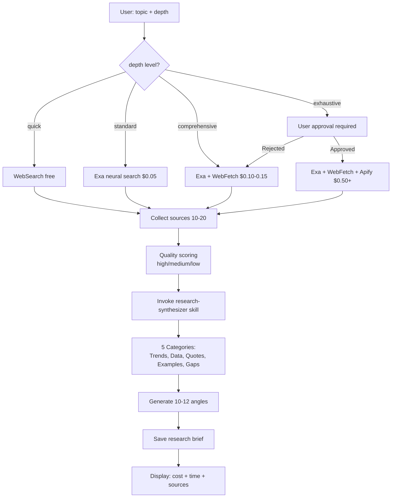
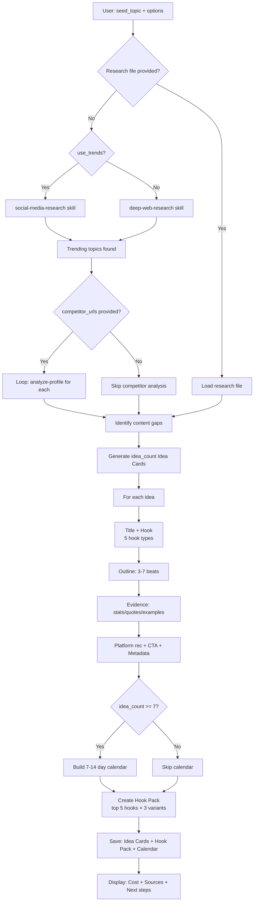
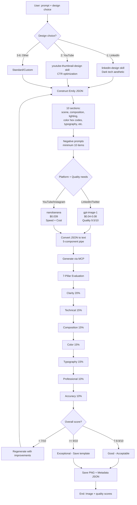
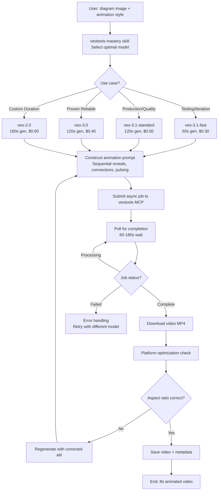

# AI-Powered Social Media Agent Team - Product Requirements Document (PRD)

**Version:** 1.0
**Date:** October 31, 2025
**Author:** Product Management
**Status:** Draft
**Related Documents:** [Project Brief](./brief.md)

---

## Goals and Background Context

### Goals

- Reduce content creation time by 85-90% (from 75-135 minutes to 10-15 minutes per post)
- Increase content output 3-4x (from 2-3 posts/week to 8-10 posts/week across platforms)
- Maintain authentic voice consistency across all generated content (≥8/10 confidence score)
- Achieve zero platform-specific publishing errors through automated validation
- Keep AI/API costs under $50/month while producing 30+ posts across platforms
- Establish modular, extensible foundation that enables organic growth of the agentic ecosystem beyond the current 3 core agents (Jarvis, Zoe, Zoro)
- Enable seamless addition of new agents, skills, and workflows as content strategy matures without requiring architectural rewrites
- Standardize workflow quality and patterns to ensure consistent, reliable processes across all agent operations
- Optimize tool selection and usage patterns (Apify actors, image models, video providers) based on real-world performance and cost data as the system matures
- Create comprehensive documentation mapping the complete agent→workflow→skill→tool hierarchy with clear decision criteria for when to use each component
- Integrate Notion as collaborative workspace for status-driven coordination, enabling agents to work asynchronously on shared content pipeline
- Enable flexible agent routing based on content needs (Jarvis→Zoro for text-only, Jarvis→Zoe→Zoro for visuals, Zoe→Zoro for standalone visuals) rather than rigid pipeline

### Background Context

The current content creation process is unsustainable for solo creators managing multiple platforms. A single LinkedIn post requires 75-135 minutes of fragmented work: research (30-60 min), writing with voice consistency (20-30 min), visual creation (15-30 min), and platform-specific formatting/publishing (10-15 min). Multiplied across platforms (LinkedIn, Twitter, YouTube, Instagram), this creates an impossible time burden that limits output to 2-3 posts/week when 8-10 posts/week is needed for meaningful audience growth.

Existing solutions fail to address the complete pipeline. Social media management tools (Buffer, Hootsuite) handle scheduling but not creation. AI writing assistants (ChatGPT, Claude) provide generic content without voice learning, research integration, or visual production. All-in-one platforms (Postiz, ContentStudio) offer basic AI but lack research depth, custom visual generation, and workflow customization. Freelancers and agencies are expensive ($2k-5k/month), slow (back-and-forth delays), and can't authentically replicate your voice.

This PRD defines an AI-powered social media team built on Claude Code's agent and skill infrastructure, coordinated through custom workflows and Notion-based collaborative state management. The system uses 3 core agents (Jarvis for content intelligence, Zoe for visual production combining images and videos, Zoro for publishing) that coordinate flexibly based on content needs—not a rigid pipeline but dynamic routing where Jarvis can hand to Zoro for text-only posts, or route through Zoe when visuals are needed, or Zoe can work independently for standalone graphics.

The system is already partially operational with 24+ skills, 20+ workflows, and 20+ MCP integrations including Notion for status tracking (Idea → Research → Writing → Editing → Posted) and Postiz for multi-platform scheduling. The MVP focuses on standardizing this foundation, documenting the complete agent→workflow→skill→tool hierarchy, and establishing clear patterns for organic growth. Both skills AND workflows are critical architectural components: skills provide reusable autonomous expertise while workflows orchestrate multi-step processes with quality gates. Tool choices (Apify actors, image models, video providers) are documented as current best practices with the understanding they will evolve and improve as usage patterns emerge.

### Change Log

| Date | Version | Description | Author |
|------|---------|-------------|---------|
| 2025-10-31 | 1.0 | Initial PRD draft created from Project Brief | PM Agent |

---

## Requirements

### Functional

**Content Intelligence & Research:**

- FR1: The system must support deep research on any topic using intelligent tool routing (free WebSearch → low-cost Exa neural search → comprehensive Exa+Firecrawl+Apify) with user-specified depth levels (quick, standard, comprehensive, exhaustive)
- FR2: All research outputs must include cited sources with URLs, timestamps, and reliability scores (high/medium/low) to enable verification and transparency
- FR3: The system must analyze social media profiles (Instagram, TikTok, Twitter, LinkedIn, YouTube) to extract posting patterns, content themes, engagement metrics, and audience insights
- FR4: The system must perform competitive analysis comparing multiple creator profiles to identify content gaps, differentiation opportunities, and strategic positioning

**Content Generation & Voice:**

- FR5: The system must learn and maintain user voice profiles from historical content (minimum 50 posts for ≥7/10 confidence, 75+ posts for ≥8/10 confidence) with support for multiple voice modes (primary, professional, casual, technical, humorous)
- FR6: The system must generate social media posts optimized for specific platforms (LinkedIn PAIPS formula <300 words, Twitter threads with Greg Isenberg questions, Substack essays with Paul Graham style) while maintaining learned voice consistency
- FR7: The system must generate video scripts with embedded timestamp markers, scene descriptions, thumbnail concepts, and platform-specific formatting (YouTube descriptions with chapters, Short-form hooks)
- FR8: All generated content must achieve minimum quality thresholds before handoff: voice confidence ≥8/10, research backing ≥3 credible sources, platform compliance 100%

**Visual Production:**

- FR9: The system must generate images optimized for platform specifications (LinkedIn 1200x627 dark monochrome, YouTube thumbnails 1280x720 CTR-optimized, Instagram 1080x1080 square, Twitter 1200x675)
- FR10: Image generation must support multiple modes: single image, multi-slide carousels (2-10 images), image editing (blur, color correction, object removal), and image blending (2-3 image compositing)
- FR11: All images must be evaluated using the Emily JSON 7-pillar quality framework (composition, color theory, typography, visual hierarchy, emotional impact, brand consistency, platform optimization) with scores ≥7/10 required for publication
- FR12: The system must generate videos in multiple formats: talking head (HeyGen avatars with consent verification), b-roll scenes (Veo 3, Fal-Video), and cinematic sequences (multi-scene stitching with transitions)
- FR13: Video generation must support platform-specific optimization: 9:16 vertical (Instagram Reels, YouTube Shorts, TikTok), 16:9 horizontal (YouTube, LinkedIn), and square 1:1 (Instagram feed)
- FR14: Videos must include optional captions (defaulted ON), platform-appropriate aspect ratios, and duration constraints (YouTube Shorts ≤3 min auto-detected, Instagram Reels ≤90 sec, TikTok ≤10 min)

**Multi-Platform Publishing:**

- FR15: The system must publish to Twitter Premium API with support for: 25,000 character posts, 1-4 images per post, video attachments, and threaded replies (auto-linked parent-child relationships)
- FR16: The system must publish to LinkedIn API with support for: text posts, single image posts, multi-image carousels (2-20 images), PDF carousels (multi-page documents), and video posts
- FR17: The system must publish to YouTube Data API v3 with support for: regular videos with full metadata (title, description, tags, category), and auto-detected Shorts (9:16 aspect ratio, ≤3 min duration)
- FR18: The system must validate all content before publishing: character limits (Twitter 25k Premium/280 standard, LinkedIn 3000), media formats (PNG/JPG/MP4), file sizes (Twitter 5MB images/512MB video, LinkedIn 8MB images/200MB video), and hashtag counts (LinkedIn ≤3 optimal, Twitter no hard limit)
- FR19: The system must track and enforce API rate limits: Twitter Premium 1500 posts/month, LinkedIn 150 posts/day, YouTube 6 uploads/day, with warnings at 80% utilization and blocking at 100%
- FR20: The system must support multi-platform scheduling via Postiz MCP for queued posting across Twitter, LinkedIn, Instagram, Facebook, and TikTok

**Agent Coordination & Handoffs:**

- FR21: Agents must communicate via standardized JSON handoff packages containing: source agent, target agent, content type, platform specs, file paths, metadata (voice version, quality scores, timestamps)
- FR22: Handoff packages must be validated against JSON schema before agent transition to prevent coordination failures
- FR23: All agent outputs must be saved to centralized outputs/{date}/{session}/ directory structure with session metadata, preventing scattered files across agent folders
- FR24: Workflows must support pause/resume functionality, saving progress at each step to prevent data loss during long-running processes (research, multi-image generation)

**Workflow System:**

- FR25: All workflows must use external instructions.md files (no embedded YAML or JavaScript code blocks) following standardized XML workflow format
- FR26: Workflows must support conditional execution based on context (skip UI Goals section if no UX requirements, skip video generation if text-only post)
- FR27: Workflows must provide clear user guidance at each step, explaining what's happening and what input is needed (no implicit behavior)
- FR28: Workflows must implement error handling patterns for common failures (API timeouts, rate limits, cost thresholds, invalid inputs) with graceful degradation (fallback to free tools when paid APIs fail)

**System Extensibility:**

- FR29: New agents must be addable by creating single .md definition file in .claude/commands/ and bmad/agents/ without modifying existing agents or central registries
- FR30: New skills must be addable by creating folder with SKILL.md in .claude/skills/{agent}/ following standardized structure (Purpose, Instructions, Reference Documentation, Examples)
- FR31: New workflows must be addable by following create-workflow template (workflow.yaml + instructions.md + template.md) without breaking existing workflows
- FR32: Skills must be composable—any workflow can invoke any skill, enabling mix-and-match reuse as needs evolve
- FR33: The system must provide clear guidelines for extensibility decisions: when to create new agent vs add workflow to existing agent, when to create skill vs call MCP directly, when to create workflow vs extend existing workflow

**Workflow Architecture & Quality:**

- FR34: Each agent must document which workflows it owns with clear descriptions (e.g., Jarvis: research-topic, write-post, analyze-profile, competitive-analysis, generate-ideas, learn-voice, write-scripts)
- FR35: Each workflow must document which skills it triggers (via context creation) and at which steps, enabling transparency about skill discovery patterns (e.g., research-topic workflow step 2 creates context "research {topic} with depth={depth}" triggering deep-web-research skill, step 3 creates context "synthesize findings" triggering research-synthesizer skill)
- FR36: Workflows must define clear success criteria and validation checkpoints at each step to ensure quality before proceeding (e.g., research must have ≥3 credible sources before writing step begins)
- FR37: Workflows must support both linear execution (step 1→2→3) and conditional branching (if content-type=text-only, skip visual generation steps) based on runtime context
- FR38: The system must maintain a workflow registry (Story 7.5) documenting purpose, owner agent, skills triggered (via context creation), and example use cases for each workflow to support discovery and reuse

**Tool Selection & Specificity:**

- FR39: The system must document specific tool choices for each use case with rationale: Apify actors (apify/instagram-scraper for Instagram, clockworks/tiktok-scraper for TikTok, apidojo/twitter-scraper-lite for Twitter), image models (nanobanana/Gemini 2.5 for cost, gpt-image-1/DALL-E 3 for quality), video providers (HeyGen for avatars, Veo 3 for b-roll, Fal-Video for cinematic)
- FR40: Skills that orchestrate multiple tools must implement intelligent routing based on parameters (e.g., deep-web-research skill routes: depth=quick→WebSearch free, depth=standard→Exa $0.05, depth=comprehensive→Exa+Firecrawl+Apify, depth=exhaustive→all tools with user approval)
- FR41: Tool selection criteria must be explicit and evolvable: current choices documented as "best practice as of [date]" with mechanism to update as new tools emerge or pricing/quality changes
- FR42: The system must track tool performance metrics (cost, quality, reliability, speed) to inform optimization decisions as usage patterns mature

**Notion Integration & Collaborative State:**

- FR43: The system must integrate with Notion Content Tracker database to manage content workflow status (Idea → Research → Next Up → Writing → Editing → Posted → Archived) with agents updating status as they complete work
- FR44: Agents must be status-aware: Jarvis checks for content in "Research" or "Next Up" status, Zoe checks for content in "Editing" status needing visuals, Zoro checks for content in "Posted" status ready to publish
- FR45: The system must create Notion pages for each content piece with proper relations: linked to Channel (My Channels DB), Keywords (Keywords DB), and Tasks (Action Items DB) to maintain relational integrity
- FR46: Agents must update Notion metadata as they work: Jarvis sets Publish Date and Next Actions, Zoe adds thumbnail URLs to page properties, Zoro updates Views/Likes/Comments after publishing

**Postiz Integration & Scheduling:**

- FR47: The system must use Postiz MCP as PRIMARY scheduling mechanism for all platforms (Twitter, LinkedIn, Instagram, Facebook, TikTok, YouTube) with future publish dates, providing unified queue management and multi-platform consistency
- FR48: Zoro agent must support BOTH scheduled posting via Postiz MCP (primary, recommended) and immediate "post now" operations via direct APIs (Twitter Premium API, LinkedIn API, YouTube Data API) for urgent content that can't wait for scheduled time, with user selecting mode at publish time

**Tool Evolution & Optimization:**

- FR49: Tool choices (Apify actors, image models, video providers) must be documented as "current best practice" with explicit acknowledgment they will evolve based on cost/quality/reliability data as system matures
- FR50: The system must support tool substitution without workflow changes: if apify/instagram-scraper becomes unreliable, workflows must adapt to use alternative scrapers by updating skill tool mapping, not rewriting workflow logic
- FR51: Skills must abstract tool complexity: workflows invoke "deep-web-research skill" not "call Exa API directly"—this enables skill to improve tool selection over time without breaking workflow callers

**Centralized Output Management:**

- FR52: All workflow outputs must be saved to standardized project-centric folder structure `outputs/projects/{YYYY-MM-DD}-{project-slug}/` with numbered lifecycle stages (00-session, 01-research, 02-ideas, 03-drafts, 04-media, 05-final, 06-published, handoffs/) enabling consistent organization, lifecycle tracking, and discoverability across all content projects
- FR53: All file names and folder names must use lowercase kebab-case format (e.g., `linkedin-post-ai-agents`, `research-brief.md`, `animated-diagram.mp4`) with no mixed case, underscores, or spaces to ensure consistency and prevent case-sensitivity issues across operating systems
- FR54: Each project folder must include `00-session/metadata.json` containing: Notion page URL, agents involved, workflows executed, skills triggered, costs breakdown, duration tracking, file inventory, and platform publishing status to enable bidirectional linking between local artifacts and Notion collaborative workspace
- FR55: Workflows must automatically create project folder structure from template (`outputs/templates/project-structure/`) if project doesn't exist, eliminating manual folder creation and ensuring structural consistency across all projects

### Non Functional

**Performance:**

- NFR1: Workflow execution must complete within reasonable timeframes: simple tasks <30 seconds (post formatting, validation), standard tasks <5 minutes (research + content generation), complex tasks <15 minutes (full pipeline with visuals)
- NFR2: Skill invocations must report progress for long-running operations (research >30 sec, image generation >30 sec, video generation >2 min) to provide user feedback
- NFR3: The system must minimize unnecessary file reads and API calls to stay within Claude Code context limits and reduce costs

**Cost Efficiency:**

- NFR4: Total monthly AI/API costs must remain under $50 for 30+ posts across platforms, with transparent tracking by service (Exa, Apify, Images, Videos)
- NFR5: The system must implement tiered tool selection prioritizing free options first (WebSearch before Exa, nanobanana before gpt-image-1) and requiring user approval for operations >$1
- NFR6: Cost per post must average <$1.50 across all content types (text-only $0.10-0.30, with images $0.50-1.00, with video $2-4)

**Reliability:**

- NFR7: The end-to-end pipeline (research → content → visuals → publish) must achieve 95% success rate without manual intervention or error recovery
- NFR8: The system must handle API failures gracefully with fallback options (free tools when paid fail, cached results when APIs timeout, user notification for unrecoverable errors)
- NFR9: All workflows must be resumable after interruption—state saved at each step, no loss of work if Claude Code crashes or user closes mid-session

**Quality & Consistency:**

- NFR10: Voice consistency must be validated on all generated text content with automatic flagging if confidence <8/10 for user review before publishing
- NFR11: All visual content (images, videos) must meet minimum quality thresholds (≥7/10 on Emily 7-pillar framework for images, platform optimization checks for videos) before handoff to publishing
- NFR12: Platform compliance must be enforced: character limits, media formats, file sizes, rate limits, hashtag counts—zero manual corrections required after validation

**Maintainability:**

- NFR13: All workflows must follow standardized format (external instructions.md, workflow.yaml with consistent YAML schema, template.md for outputs) to enable predictable behavior and easier debugging
- NFR14: Handoff packages between agents must use versioned JSON schemas with validation to prevent coordination failures when formats evolve
- NFR15: Documentation must be consolidated into single authoritative ARCHITECTURE.md with clear definitions, naming conventions, and extensibility guidelines to prevent knowledge fragmentation
- NFR16: The codebase must maintain clear separation of concerns: Agents (interface/persona), Workflows (process orchestration), Skills (reusable expertise), MCPs (external tools)—no mixing of responsibilities

**Security & Privacy:**

- NFR17: API keys must never be committed to git—stored in .env (gitignored) and referenced via MCP server configurations in Claude Code settings
- NFR18: User content must remain local in outputs/ directory with no transmission to third parties except when explicitly publishing to social platforms
- NFR19: The system must respect platform Terms of Service (no automation abuse, rate limit compliance, no prohibited content types)

**Extensibility & Evolution:**

- NFR20: The modular architecture must support organic growth—new agents/skills/workflows addable without modifying existing components, no central registries or dependency graphs required
- NFR21: Loose coupling must be maintained—agents coordinate via JSON handoffs (not direct calls), workflows invoke skills via natural language references (not hard dependencies), skills call MCPs via Claude Code platform (not direct imports)
- NFR22: Pattern documentation must enable confident extension—create-agent and create-workflow templates provide complete guidance for adding new components without consulting original developers
- NFR23: As the agentic ecosystem matures, skills and workflows must be refinable without breaking existing usage—versioning support for backward compatibility when patterns evolve

---

## User Interface Design Goals

### Overall UX Vision

The user experience centers on **conversational orchestration through 3 specialized AI personas working on shared Notion workspace**. Instead of navigating complex GUIs or learning API syntax, users interact with named agents (Jarvis for content intelligence, Zoe for visual production, Zoro for publishing) via natural language and simple menu commands. Each agent presents a focused menu of capabilities (e.g., `*research-topic`, `*write-post`, `*create-image`, `*publish-tweet`) that invoke structured workflows. These workflows are NOT just scripts—they are sophisticated multi-step processes with quality gates, skill invocations, tool orchestration, and Notion status updates.

The experience feels like delegating to a professional team with shared project board: User creates content idea in Notion (Status: Idea) → Jarvis researches and writes (updates Status: Research → Writing → Editing, saves draft to Notion page) → User decides routing: text-only goes to Zoro, visuals needed goes to Zoe → Zoe generates images/videos (Status stays Editing, adds media URLs to Notion) → Zoro publishes (updates Status: Posted, tracks metrics in Notion) → All agents aware of status, can pick up work asynchronously. The system hides technical complexity (MCP selection, API authentication, rate limiting, tool routing) while exposing creative control (voice modes, platform targeting, quality thresholds, scheduling vs immediate publish).

**Key UX Principles:**
- **Guided autonomy** - Agents lead the process, users provide creative direction
- **Transparent orchestration** - User sees which agent/workflow is active, what step is executing, what decisions are being made
- **Fail-safe defaults** - Sensible defaults for all options (primary voice mode, standard research depth, platform specs) with ability to override
- **Progress visibility** - Long-running operations (research >30s, video generation >2min) report progress, not silent black boxes
- **Error recovery** - Graceful degradation with clear explanation (e.g., "Exa API failed, falling back to WebSearch") and resumable workflows

### Key Interaction Paradigms

**1. Menu-Driven Agent Invocation**
- Users invoke agents via slash commands: `/jarvis` (content intelligence), `/zoe` (visual production), `/zoro` (publishing)
- Each agent responds with numbered menu of available workflows
- Users select by number or type workflow command (e.g., `*research-topic` for Jarvis, `*create-image` for Zoe, `*publish-tweet` for Zoro)
- Agents can also auto-suggest workflows based on Notion status (e.g., Zoe checks for content in "Editing" status and offers to create visuals)

**2. Workflow-Guided Progression with Skill Invocation**
- Selected commands trigger workflows that orchestrate multi-step processes
- Each workflow step presents: current goal, required inputs, available options, and which skills will be invoked
- Workflows call skills via natural language ("Use deep-web-research skill with depth=comprehensive")
- Skills execute as autonomous VMs (user sees "Invoking deep-web-research skill..." with progress indicators)
- Workflows manage orchestration (which skills to call, in what order, with what parameters), skills handle execution
- User provides input, workflow advances to next step, invoking appropriate skills
- Progress saved incrementally to both local outputs/ and Notion (status updates, content drafts, metadata)

**3. Elicitation-Based Refinement** (for workflows with `elicit: true`)
- Workflow presents drafted content with detailed rationale
- User chooses from 1-9 numbered options: proceed, or select elicitation method (expand/contract, critique, identify risks, challenge assumptions, etc.)
- Selected method executes, insights presented, user applies changes or returns to menu
- Never yes/no questions—always structured numbered options

**4. Flexible Agent Routing with Notion Coordination**
- Agents coordinate through Notion status updates AND local JSON handoff packages
- **Text-only path:** Jarvis writes → updates Notion status to "Posted" → suggests Zoro for publishing → Zoro reads from Notion, publishes
- **With visuals path:** Jarvis writes → status "Editing" → suggests Zoe for images → Zoe generates → adds media URLs to Notion → suggests Zoro → Zoro publishes
- **Standalone visuals:** Zoe creates images independently → saves to Notion with "Posted" status → suggests Zoro → publishes
- User decides routing at each handoff point based on content needs (not forced through all agents)
- Both JSON packages (outputs/) and Notion pages provide coordination—JSON for session artifacts, Notion for shared state

**5. Skill Discovery & Model-Invoked Execution** (autonomous, transparent to user)
- **Critical:** Skills are MODEL-INVOKED—Claude autonomously decides when to use them based on description matching, workflows don't explicitly call skills
- **How it works:** Workflow step creates rich context (e.g., "Generate LinkedIn post about {topic} using {voice_profile}"), Claude analyzes context (LinkedIn + post generation + voice matching) and autonomously discovers post-writer skill (description contains "LinkedIn posts", "social media", "voice-matched content")
- **Discovery examples:**
  - Workflow context: "Research {topic} with depth=comprehensive" → Claude discovers deep-web-research skill (description: "Exa neural search, Apify scrapers, web research")
  - Workflow context: "Create YouTube thumbnail for {video_topic}" → Claude discovers youtube-thumbnail-design skill (description: "CTR-optimized thumbnails, MrBeast psychology")
  - Workflow context: "Animate diagram showing {process}" → Claude discovers veotools-mastery skill (description: "Veo video generation, diagram animation")
- Once discovered, Claude loads skill's SKILL.md, executes as autonomous VM with tool access, returns results
- Skills then orchestrate their specific tools (deep-web-research → intelligently routes between WebSearch free, Exa $0.05, Firecrawl+Apify $0.50+ based on depth parameter)
- User sees skill activity ("Using deep-web-research skill with depth=comprehensive...") with progress indicators
- Skills run for extended periods (research 1-5 min, image generation 30-60 sec, video generation 2-5 min)
- Tool choices within skills are documented but evolvable (skill can update from apify/instagram-scraper to better actor; workflows unaffected by tool changes)

**6. Notion Status-Aware Collaboration**
- All agents check Notion Content Tracker for content status before suggesting workflows
- Jarvis sees Status="Idea" → suggests research-topic workflow
- Jarvis sees Status="Research" → suggests write-post workflow
- Zoe sees Status="Editing" with no images → suggests create-image workflow
- Zoro sees Status="Posted" with media ready → suggests publish-tweet or schedule-via-postiz workflow
- Agents update status as they complete work: Jarvis moves Idea→Research→Writing→Editing, Zoe keeps Editing (adds media), Zoro moves Editing→Posted
- User can manually update status in Notion, agents respect current state (collaborative, not agent-owned)

### Core Screens and Views

**Note:** Since this is a Claude Code CLI-based system, "screens" are really interaction states and output locations. Here are the critical views:

**1. Agent Menu View** - Landing interface when agent invoked
- Agent name and role displayed (e.g., "Jarvis - Content Intelligence Lead")
- Numbered list of available commands with descriptions
- Current session context if resuming (e.g., "Resuming session: linkedin-post-ai-agents")

**2. Workflow Execution View** - Active state during workflow
- Current step indicator (e.g., "Step 2/5: Generate post content")
- Step goal and instructions
- Input prompts with examples
- Progress indicators for long-running operations

**3. Elicitation Menu View** - Review and refinement state
- Drafted content presented with detailed rationale
- Numbered options 1-9 (proceed or select elicitation method)
- Clear prompt: "Select 1-9 or just type your question/feedback:"

**4. Handoff Package View** - Transition between agents
- Summary of created content (file paths, quality scores, metadata)
- Suggested next command for pipeline continuation
- Handoff JSON file location for reference

**5. Output Directory View** - Results and artifacts
- Session-organized outputs: `outputs/{date}/{session}/`
- Subdirectories: posts/, research/, images/, videos/, handoffs/
- Metadata files: session.json, handoff-to-{agent}.json

**6. Agent Memory View** - Persistent state and preferences
- User preferences (name, voice version, cost tracking)
- API usage statistics (monthly spend by service)
- Voice profile metadata (confidence score, modes, last updated)

**7. Notion Dashboard View** - Shared collaborative workspace
- Content Tracker database with status columns (Idea, Research, Next Up, Writing, Editing, Posted)
- Content Calendar views (Next Actions, Published Calendar)
- Channel performance analytics (Views, Likes, Comments by channel)
- Agents read/write to Notion: check status before suggesting workflows, update status as work completes, add metadata (publish dates, media URLs, performance metrics)

### Accessibility

**Platform Accessibility:** Claude Code desktop application (MacOS, Windows, Linux)
- **Text-based interaction** - All agent menus, workflow prompts, and outputs use markdown-formatted text
- **No visual UI accessibility requirements** - CLI-based, inherently screen-reader compatible
- **Keyboard-only navigation** - No mouse required, all interactions via typing
- **Clear language** - Plain language prompts, no technical jargon unless contextually appropriate
- **Structured output formats** - Markdown headers, lists, tables for easy scanning

**Ease of Use Requirements:**
- **Minimal learning curve** - Agent menus self-explanatory, no documentation required for basic usage
- **Discoverable features** - Help commands (`*help`) list all available workflows
- **Forgiving input** - Natural language accepted, no strict command syntax required
- **Clear error messages** - When something fails, explanation includes why and what to do next

### Branding

**Agent Personas (Voice & Personality):**
- **Jarvis (Content Intelligence Lead)** - Professional strategist with analytical depth, collaborative tone, evidence-driven recommendations, research-obsessed, voice consistency guardian
- **Zoe (Visual Production Specialist)** - Creative and detail-oriented, design-obsessed using Emily 7-pillar framework, platform-aware (9:16 vs 16:9 vs square), quality-focused for both images and videos, consent-conscious for avatar usage, understands visual storytelling across formats
- **Zoro (Publishing & Distribution Specialist)** - Operational and precise, rate-limit aware, validation-obsessed, multi-platform expert, scheduling-savvy with Postiz integration, analytics-focused (tracks Views/Likes/Comments in Notion)

**Content Voice (User's Brand):**
- **Primary Mode:** Lowercase Builder-Philosopher (learned from 77+ historical posts, 8/10 confidence)
- **Alternate Modes:** Professional Analyst, Critical Thinker, Excited Hype (context-dependent)
- **Consistency:** All generated content must feel "authentically me" per user validation

**Output Aesthetics:**
- **LinkedIn Images:** Dark monochrome tech design system (black/charcoal backgrounds, white/cyan text, minimal accent colors)
- **YouTube Thumbnails:** CTR-optimized (MrBeast 6 pillars, Thomas Frank AIDA, bold text, expressive faces, high contrast)
- **Twitter/Instagram:** Platform-native aesthetics (not overly designed, feels organic)

### Target Device and Platforms

**Development & Execution Platform:** Claude Code Desktop Application
- **Supported OS:** MacOS, Windows, Linux (wherever Claude Code runs)
- **Interface:** CLI/Terminal-based interaction within IDE
- **No web/mobile interface required for MVP** - Desktop-only, IDE-based workflow

**Content Target Platforms:** Multi-platform social media distribution
- **Primary Platforms:** LinkedIn (professional content), Twitter (short-form + threads), YouTube (videos + Shorts)
- **Secondary Platforms:** Instagram (Reels, Posts), TikTok (Short-form video), Substack (long-form essays)
- **Scheduling Platforms:** Postiz MCP (multi-platform queuing), Typefully (Twitter-specific)

**Platform Optimization:**
- **Responsive Design N/A** - Content formats adapt to platform specs, not screen sizes
- **Cross-Platform Consistency** - Same content strategy, different formatting per platform (LinkedIn <300 words PAIPS, Twitter Greg Isenberg questions)

---

## Technical Assumptions

### Critical Terminology Clarification

**This PRD uses custom terminology that differs from standard Claude Code concepts. Understanding this distinction is essential:**

**OUR SYSTEM:**
- **"Agents"** = Custom persona-driven menu interfaces (bmad/agents/) that present numbered workflow options to users. These are slash command handlers with personality. Example: `/jarvis` shows Jarvis persona + menu of 7 workflows.
- **"Workflows"** = Custom YAML+XML process orchestrators (workflow.yaml + instructions.md) that manage multi-step processes, state management, file I/O, user interaction, and Notion updates. These are user-invoked via agent menus.
- **"Skills"** = Claude Code Agent Skills (.claude/skills/) - model-invoked autonomous expertise that Claude discovers based on description matching. These contain methodologies, not processes.

**STANDARD CLAUDE CODE:**
- **Slash Commands** = User-invoked commands (type `/command` to trigger)
- **Agent Skills** = Model-invoked capabilities (Claude autonomously uses when relevant)
- **"Agents"** = Not a native concept (our custom orchestration layer)
- **"Workflows"** = Not a native concept (our custom YAML+XML system)

**KEY DIFFERENCE:**
- **Slash Commands** (Claude Code) ≈ **Our Agents** (user explicitly invokes)
- **Agent Skills** (Claude Code) = **Our Skills** (model autonomously discovers)
- **Our Workflows** = Custom orchestration layer between agents and skills

**INVOCATION MODEL:**
- User invokes Agent (`/jarvis`) → User-driven
- Agent presents menu of Workflows → User selects
- Workflow executes steps creating context → Process-driven
- Claude discovers Skills based on context → Model-driven
- Skills execute with tool access → Autonomous

**Why this matters:** When PRD says "workflow creates context for skill discovery," it means workflow steps provide rich task descriptions that Claude uses to autonomously match and load relevant skills. Workflows don't explicitly call skills—Claude does that automatically based on description matching.

---

### Agent Architecture & Workflow Mapping

**AGENT 1: JARVIS (Content Intelligence Lead)**

**Role:** Research, strategy, content creation, voice consistency
**Workflows Owned:**
1. `research-topic` - Deep research on any topic
   - **Triggers Skills:** deep-web-research (via context: "research {topic}" + depth parameter), research-synthesizer (via context: "synthesize findings into categories")
   - **Updates Notion:** Status Idea→Research, adds research URL to Notes relation

2. `analyze-profile` - Analyze creator profiles for insights
   - **Triggers Skills:** profile-analysis (via context: "analyze {platform} profile {url}"), evidence-tracker (via context: "track top performing posts")
   - **Updates Notion:** Creates child content for competitive analysis

3. `competitive-analysis` - Multi-profile comparison
   - **Triggers Skills:** profile-analysis (via context: "analyze profiles" repeated for your + competitors), research-synthesizer (via context: "identify gaps and strategic opportunities")
   - **Updates Notion:** Links to Keywords DB with focus keywords

4. `generate-ideas` - Create evidence-backed content ideas
   - **Triggers Skills:** deep-web-research (via context: "research {seed_topic}" if no research file), research-synthesizer (via context: "generate idea cards with hooks and outlines")
   - **Updates Notion:** Creates new pages in Content Tracker with Status="Idea", sets Category and Priority

5. `learn-voice` - Extract writing voice from historical content
   - **Triggers Skills:** voice-matcher (via context: "analyze {post_count} posts and extract rhetorical DNA")
   - **Updates Notion:** Saves voice profile version to memories.md (not Notion)

6. `write-post` - Generate social media posts
   - **Triggers Skills:** post-writer (via context: "generate {platform} post about {topic} using {voice_profile}"), voice-matcher (via context: "validate voice consistency"), platform-formatter (via context: "format for {platform} specs")
   - **Updates Notion:** Status Research→Writing→Editing, saves Content Text field, sets Publish Date

7. `write-script` - Generate video scripts with thumbnails
   - **Triggers Skills:** video-script-writer (via context: "generate {format} script for {duration} minute video"), youtube-thumbnail-mastery (via context: "suggest 3 CTR-optimized thumbnail concepts")
   - **Updates Notion:** Saves script to Content Text, thumbnail concepts to "Thumbnail ideas" property

**Jarvis Skill Dependencies:**
- deep-web-research, post-writer, video-script-writer, profile-analysis, voice-matcher, platform-formatter, research-synthesizer, evidence-tracker, youtube-growth-mastery, youtube-thumbnail-mastery, social-media-research, youtube-research

---

**AGENT 2: ZOE (Visual Production Specialist - Images + Videos Merged)**

**Role:** All visual content creation (images, videos, graphics, animations)
**Workflows Owned:**
1. `create-single-image` - Generate single optimized image
   - **Triggers Skills:** create-image (via context: "generate {design_choice} image for {platform}"), platform-specs (via context loading platform requirements), linkedin-design or youtube-thumbnail-design (via design choice context)
   - **Updates Notion:** Adds image URL to page, keeps Status="Editing"

2. `create-carousel` - Generate multi-slide carousel (2-10 images)
   - **Triggers Skills:** create-image (via context: "generate slide {n} of carousel about {topic}"), linkedin-design (via context: "LinkedIn carousel dark tech aesthetic")
   - **Updates Notion:** Adds all image URLs to page media property

3. `edit-image` - Modify existing images
   - **Triggers Skills:** edit-image (via context: "edit image at {path} to {edit_prompt}")
   - **Updates Notion:** Replaces image URL with edited version

4. `blend-images` - Composite 2-3 images
   - **Triggers Skills:** blend-images (via context: "composite {image_count} images with {blend_description}")
   - **Updates Notion:** Adds blended image URL

5. `create-talking-head` - Generate HeyGen avatar video
   - **Triggers Skills:** None (direct HeyGen MCP call, no skill needed for simple avatar generation)
   - **Updates Notion:** Adds video URL, sets Status="Posted" when complete

6. `create-scene` - Generate b-roll or diagram animation
   - **Triggers Skills:** veotools-mastery (via context: "animate diagram/generate b-roll using Veo 3 with {aspect_ratio}")
   - **Updates Notion:** Adds video URL

7. `create-cinematic-sequence` - Multi-scene video with stitching
   - **Triggers Skills:** veotools-mastery (via context: "plan multi-scene cinematic video"), create-image (via context: "generate keyframe images for scenes"), veotools-mastery (via context: "animate scenes and merge")
   - **Updates Notion:** Adds final video URL

**Zoe Skill Dependencies:**
- create-image, edit-image, blend-images, veotools-mastery, platform-specs, linkedin-design, youtube-thumbnail-design, mcp-tool-selection, generating-sid-images

---

**AGENT 3: ZORO (Publishing & Distribution Specialist)**

**Role:** Multi-platform publishing, validation, scheduling via Postiz, analytics tracking
**Workflows Owned:**

**Publishing Strategy:** ALL scheduling done via Postiz MCP for multi-platform consistency and unified queue management. Direct APIs (Twitter, LinkedIn, YouTube) used only for immediate "post now" operations when Postiz not needed.

1. `schedule-post` - Schedule content for future posting across platforms
   - **Triggers Skills:** None (direct Postiz MCP integration)
   - **Platforms Supported:** Twitter, LinkedIn, Instagram, Facebook, TikTok, YouTube
   - **Updates Notion:** Sets future Publish Date, Status stays "Editing" until Postiz auto-publishes at scheduled time, then requires manual update to "Posted"

2. `publish-tweet-now` - Immediate Twitter posting (bypass Postiz for urgent posts)
   - **Triggers Skills:** None (direct Twitter API via mcp-twitter or custom twitter-api-client module)
   - **Updates Notion:** Status Editing→Posted, sets Publish Date to now(), prompts for Views/Likes tracking

3. `publish-linkedin-now` - Immediate LinkedIn posting (bypass Postiz for urgent posts)
   - **Triggers Skills:** None (direct LinkedIn API via custom linkedin-api-client module)
   - **Updates Notion:** Updates Posted status, tracks Channel relation

4. `publish-youtube-now` - Immediate YouTube upload (bypass Postiz for video uploads)
   - **Triggers Skills:** None (direct YouTube Data API v3 via youtube-uploader-mcp)
   - **Updates Notion:** Updates Posted status, prompts user to manually add YouTube URL for analytics tracking
   - **Note:** YouTube videos uploaded as Private by default for safety, user changes to Public in YouTube Studio

5. `check-rate-limits` - Validate Postiz quotas and direct API limits
   - **Triggers Skills:** None (queries Postiz MCP integration stats and agent memories)
   - **Shows:** Postiz scheduled posts count, Twitter/LinkedIn/YouTube API limits remaining
   - **Updates Notion:** N/A (informational only)

**Zoro Skill Dependencies:**
- None (Zoro is pure API/MCP integration layer, no autonomous skills needed—validation and formatting logic embedded in workflow steps)

---

### Skill → Tool Mapping

**deep-web-research Skill:**
- **Tools Used:** WebSearch (free), Exa (neural search, $0.05-0.15), Firecrawl (web scraping with caching), Apify (platform scrapers)
- **Apify Actors:** apify/instagram-scraper, clockworks/tiktok-scraper, apidojo/twitter-scraper-lite, apify/youtube-scraper
- **Routing Logic:** depth=quick→WebSearch only, depth=standard→Exa, depth=comprehensive→Exa+Firecrawl, depth=exhaustive→Exa+Firecrawl+Apify (user approval required)
- **Tool Evolution:** Current Apify actors documented as best practice (Oct 2025). If better scrapers emerge or current ones become unreliable, skill will update tool selection. Workflows calling this skill unaffected by tool changes.

**post-writer Skill:**
- **Tools Used:** None (pure Claude generation using learned voice + platform formulas)
- **Methodologies:** Justin Welsh PAIPS (LinkedIn), Greg Isenberg questions (Twitter), Paul Graham essays (Substack)
- **Tool Evolution:** May add MCP tools for grammar checking, SEO optimization, or A/B testing in future iterations

**video-script-writer Skill:**
- **Tools Used:** None (pure Claude generation using scriptwriting methodologies)
- **Methodologies:** Ali Abdaal storytelling, MKBHD review structure, YouTube chapter timestamps
- **Tool Evolution:** May integrate youtube-research skill for trending format analysis

**profile-analysis Skill:**
- **Tools Used:** Apify (platform scrapers), social-media-mcp (Brave + Perplexity for trends)
- **Apify Actors:** apify/instagram-scraper (profile + posts + metrics), clockworks/tiktok-scraper (profile + videos), apidojo/twitter-scraper-lite (tweets + profile)
- **Tool Evolution:** May add direct platform APIs (Instagram Graph API, TikTok Research API) if access granted. Current scrapers work but may need replacement as platforms change anti-bot measures.

**voice-matcher Skill:**
- **Tools Used:** None (pure Claude analysis of historical content)
- **Data Source:** User's 77+ historical posts analyzed for patterns
- **Tool Evolution:** May integrate sentiment analysis MCP or stylometry tools for deeper voice profiling

**create-image Skill:**
- **Tools Used:** nanobanana (Gemini 2.5 Flash, $0.002-0.004/image), gpt-image-1 (DALL-E 3, $0.04-0.08/image)
- **Tool Selection:** Default to nanobanana for cost efficiency, use gpt-image-1 when quality >cost priority or when specific DALL-E features needed
- **Tool Evolution:** Monitor new models (Imagen 4, Midjourney API if released, FLUX Kontext Pro via fal-video). Update based on quality/cost benchmarks.

**edit-image Skill:**
- **Tools Used:** nanobanana (edit mode), gpt-image-1 (edit mode)
- **Tool Evolution:** May add Cloudinary transformation API for programmatic edits (crop, resize, filters)

**blend-images Skill:**
- **Tools Used:** nanobanana (multi-image input mode)
- **Tool Evolution:** May add custom compositing if nanobanana blending quality insufficient

**veotools-mastery Skill:**
- **Tools Used:** veotools (Veo 3 via Google AI Studio), fal-video (Veo 3, Luma Ray 2, Kling 2.1, Pixverse V4.5, Sora 2 via Fal.ai), heygen (talking head avatars)
- **Model Selection:** HeyGen for avatars ($0.20-0.50/min, high quality faces), Veo 3 for fast b-roll ($0.30-0.60/8sec), Fal-Video Luma/Kling for cinematic ($1-3/video)
- **Tool Evolution:** Video generation rapidly improving. Currently Veo 3 best quality/cost for b-roll, but Sora 2, Kling 3, and others launching. Skill will benchmark and update model preferences quarterly based on quality/cost/speed.

**youtube-thumbnail-mastery Skill:**
- **Tools Used:** None (strategic knowledge: MrBeast 6 pillars, Thomas Frank AIDA, CTR psychology)
- **Tool Evolution:** May integrate CTR prediction API or A/B testing data if available

**linkedin-design Skill:**
- **Tools Used:** None (design system knowledge: dark monochrome palette, typography rules, layout templates)
- **Tool Evolution:** May formalize into Figma templates or Cloudinary transformation presets

**research-synthesizer Skill:**
- **Tools Used:** None (pure Claude synthesis of research findings)
- **Tool Evolution:** May integrate citation management or fact-checking MCPs

**platform-formatter Skill:**
- **Tools Used:** None (formatting rules per platform)
- **Tool Evolution:** May add HTML-to-markdown converters or platform-specific preview generators

---

### Skill Discovery & Description Field Optimization

**How Claude Discovers Skills:**

Skills are **model-invoked**—Claude autonomously decides when to use them by matching current task context against skill descriptions. The `description` field in SKILL.md frontmatter is CRITICAL for discovery.

**Description Best Practices:**

Each skill must have discovery-optimized description including:
1. **What the skill does** (capabilities)
2. **When to use it** (trigger conditions)
3. **Key terms users/workflows mention** (discovery keywords)

**Examples from Current System:**

**post-writer skill:**
```yaml
---
name: post-writer
description: Generate platform-optimized social media posts using proven formulas (Justin Welsh PAIPS for LinkedIn, Greg Isenberg questions for Twitter, Paul Graham essays for Substack). Use when creating LinkedIn posts, Twitter threads, Substack essays, or any social media content requiring voice-matched writing.
---
```
**Triggers:** "LinkedIn post", "Twitter thread", "social media content", "voice-matched"

**deep-web-research skill:**
```yaml
---
name: deep-web-research
description: Multi-tool research orchestrator using Exa neural search, Apify platform scrapers, Firecrawl web scraping, and WebSearch. Intelligently routes between tools based on depth parameter (quick=free, comprehensive=paid). Use when researching topics, gathering web data, analyzing trends, or scraping social media platforms.
---
```
**Triggers:** "research", "web data", "Exa", "Apify", "scraping", "trends"

**veotools-mastery skill:**
```yaml
---
name: veotools-mastery
description: Google Veo 2.0/3.0/3.1 video generation expertise for animating diagrams, creating b-roll scenes, and image-to-video conversion. Knows model selection (veo-3.1-fast for iteration, veo-3.1-standard for quality), aspect ratio optimization (16:9 YouTube, 9:16 Shorts), and async job management. Use when generating videos from images, animating diagrams, or creating b-roll footage.
---
```
**Triggers:** "animate diagram", "video from image", "b-roll", "Veo"

**Avoiding Skill Conflicts:**

When skills have overlapping domains, use **distinct trigger terms** in descriptions:

**Problem:** Multiple research skills could conflict
**Solution:** Differentiate by domain

```yaml
# deep-web-research
description: Web scraping and neural search using Exa, Apify, Firecrawl. Use for general web research, trending topics, and data gathering.

# youtube-research
description: YouTube-specific research including video analysis, transcript extraction, retention patterns. Use when researching YouTube content, analyzing videos, or studying creator strategies.

# social-media-research
description: Platform trend analysis for Twitter, LinkedIn, Instagram using social-media-mcp and Brave/Perplexity. Use when tracking trending topics, viral content, or platform-specific trends.
```

**Discovery Process in Workflows:**

When workflow step says: "Research {topic} with depth=comprehensive"

Claude's discovery process:
1. Analyzes context: task=research, depth=comprehensive, domain=web
2. Scans available skills for description matches
3. Finds: deep-web-research (description contains "research", "Exa", "Apify", "depth parameter")
4. Loads deep-web-research/SKILL.md
5. Executes skill instructions with available tools
6. Returns research results to workflow

**Workflow authors optimize for discovery by:**
- Using specific task terminology ("research" not "find stuff")
- Including parameters mentioned in skill descriptions ("depth=comprehensive" matches deep-web-research's "depth parameter")
- Providing rich context (topic, platform, format) that skills can match against

---

### Notion Integration Architecture

**Content Tracker Database:**
- **Data Source URL:** `collection://956447a76e7b4b2eafb1e4c9adfcbcf3`
- **Purpose:** Central hub for all content ideas, workflow status, and metadata
- **Status Workflow:** Idea → Research → Next Up → Writing → Editing → Posted → Archived
- **Agent Status Triggers:**
  - Jarvis: Reads from Idea/Research/Next Up, writes to Research/Writing/Editing
  - Zoe: Reads from Editing (no media), writes media URLs, keeps Editing status
  - Zoro: Reads from Posted (ready to publish), updates to Posted with Publish Date

**Key Properties Used by Agents:**
- **Name** (title) - Content title (Jarvis creates)
- **Status** (status) - Workflow stage (all agents update)
- **Channel** (relation) - Target platform(s) (Jarvis links, Zoro validates)
- **Category** (select) - Content category (Jarvis sets based on topic)
- **Priority** (select) - Urgency (Jarvis sets, user can override)
- **Publish Date** (date) - When published/scheduled (Jarvis estimates, Zoro confirms)
- **Content Text** (text) - Post body or script (Jarvis populates)
- **Thumbnail ideas, YouTube Title ideas** (text) - Platform-specific metadata (Jarvis from write-script)
- **Views, Likes, Comments** (number) - Performance metrics (Zoro prompts user to add after publishing)
- **Focus Keywords** (relation) - SEO keywords (Jarvis links from Keywords DB)
- **Notes** (relation) - Research sources (Jarvis links research brief pages)

**MCP Server:** Notion MCP (`@notionhq/notion-mcp-server`)
- **Authentication:** Integration token (ntn_***) stored in Claude Code MCP settings
- **Permissions:** Read content, Update content, Insert content
- **Shared With:** Content Dashboard page + all child databases

---

### Postiz Integration Architecture

**Purpose:** PRIMARY multi-platform publishing and scheduling hub
**Strategic Decision:** Use Postiz MCP as the unified publishing interface for all platforms (Twitter, LinkedIn, Instagram, Facebook, TikTok, YouTube), with direct APIs available only for urgent immediate posting when scheduling not appropriate.

**Primary Use Cases:**
1. **Schedule posts for future dates** (recommended default) - Queue content with optimal posting times
2. **Multi-platform distribution** - Post to multiple platforms simultaneously from single interface
3. **Unified queue management** - View all scheduled content in Postiz dashboard
4. **Analytics tracking** - Centralized performance metrics (Views/Likes/Comments) across platforms

**Integration Points:**
- **Primary Workflow:** `schedule-post` workflow (Zoro's main publishing interface)
  - Handles: Twitter, LinkedIn, Instagram, Facebook, TikTok, YouTube
  - User specifies: platforms[], post_content, media_paths[], schedule_date (future timestamp or "next-free-slot")
  - Postiz handles: Platform-specific formatting, media upload, queue management, auto-publishing at scheduled time
- **Backup Workflows:** `publish-{platform}-now` (immediate posting when scheduling not appropriate)
  - Use cases: Breaking news, urgent announcements, time-sensitive content
  - Trade-off: Loses unified queue, manual per-platform posting, no analytics aggregation
  - Advantage: Full API feature access (Twitter Premium 25k chars, LinkedIn carousels), lower latency

**Why Postiz Primary:**
- **Consistency:** All platforms use same publishing interface (no switching between Twitter API, LinkedIn API, YouTube API)
- **Batch efficiency:** Queue multiple posts across platforms in single session
- **Optimal timing:** Schedule for best engagement times without manual posting
- **Unified analytics:** All performance data in one dashboard
- **Less complexity:** One integration to maintain vs 3+ separate APIs

**MCP Server:** Postiz MCP (`mcp__postiz`)
- **Tools Available:**
  - integrationList: Get connected platform accounts
  - integrationSchema: Get platform-specific requirements (char limits, media formats)
  - integrationSchedulePostTool: Queue posts for future publishing
  - generateImageTool: Optional AI image generation (we use Zoe instead)
  - generateVideoTool: Optional AI video generation (we use Zoe instead)
- **Authentication:** Postiz API key + platform OAuth tokens managed via Postiz dashboard
- **Supported Platforms:** Twitter, LinkedIn, Instagram, Facebook, TikTok, YouTube, Pinterest, Reddit, Mastodon, Threads
- **Tool Evolution:** Postiz adding more platforms monthly. Workflows adapt as new capabilities emerge (e.g., Bluesky, Threads, new platforms).

---

### Repository Structure & Service Architecture

**Repository Type:** Modular Monorepo
**Structure:**
```
/
├── .claude/
│   ├── commands/               # Agent menu definitions
│   │   ├── jarvis/
│   │   │   └── jarvis.md       # Jarvis agent persona + menu
│   │   ├── zoe/               # (To be created by merging ai-image-generator + ai-video-agent)
│   │   │   └── zoe.md
│   │   └── zoro/              # (Rename from social-posting-agent)
│   │       └── zoro.md
│   └── skills/                # Skill knowledge modules (Claude Code Skills = autonomous VMs)
│       ├── jarvis/
│       │   ├── deep-web-research/
│       │   │   ├── SKILL.md
│       │   │   ├── reference/
│       │   │   └── examples/
│       │   ├── post-writer/
│       │   ├── video-script-writer/
│       │   └── ... (12 total skills)
│       ├── zoe/               # (Merged from ai-image-generator + ai-video-agent skills)
│       │   ├── create-image/
│       │   ├── video-generation/
│       │   ├── veotools-mastery/
│       │   └── ... (9 total skills)
│       └── shared/            # Skills usable by multiple agents
│           ├── visual-prompt-mastery/
│           └── skill-creator/
├── bmad/
│   ├── agents/                # Agent implementation + workflows
│   │   ├── jarvis/
│   │   │   ├── jarvis.md      # Agent definition
│   │   │   ├── config.yaml
│   │   │   ├── jarvis-sidecar/
│   │   │   │   ├── memories.md        # Voice profiles, preferences, API tracking
│   │   │   │   └── workflows/
│   │   │   │       ├── research-topic/
│   │   │   │       │   ├── workflow.yaml
│   │   │   │       │   ├── instructions.md
│   │   │   │       │   └── template.md
│   │   │   │       ├── write-post/
│   │   │   │       └── ... (7 workflows)
│   │   ├── zoe/               # (Merged agent)
│   │   │   ├── zoe.md
│   │   │   ├── zoe-sidecar/
│   │   │   │   └── workflows/
│   │   │   │       ├── create-single-image/
│   │   │   │       ├── create-talking-head/
│   │   │   │       └── ... (7 workflows)
│   │   └── zoro/
│   │       ├── zoro.md
│   │       ├── zoro-sidecar/
│   │       │   └── workflows/
│   │       │       ├── publish-tweet/
│   │       │       ├── publish-linkedin/
│   │       │       └── ... (6 workflows)
│   └── modules/               # Shared utilities
│       ├── twitter-api-client/    # Node.js Twitter Premium OAuth client
│       └── linkedin-api-client/   # Node.js LinkedIn OAuth client
├── docs/
│   ├── brief.md               # This Project Brief
│   ├── prd.md                 # This PRD
│   ├── notion-content-dashboard.md    # Notion DB schemas and agent integration guide
│   ├── postiz-mcp.md         # Postiz integration guide
│   └── content-intelligence/  # Research and session documentation
├── outputs/                   # Centralized output management (all agents write here)
│   └── {date}/
│       └── {session}/
│           ├── posts/
│           ├── research/
│           ├── images/
│           ├── videos/
│           └── handoffs/
└── .bmad-core/               # PM agent + workflow/agent creation templates
    ├── templates/
    └── tasks/
```

**Design Principles:**
- **Loose coupling:** Each agent folder is self-contained, can be added/removed independently
- **No central registry:** Agents discovered via .claude/commands/, skills via .claude/skills/, no manifest files to update
- **Dual location pattern:** Agent definitions in both .claude/commands/ (Claude Code reads) and bmad/agents/ (source of truth with workflows/config)
- **Skill organization by agent:** Skills grouped in agent-named folders (.claude/skills/jarvis/, .claude/skills/zoe/) for developer convenience and discoverability, NOT hard restrictions
  - **Critical:** Claude can discover and use ANY skill regardless of folder location—organization is a hint, not a boundary
  - Example: Zoe can use jarvis/voice-matcher if generating voice-matched image captions (Claude discovers based on description matching)
  - Example: Jarvis can use zoe/create-image if workflow step requires image generation (model-invoked, not agent-restricted)
  - Shared skills (visual-prompt-mastery, skill-creator) available to all agents
  - Organization pattern: Primary agent owner's folder, but cross-agent usage expected and encouraged

---

### Testing Requirements

**Testing Strategy:** Manual validation during MVP, automated testing in Phase 2

**MVP Testing Approach:**
1. **Unit testing:** Individual skill invocations (does post-writer generate content with voice >8/10?)
2. **Workflow testing:** End-to-end workflow execution (does research-topic complete all steps without errors?)
3. **Integration testing:** Agent handoffs (does Jarvis→Zoe→Zoro pipeline work with Notion status updates?)
4. **Tool testing:** Validate each Apify actor, image model, video provider works as expected
5. **Cost tracking:** Monitor actual vs estimated costs per workflow execution

**Test Artifacts:**
- Test session outputs in outputs/testing/{date}/
- Tool performance log (cost, speed, quality scores)
- Workflow success rate tracking (95% target)

**Testing Cadence:**
- **Daily:** Run 1-2 end-to-end pipelines with real content
- **Weekly:** Review cost data, update tool selection if needed
- **Monthly:** Audit workflow standardization compliance

---

### Additional Technical Assumptions

**Data Persistence Strategy:**
- **Transient (session):** outputs/{date}/{session}/ - cleared after 30 days or manually
- **Persistent (config):** agent memories.md, voice profiles, preferences - version controlled in git
- **Collaborative (Notion):** Content Tracker, channels, keywords, tasks - authoritative source, agents sync to it
- **Hybrid (handoffs):** JSON packages saved to outputs/ AND summarized in Notion page properties

**Tool Choice Philosophy:**
- **Free-first:** Always try WebSearch, WebFetch before paid APIs
- **Cost-conscious:** nanobanana ($0.002/image) before gpt-image-1 ($0.04/image) unless quality demands it
- **User-approved:** Operations >$1 require explicit confirmation (video generation, exhaustive research)
- **Documented & evolvable:** Current tool choices = "best practice as of [date]", explicit mechanism to update as ecosystem matures
- **Abstracted in skills:** Workflows don't call tools directly, skills handle tool orchestration and can optimize over time

**Notion vs Local Outputs Trade-off:**
- **Notion advantages:** Shared workspace, status-driven collaboration, mobile access (check status on phone), analytics (Views/Likes), relational data (Keywords, Channels)
- **Local outputs/ advantages:** Full artifacts (research briefs, multi-page content), version history (git tracked), no API dependencies, faster access
- **MVP Approach:** Use both—Notion for status/metadata/coordination, local for complete artifacts. Notion pages link to local files via URLs when needed.

---

## Epic List

The following epics represent the major product capabilities for the AI-Powered Social Media Agent Team. These epics are **strategically sequenced** to de-risk greenfield work early (Notion integration), establish documentation foundation first, enable parallel development where possible, and defer optimization until core features stable.

**Note:** The current system already has partial implementations of most epics. The MVP work focuses on standardizing, completing, and optimizing these capabilities.

**Sequencing Rationale:**
1. **Foundation first** (Epic 1: Documentation) - Enables all other work, low-risk
2. **De-risk greenfield early** (Epic 2: Notion) - Highest uncertainty, provides coordination layer for Epics 3-6
3. **Parallelize features** (Epics 3-6) - Voice, Visual, Publishing, Intelligence can develop simultaneously using Notion coordination
4. **Test when ready** (Epic 7: Pipeline Testing) - After features complete and Notion integrated
5. **Optimize last** (Epic 8: Workflow Migration) - Polish after core system stable

---

**Epic 1: System Foundation & Documentation**

**Goal:** Establish comprehensive documentation (ARCHITECTURE.md), create tool and workflow registries for transparency, and implement standardized output management system with project-centric organization—providing the foundation that enables all subsequent development.

**Value:** Single source of truth prevents knowledge fragmentation, registries enable discovery and optimization, output structure eliminates organizational chaos. Without this foundation, system becomes unmaintainable as complexity grows.

**Stories:** 7.3 (ARCHITECTURE.md), 7.4 (Tool Registry), 7.5 (Workflow Registry), 7.6 (Output Management)

**Current State:** ⚠️ 30% Complete - Template created for output management, registries need creation, ARCHITECTURE.md needs writing

**Estimated:** 2-3 days

---

**Epic 2: Notion Integration & Status-Driven Collaboration** ⚡ **GREENFIELD - DE-RISK EARLY**

**Goal:** Integrate Notion Content Tracker as collaborative workspace enabling status-driven agent coordination (Idea → Research → Writing → Editing → Posted). Agents become Notion-aware: checking status before suggesting workflows, updating status as work completes, maintaining relational integrity (Keywords, Channels, Tasks).

**Value:** Provides coordination layer for all agents (Epics 3-6 can parallelize after this), enables asynchronous work (user updates Notion, agents adapt), mobile access, unified analytics.

**Stories:** 5.1 (Status-Aware Triggering), 5.2 (Agent Status Updates with transition rules), 5.3 (Relational Data Management)

**Current State:** ❌ 20% Complete - Notion MCP configured, schema documented, but agents not yet Notion-aware

**Estimated:** 3-5 days (greenfield, highest uncertainty)

**Critical Path:** Blocks Epic 7 (Pipeline Testing), but UNBLOCKS Epics 3-6 for parallel development

---

**Epic 3: Content Intelligence & Research Pipeline (JARVIS)** 🔄 **CAN PARALLELIZE after Epic 2**

**Goal:** Enable data-backed content research, profile analysis, competitive intelligence, and evidence-backed idea generation using intelligent tool orchestration (Exa, Apify, WebSearch) integrated with Notion status updates.

**Value:** Transforms guesswork into data-driven content strategy. Research time 30-60 min → 2-5 min while improving quality.

**Stories:** 1.1 (Deep Research), 1.2 (Profile Analysis), 1.3 (Competitive Gap Analysis), 1.4 (Idea Generation)

**Current State:** ✅ 80% Complete - 4 workflows operational, needs Notion status integration

**Estimated:** 1-2 days (mostly Notion integration work)

**Parallelization:** Can develop alongside Epics 4-6 after Notion ready

---

**Epic 4: Voice-Matched Content Creation (JARVIS)** 🔄 **CAN PARALLELIZE after Epic 2**

**Goal:** Generate social media posts and video scripts that authentically match user's voice through Enhanced Voice Profile v2.0, with platform-specific optimization and Notion content saving.

**Value:** Eliminates generic AI voice problem. Content feels "authentically me" (≥8/10 confidence).

**Stories:** 2.1 (Voice Profile Learning), 2.2 (Post Generation - **NEW workflow**), 2.3 (Script Generation - **NEW workflow**)

**Current State:** ⚠️ 50% Complete - learn-voice works, voice profile exists, write-posts and write-scripts workflows need creation

**Estimated:** 2-3 days (greenfield workflows)

**Parallelization:** Can develop alongside Epics 3, 5, 6 after Notion ready

---

**Epic 5: Visual Content Production (ZOE - Merged Agent)** 🔄 **CAN PARALLELIZE after Epic 2**

**Goal:** Create professional images and videos using Emily JSON methodology (7-pillar ≥7/10) and Veo/HeyGen, with intelligent tool selection and platform-agnostic media reusability (04-media/).

**Value:** Visual bottleneck eliminated. Publication-ready images in 30-60 sec, videos in 1-2 min.

**Stories:** 3.1 (Image Generation), 3.2 (Carousel), 3.3 (Image Editing), 3.4 (Diagram Animation), 3.5 (YouTube Thumbnails), 3.6 (Talking Heads)

**Current State:** ⚠️ 60% Complete - Image workflows operational, video workflows partial

**Estimated:** 2-3 days (complete video workflows, merge into Zoe agent)

**Parallelization:** Can develop alongside Epics 3, 4, 6 after Notion ready

---

**Epic 6: Multi-Platform Publishing (ZORO)** 🔄 **CAN PARALLELIZE after Epic 2**

**Goal:** Publish to Twitter/LinkedIn/Instagram/Facebook/TikTok/YouTube using Postiz MCP as PRIMARY with zero errors through validation, integrated with Notion status updates (Editing→Posted).

**Value:** Unified multi-platform scheduling, centralized analytics, simplified maintenance.

**Stories:** 4.1 (Postiz Scheduling - **NEW PRIMARY**), 4.2 (Twitter Backup), 4.3 (LinkedIn Backup), 4.4 (YouTube Backup)

**Current State:** ⚠️ 60% Complete - Direct APIs work, needs Postiz workflow + Notion integration

**Estimated:** 2-3 days (create Postiz workflow, add Notion updates)

**Parallelization:** Can develop alongside Epics 3-5 after Notion ready

---

**Epic 7: End-to-End Pipeline Validation & Cost Benchmarking**

**Goal:** Validate 3 routing paths with Notion coordination, test with real content across platforms, achieve 95% success rate, establish cost/quality benchmarks.

**Value:** Confidence in complete pipeline. Data-driven optimization insights.

**Stories:** 6.1 (Text-Only Pipeline), 6.2 (Full Visual Pipeline), 6.3 (Video Production Pipeline)

**Current State:** ⚠️ 40% Complete - Agents functional, Notion coordination needed

**Estimated:** 1-2 days

**Dependency:** REQUIRES Epic 2 (Notion) complete, benefits from Epics 3-6 complete

---

**Epic 8: Workflow Standardization & Continuous Optimization**

**Goal:** Migrate remaining workflows to external instructions.md format (Zoe/Zoro), establish continuous improvement processes.

**Value:** Consistent patterns across all workflows, easier maintenance.

**Stories:** 7.1 (Workflow Format Standardization), 7.2 (Tool Performance Tracking)

**Current State:** ⚠️ 50% Complete - Jarvis already standardized, Zoe/Zoro need migration

**Estimated:** 1-2 days (workflow migration, setup tracking)

**Dependency:** Can happen last after system proven stable

---

## **OPTIMIZED DEVELOPMENT TIMELINE**

**Sequential Phases:**

**Phase 1: Foundation (Days 1-3)**
- Epic 1: Documentation + Registries + Output Structure
- **Deliverable:** ARCHITECTURE.md, tool-registry.yaml, workflow-registry.yaml, outputs/templates/

**Phase 2: Coordination Layer (Days 4-8)**
- Epic 2: Notion Integration (greenfield, de-risked early)
- **Deliverable:** Status-aware agents, Notion property updates, relational linking

**Phase 3: Feature Development (Days 9-15)** ⚡ **PARALLELIZABLE**
- Epic 3: Content Intelligence (1-2 days) 🔄
- Epic 4: Voice Content (2-3 days) 🔄
- Epic 5: Visual Production (2-3 days) 🔄
- Epic 6: Publishing (2-3 days) 🔄
- **All use Notion coordination from Epic 2**
- **Can assign different epics to different sessions/days**

**Phase 4: Validation (Days 16-17)**
- Epic 7: Pipeline Testing
- **Deliverable:** 95% success rate validated, cost/quality benchmarks established

**Phase 5: Polish (Days 18-19)**
- Epic 8: Workflow Standardization
- **Deliverable:** 100% workflows use external instructions.md

**TOTAL: 14-19 days → Optimized to 11-15 days** (parallelization gains)

**Critical Path:** Epic 1 (3 days) → Epic 2 (5 days) → Epic 7 (2 days) → Epic 8 (2 days) = **12 days minimum**

---

## Epic 1: Content Intelligence & Research Pipeline (JARVIS)

**Epic Goal:** Enable data-backed content research, profile analysis, competitive intelligence, and evidence-backed idea generation—transforming content strategy from guesswork to data-driven decision making with 2-5 minute research cycles instead of 30-60 minutes.

### Story 1.1: Deep Topic Research with Intelligent Tool Routing

**User Story:**
As a content creator,
I want to research any topic using intelligent tool selection (free WebSearch for quick, paid Exa for comprehensive),
so that I get high-quality research briefs with cited sources while optimizing costs.

**Acceptance Criteria:**

1. User invokes Jarvis `/jarvis` → selects `*research-topic` workflow
2. Workflow prompts for: topic, depth (quick/standard/comprehensive/exhaustive), focus_areas (optional)
3. **Step 1 (Intelligent Tool Routing):**
   - depth=quick → Uses WebSearch only (free, 10-20 results)
   - depth=standard → Uses Exa neural search ($0.05, 10 auto + 5 similar results)
   - depth=comprehensive → Uses Exa + WebFetch for detailed analysis ($0.10-0.15)
   - depth=exhaustive → Uses Exa + WebFetch + Apify scrapers ($0.50+, user approval required)
4. **Step 2 (Source Quality Scoring):**
   - Each source rated: high (academic/authoritative), medium (industry blogs), low (forums/social)
   - Sources include: URL, timestamp, reliability score, key quote
5. **Step 3 (Research Synthesis via research-synthesizer skill):**
   - Organizes findings into 5 categories: Trends, Data & Statistics, Expert Quotes, Examples & Case Studies, Content Gaps
   - Each finding linked to source for verification
6. **Step 4 (Content Angle Generation):**
   - Generates 10-12 specific content angles based on research
   - Each angle includes: hook, core argument, evidence backing, platform recommendation
7. Workflow saves research brief to: `outputs/{date}/{session}/research/{topic-slug}.md`
8. Research brief includes: Topic, depth used, tools called, cost breakdown, 5 finding categories, 10-12 angles, all sources cited
9. Cost tracking: depth=quick ($0), standard ($0.05), comprehensive ($0.10-0.15), exhaustive ($0.50+)
10. Execution time: quick (30-60s), standard (2-3 min), comprehensive (3-5 min), exhaustive (5-10 min)

**Mermaid Diagram:**


---

### Story 1.2: Social Media Profile Analysis

**User Story:**
As a content creator,
I want to analyze any social media profile (Instagram, TikTok, Twitter, LinkedIn, YouTube),
so that I understand their content patterns, top performers, hooks, and posting cadence to inform my strategy.

**Acceptance Criteria:**

1. User invokes Jarvis → `*analyze-profile` workflow
2. Workflow prompts for: profile_url, analysis_depth (quick 20 posts / deep 50-100 posts)
3. **Step 1 (Platform Detection & Scraper Selection):**
   - Instagram → Uses apify/instagram-reel-scraper
   - Twitter → Uses scraper_one/x-profile-posts-scraper ($0.02-0.04 for 100 tweets)
   - LinkedIn → Uses apimaestro/linkedin-profile-posts ($0.10-0.15 for 50 posts)
   - YouTube → Uses starvibe/youtube-transcripts ($0.05/video)
   - TikTok → Uses clockworks/tiktok-scraper
4. **Step 2 (Invoke profile-analysis skill):**
   - Skill extracts: posting frequency, content themes, engagement patterns, hooks used, proof styles
   - Generates: Top 5 performing posts with analysis (why they worked)
5. **Step 3 (Generate Profile Summary Report):**
   - Content Strategy: Main themes, posting cadence, content mix (educational/personal/promotional)
   - Hook Patterns: Question hooks, number hooks, story hooks, reveal hooks—with examples
   - Proof Style: Specificity ratio, personal experience %, data density
   - Timing Insights: Best performing days/times if data available
   - Top Performers: 5 posts with engagement metrics and success factor analysis
6. Workflow saves profile summary to: `outputs/{date}/{session}/research/profile-{username}.md`
7. Cost tracking: Instagram ~$0.05, Twitter ~$0.02-0.04, LinkedIn ~$0.10-0.15, YouTube ~$0.05/video
8. Execution time: 2-4 minutes depending on depth

---

### Story 1.3: Competitive Gap Analysis

**User Story:**
As a content creator,
I want to compare my profiles against 3-8 competitors,
so that I identify content gaps, differentiation opportunities, and strategic positioning.

**Acceptance Criteria:**

1. User invokes Jarvis → `*competitive-analysis` workflow
2. Workflow prompts for: your_profiles[] (1-2 URLs), competitor_profiles[] (max 8 URLs), platform
3. **Step 1 (Batch Profile Analysis):**
   - Invokes profile-analysis skill for each profile (your + competitors)
   - Runs in parallel where possible to minimize time
4. **Step 2 (Comparative Synthesis):**
   - Identifies: Content themes you cover vs gaps, Hook styles competitors use that you don't, Engagement patterns (what works for them)
   - Generates: Gap Analysis Matrix (themes × creators showing coverage)
5. **Step 3 (Strategic Recommendations):**
   - Suggests 5-7 specific content angles exploiting gaps
   - Each recommendation includes: Gap identified, Why it matters, Suggested approach, Evidence from competitor data
6. Workflow saves gap analysis to: `outputs/{date}/{session}/research/competitive-analysis-{date}.md`
7. Cost tracking: Number of profiles × per-profile cost (~$0.05-0.40 each = $0.40-3.60 total for 8 profiles)
8. Execution time: 5-10 minutes for 8 profiles

---

### Story 1.4: Evidence-Backed Idea Generation

**User Story:**
As a content creator,
I want to generate 5-10 content ideas backed by real research and trends,
so that every idea has evidence support and I'm not guessing what will resonate.

**Acceptance Criteria:**

1. User invokes Jarvis → `*generate-ideas` workflow
2. Workflow prompts for: seed_topic, target_platforms[], idea_count (5-10), use_trends (yes/no), use_research_file (optional), competitor_urls (optional)
3. **Step 1 (Gather Intelligence):**
   - If use_trends=yes → Invokes social-media-research skill to find trending topics related to seed_topic
   - If use_research_file provided → Loads existing research brief
   - If not provided → Invokes deep-web-research skill with depth=standard
   - If competitor_urls provided → Invokes analyze-profile workflow for each competitor
4. **Step 2 (Generate Idea Cards):**
   - For each idea (up to idea_count):
     - **Title & Hook** - 5 hook types (Question, Number, Story, Reveal, Pattern-breaking)
     - **Outline** - 3-7 beats showing content flow
     - **Evidence** - Specific stats, quotes, examples backing the idea
     - **Platform Recommendation** - Best fit platform(s) with rationale
     - **CTA Suggestions** - 2-3 call-to-action options
     - **Metadata** - Category, pillar, keywords, estimated effort
5. **Step 3 (Hook Pack Creation):**
   - Takes top 5 hooks from ideas
   - Generates 3 variants each (15 total hooks)
   - Formats for testing (A/B comparison)
6. **Step 4 (Optional: Content Calendar):**
   - If idea_count ≥ 7 → Generates 7-14 day content calendar
   - Maps ideas to posting schedule with platform distribution
7. Workflow saves to: `outputs/{date}/{session}/ideas/idea-cards-{topic}.md` + `hook-pack.md`
8. Each Idea Card includes evidence-tracker metadata (sources cited, claim strength, verification URLs)
9. Cost: Depends on intelligence gathering ($0 if research file provided, $0.05-0.50 if deep-web-research needed, $0.40-3.60 if competitive analysis)
10. Execution time: 3-7 minutes depending on intelligence steps

**Mermaid Diagram:**


---

## Epic 2: Voice-Matched Content Creation (JARVIS)

**Epic Goal:** Generate social media posts and video scripts that authentically match user's voice through Enhanced Voice Profile v2.0, eliminating generic AI voice and maintaining consistency across platforms and content types.

### Story 2.1: Voice Profile Learning from Historical Content

**User Story:**
As a content creator,
I want the system to analyze 50+ of my historical posts across platforms,
so that it extracts my rhetorical DNA and can generate content that sounds exactly like me.

**Acceptance Criteria:**

1. User invokes Jarvis → `*learn-voice` workflow
2. Workflow prompts for: profile_urls[] (Twitter, LinkedIn, YouTube), post_count (minimum 50 recommended)
3. **Step 1 (Multi-Platform Content Collection):**
   - Twitter: Uses scraper_one/x-profile-posts-scraper ($0.02-0.04 for 100 tweets)
   - LinkedIn: Uses apimaestro/linkedin-profile-posts ($0.10-0.15 for 50 posts)
   - YouTube: Uses starvibe/youtube-transcripts ($0.05/video) if video content
4. **Step 2 (Rhetorical Analysis):**
   - Extracts **10 dimensions**:
     1. **Argument Architecture** - Opening styles (Observation → Question, Thesis → Context, Story Hook), Qualification patterns (Caveat/Nuance/Counter), Proof structures (Example-first, Data-driven, Personal experience), Closing patterns (Action CTA, Question CTA, Forward-looking)
     2. **Voice Modes** - Identifies 5 distinct modes: Analyst (tech breakdowns), Casual (personal stories), Community Protector (empathetic), Satirist (tongue-in-cheek), Enthusiast (energy + urgency)
     3. **Structural Frameworks** - Patterns: Eras/Phases storytelling, Comparative analysis, Numbered lists, "What sets this apart" framing
     4. **Proof Style** - Specificity ratio (Gmail/Notion/GitHub vs "various tools"), Personal experience % (~15% of content), Data density (stats per 100 words), Enumeration preference (numbered vs bulleted)
     5. **Humor & Satire Mechanics** - Techniques: Hypothetical scenarios (Bezos on vacation), Tongue-in-cheek tone, Self-deprecation patterns
     6. **Emotional Range** - Analytical (default 60%), Empathetic (15%), Energetic (10%), Satirical (10%), Earnest (5%)
     7. **Closing Patterns** - CTA frequency, Question vs statement endings, Forward-looking vs reflective
     8. **Parenthetical Usage** - Frequency, purpose (clarification vs tangent vs humor)
     9. **Cultural Voice** - Code-switching patterns, immigrant perspective references if present
     10. **Comparative Lens** - How often "X vs Y" structures used, comparison depth
5. **Step 3 (Voice Mode Extraction):**
   - Analyst mode: For tech breakdowns, product reviews, industry analysis
   - Casual mode: For personal stories, community posts, behind-the-scenes
   - Community Protector mode: For empathetic support, addressing struggles
   - Satirist mode: For tongue-in-cheek takes, calling out absurdities
   - Enthusiast mode: For genuine excitement, recommendations, discoveries
6. **Step 4 (Enhanced Voice Profile v2.0 Creation):**
   - Saves to `jarvis-sidecar/memories.md` with version number
   - Includes: Overall confidence score (posts analyzed / 100 = confidence %), 10 dimensions with examples, 5 voice modes with triggers, Signature phrases, Platform adaptations (LinkedIn more professional, Twitter more casual)
7. Minimum 50 posts required for ≥7/10 confidence, 75+ posts for ≥8/10, 100+ posts for ≥9/10
8. Voice profile includes real examples: "As someone who's been there..." (personal proof), "Gmail, not email. Notion, not note-taking app." (specificity), "What sets this apart is..." (structural framework)
9. Cost: Twitter $0.02-0.04, LinkedIn $0.10-0.15, YouTube $0.05/video (total ~$0.17-0.24 for multi-platform)
10. Execution time: 3-5 minutes for 50-100 posts

---

### Story 2.2: Platform-Optimized Post Generation with Voice Matching

**User Story:**
As a content creator,
I want to generate social media posts for specific platforms that sound authentically like me,
so that I maintain voice consistency while optimizing for each platform's format and audience.

**Acceptance Criteria:**

1. User invokes Jarvis → `*write-post` workflow (**NEW DEVELOPMENT:** Workflow does not exist yet, needs creation following Jarvis standardized pattern with external instructions.md)
2. Workflow prompts for: topic, platform (LinkedIn/Twitter/Substack), style (optional override), target_length
3. **Step 1 (Load Voice Profile):**
   - Reads Enhanced Voice Profile v2.0 from memories.md
   - Selects voice mode based on topic: tech analysis → Analyst, personal story → Casual, community support → Community Protector
4. **Step 2 (Trigger post-writer skill via context):**
   - Workflow step creates context: "Generate {platform} post about {topic} using {voice_profile}"
   - Claude autonomously discovers post-writer skill (description matches "LinkedIn posts", "social media", "voice-matched")
   - Skill loads and executes with platform formula:
   - **LinkedIn PAIPS Formula** (Justin Welsh):
     - P: Personal story or observation (1-2 sentences)
     - A: Agitate the problem (2-3 sentences)
     - I: Introduce solution with specificity (Gmail not email app)
     - P: Proof via example/data/personal experience
     - S: Simple next step CTA
     - Target: <300 words, 2-3 short paragraphs, 3 hashtags max
   - **Twitter Thread** (Greg Isenberg):
     - Tweet 1: Hook with question or bold claim
     - Tweets 2-6: Numbered insights with specificity
     - Tweet 7: Question CTA ("What's your take?")
     - Format: 280 chars per tweet standard, 25k chars if Premium
   - **Substack Essay** (Paul Graham):
     - Conversational, "What most people don't realize..." opening
     - Personal anecdotes, specific examples (no abstractions)
     - Meandering structure, builds to insight
     - Target: 800-1500 words
5. **Step 3 (Voice Validation via voice-matcher skill):**
   - Compares generated content against voice profile
   - Calculates confidence score across 10 dimensions
   - If score <8/10 → Flags for review with specific mismatches identified
   - If score ≥8/10 → Approved for publication
6. **Step 4 (Platform Formatting via platform-formatter skill):**
   - LinkedIn: Line breaks for readability, hashtag placement, call-out boxes if needed
   - Twitter: Thread numbering (1/7, 2/7...), character count per tweet, @mention formatting
   - Substack: H2 headers, pull quotes, email-friendly formatting
7. Workflow saves post to: `outputs/{date}/{session}/posts/{platform}-{topic-slug}.md`
8. Post includes metadata: platform, voice mode used, confidence score, word count, estimated engagement score
9. Post can be edited and regenerated (workflow supports multi-turn refinement)
10. Cost: $0 (pure Claude generation, no external API calls)
11. Execution time: 1-3 minutes depending on length

---

### Story 2.3: Video Script Generation with Thumbnail Concepts

**User Story:**
As a YouTube content creator,
I want to generate video scripts with embedded timestamps, scene descriptions, and thumbnail concepts,
so that I have production-ready scripts optimized for viewer retention and CTR.

**Acceptance Criteria:**

1. User invokes Jarvis → `*write-script` workflow (**NEW DEVELOPMENT:** Workflow does not exist yet, needs creation following Jarvis standardized pattern)
2. Workflow prompts for: topic, format (Ali Abdaal Top 5 / MKBHD Tech Review / Tutorial / Short-form), duration (target video length)
3. **Step 1 (Load Voice Profile & Select Format):**
   - Reads voice profile, selects mode (Analyst for tech, Enthusiast for recommendations)
   - **Ali Abdaal Top 5 Format**:
     - Hook (0:00-0:15): "Here are 5 X that Y..."
     - Intro (0:15-1:00): Why this matters, personal context
     - Items 1-5 (each 1-2 min): Title card, explanation, specific example, why it's useful
     - Outro (last 30s): Recap, CTA (like/subscribe/comment)
   - **MKBHD Tech Review**:
     - Cold open (0:00-0:30): Product in action, hook question
     - Specs overview (0:30-2:00): Key features, comparisons
     - Deep dive (2:00-8:00): Build quality, performance, user experience
     - Verdict (last 1-2 min): Who it's for, final recommendation
4. **Step 2 (Invoke video-script-writer skill):**
   - Generates full script with **timestamp markers** [00:15], [01:30], etc.
   - Includes **scene descriptions**: "B-roll: Close-up of keyboard typing", "Screen record: Demo of feature X"
   - Adds **chapter markers** for YouTube (00:00 Intro, 02:15 Feature 1, 04:30 Feature 2)
5. **Step 3 (Thumbnail Concept Generation via youtube-thumbnail-mastery skill):**
   - Generates 3 thumbnail concepts using:
     - MrBeast 6 Pillars: Readable text, expressive face, high contrast, vibrant colors, curiosity gap, pattern interruption
     - Thomas Frank AIDA: Attention (bold visual), Interest (compelling text), Desire (value prop), Action (implied CTR)
   - Each concept: Design description, text overlay, color palette, composition notes
6. **Step 4 (YouTube Metadata Generation):**
   - Title: 60-70 chars, keyword-rich, curiosity-driven
   - Description: First 150 chars (preview), chapter timestamps, links, hashtags
   - Tags: 15-20 relevant tags for SEO
7. Workflow saves script to: `outputs/{date}/{session}/scripts/{topic-slug}-script.md`
8. Script includes: Full narration with timestamps, scene descriptions, chapter markers, 3 thumbnail concepts, YouTube metadata
9. Cost: $0 (pure Claude generation)
10. Execution time: 2-4 minutes for 8-12 minute script

---

This is Epic 1 & Epic 2 with detailed stories, acceptance criteria based on actual implementation, mermaid diagrams, cost/time estimates, and tool specifics.

**Select 1-9 or just type your question/feedback:**

1. **Proceed to next epic** (Epic 3: Visual Content Production)

2. **Expand or Contract for Audience** - Add more technical details or simplify for readability?

3. **Explain Reasoning (CoT Step-by-Step)** - Walk through how I structured these stories from the workflow investigation

4. **Critique and Refine** - Review acceptance criteria for completeness, testability, and accuracy

5. **Analyze Logical Flow and Dependencies** - Validate story sequencing within epics

6. **Assess Alignment with Overall Goals** - Do these stories deliver on the 12 goals from Section 1?

7. **Identify Potential Risks and Unforeseen Issues** - What could break these workflows? What edge cases are missing?

8. **Challenge from Critical Perspective** - "Why 10 rhetorical dimensions for voice? Isn't that over-engineered?"

9. **Agile Team Perspective Shift** - Review from Developer (implementation effort), QA (testing complexity), User (value clarity) viewpoints

---

## Epic 3: Visual Content Production (ZOE - Merged Agent)

**Epic Goal:** Create professional images and videos using Emily JSON methodology for images (7-pillar quality ≥7/10 required) and Veo/HeyGen for videos, with intelligent tool selection optimizing for cost vs quality trade-offs.

### Story 3.1: Professional Image Generation with Emily JSON Methodology

**User Story:**
As a content creator,
I want to generate platform-optimized images (LinkedIn dark tech, YouTube CTR thumbnails, Instagram graphics) with quality validation,
so that I get publication-ready visuals in 30-60 seconds instead of 15-30 minutes in design tools.

**Acceptance Criteria:**

1. User invokes Zoe `/zoe` → selects `*create-single-image` workflow
2. Workflow prompts for: prompt_description, design_choice (1-6), aspect_ratio (auto-detected from design choice or manual)
3. **Design Choices Available:**
   - 1: LinkedIn Professional (dark monochrome tech aesthetic, 1200x627)
   - 2: YouTube Thumbnail (bold text CTR-optimized, 1280x720)
   - 3: Photorealistic Scene (natural lighting, detailed)
   - 4: Instagram Social (square 1080x1080, vibrant)
   - 5: Twitter Card (horizontal 1200x675, clean)
   - 6: Custom (user specifies full parameters)
4. **Step 1 (Design System Loading):**
   - Choice 1 → Invokes linkedin-design skill (loads dark tech palette, typography rules)
   - Choice 2 → Invokes youtube-thumbnail-design skill (loads MrBeast 6 pillars, Thomas Frank AIDA)
   - Choices 3-6 → Uses standard photorealistic or custom parameters
5. **Step 2 (Construct Emily JSON Prompt via create-image skill):**
   - **10+ JSON sections:**
     1. scene_description (detailed narrative)
     2. composition (rule of thirds, focal points, negative space)
     3. lighting (natural/studio/dramatic, direction, shadows)
     4. color_palette (hex codes: #1a1a1a, #00ffff for LinkedIn dark tech)
     5. typography (font style, size, placement, readability)
     6. camera_simulation (focal length, depth of field, angle)
     7. mood_atmosphere (professional/energetic/calm)
     8. technical_specs (resolution, aspect_ratio, format)
     9. style_references (minimalist/maximalist, photorealistic/illustrated)
     10. brand_consistency (design system adherence)
   - **Negative prompts library:** Minimum 10 items (no watermarks, no blurry text, no crowded composition, etc.)
6. **Step 3 (MCP Tool Selection via mcp-tool-selection logic):**
   - **gpt-image-1 (DALL-E 3)** selected when:
     - Platform = LinkedIn or Twitter (professional quality needed)
     - Text rendering critical (quality 9.5/10 for typography)
     - Cost: $0.04-0.08/image
   - **nanobanana (Gemini 2.5 Flash)** selected when:
     - Platform = YouTube, Instagram (social media volume)
     - Speed priority (generates in 10-15s vs 20-30s)
     - Cost: $0.039/image
7. **Step 4 (Convert JSON to Text Prompt):**
   - 5-component pipe structure: Scene | Composition | Lighting | Color | Technical
   - Example: "Modern tech workspace with laptop displaying code | Rule of thirds, laptop left third, negative space right | Soft natural window light from left | Dark palette #1a1a1a background, #00ffff accent | 1200x627, photorealistic, sharp focus"
8. **Step 5 (Generate Image via MCP):**
   - Calls selected tool with text prompt + negative prompts
   - Receives image PNG + metadata
9. **Step 6 (7-Pillar Quality Evaluation):**
   - **Pillar 1: Clarity** - Message understandable in <3 seconds? (weight: 20%)
   - **Pillar 2: Technical Quality** - Sharp focus, no artifacts, proper resolution? (weight: 15%)
   - **Pillar 3: Composition** - Good balance, effective use of space? (weight: 15%)
   - **Pillar 4: Color Harmony** - Matches hex codes, visually pleasing? (weight: 15%)
   - **Pillar 5: Typography** - Legible, proper hierarchy, readable? (weight: 15%)
   - **Pillar 6: Professionalism** - Enterprise-grade, publication-ready? (weight: 10%)
   - **Pillar 7: Prompt Accuracy** - All requested elements present? (weight: 10%)
   - Overall score calculated (weighted average)
10. **Step 7 (Quality Gate):**
    - Score <7/10 → Regenerate with improvements identified
    - Score 7-8.9/10 → Good quality, acceptable for publication
    - Score ≥9/10 → Exceptional, save as template for future reference
11. Workflow saves: Image PNG to `outputs/{date}/{session}/images/{design}-{topic}.png`
12. Metadata JSON includes: tool_used, cost, generation_time, design_choice, 7_pillar_scores, overall_score, prompt_json, negative_prompts
13. Workflow can iterate: if user requests changes, regenerate with refinements (multi-turn supported)
14. Cost: nanobanana $0.039, gpt-image-1 $0.04-0.08
15. Execution time: 30-60 seconds including quality evaluation

**Mermaid Diagram:**


---

### Story 3.2: Multi-Slide Carousel Generation

**User Story:**
As a content creator,
I want to generate 2-10 image carousels for LinkedIn or Instagram,
so that I create visual storytelling sequences without designing each slide individually.

**Acceptance Criteria:**

1. User invokes Zoe → `*create-carousel` workflow
2. Workflow prompts for: topic, slide_count (2-10), design_system (LinkedIn dark tech / Instagram vibrant / Custom), content_structure (numbered list / storytelling / comparison / tutorial)
3. **Step 1 (Content Planning):**
   - Breaks topic into slide_count logical beats
   - Example: "5 AI tools" → Slide 1: Hook/Intro, Slides 2-6: Each tool, Slide 7: Summary/CTA
4. **Step 2 (Design System Selection):**
   - LinkedIn → Invokes linkedin-design skill (dark monochrome, consistent typography, minimal)
   - Instagram → Uses vibrant colorful aesthetic, more dynamic
5. **Step 3 (Generate Each Slide via create-image skill):**
   - Loop slide_count times
   - Each slide: Consistent design system, progressive content, numbered if applicable
   - Tool selection: gpt-image-1 for LinkedIn (professional), nanobanana for Instagram (social)
6. **Step 4 (Consistency Validation):**
   - Checks: Same color palette across slides, consistent typography, visual hierarchy maintained, storytelling flow logical
   - Flags inconsistencies for regeneration
7. **Step 5 (Quality Evaluation per Slide):**
   - Each slide evaluated via 7-pillar framework
   - Minimum 7/10 per slide required
   - Overall carousel score = average of slide scores
8. Workflow saves: `outputs/{date}/{session}/images/carousel-{topic}/slide-{n}.png` for each slide
9. Summary JSON includes: slide_count, design_system, tool_used, cost_per_slide, total_cost, quality_scores[], storytelling_flow_assessment
10. Cost: slide_count × per-image cost (2-10 slides × $0.039-0.08 = $0.08-0.80 total)
11. Execution time: 1-3 minutes for 2-5 slides, 3-6 minutes for 6-10 slides

---

### Story 3.3: Image Editing and Refinement

**User Story:**
As a content creator,
I want to edit existing images (blur background, remove objects, enhance quality, style transfer),
so that I can refine generated or existing images without using separate design tools.

**Acceptance Criteria:**

1. User invokes Zoe → `*edit-image` workflow
2. Workflow prompts for: input_image_path, edit_prompt (description of desired changes)
3. **Step 1 (Load Input Image):**
   - Validates image exists and is valid format (PNG/JPG/WEBP)
   - Displays current image for reference
4. **Step 2 (Invoke edit-image skill):**
   - Uses nanobanana MCP in edit mode (pixel-perfect editing)
   - Supports operations: blur background, remove objects, color correction, style transfer, add/remove text, enhance quality
5. **Step 3 (Generate Edited Image):**
   - Preserves original dimensions and aspect ratio
   - Applies edits precisely per prompt
6. **Step 4 (Multi-Turn Refinement Support):**
   - User reviews edited image
   - Can provide additional edit prompts ("Now remove the watermark", "Enhance colors more")
   - Workflow loops, applying cumulative edits
7. **Step 5 (Quality Comparison):**
   - Compares original vs edited on 7-pillar framework
   - Ensures edits improve or maintain quality (no degradation)
8. Workflow saves: `outputs/{date}/{session}/images/edited-{original-name}-v{n}.png`
9. Metadata includes: original_image_path, edit_prompts[], iterations_count, quality_score_original vs quality_score_edited
10. Cost: $0.039 per edit iteration (can stack multiple edits)
11. Execution time: 20-40 seconds per iteration

---

### Story 3.4: Diagram Animation for Tutorial Videos

**User Story:**
As a technical content creator,
I want to animate static diagrams and workflows into 8-second videos,
so that I create engaging explainer content showing processes step-by-step.

**Acceptance Criteria:**

1. User invokes Zoe → `*animate-diagram` workflow (currently `generate-scene` with image-to-video)
2. Workflow prompts for: input_diagram_image, animation_style (sequential reveals / connection animations / pulsing highlights), aspect_ratio (16:9 YouTube / 9:16 Shorts)
3. **Step 1 (Invoke veotools-mastery skill for model selection):**
   - **veo-3.1-fast-generate-preview:** 60s generation, good for iteration/testing
   - **veo-3.1-generate-preview:** 120s generation, highest quality for production
   - **veo-3.0-generate-preview:** 120s generation, proven reliable fallback
   - **veo-2.0-generate-001:** 180s generation, custom duration/FPS control
4. **Step 2 (Construct Animation Prompt):**
   - Example: "Animate this architecture diagram. Start with all components faded. Sequentially reveal each component from left to right with a subtle fade-in effect. Then animate connection arrows lighting up in sequence showing data flow. End with gentle pulsing on the final component."
   - Includes: Animation sequence, timing cues, camera movement (if any), aspect ratio specification
5. **Step 3 (Generate via veotools MCP):**
   - Async job submission (returns job_id immediately)
   - Polls for completion (typical 60-180s depending on model)
   - Downloads video when complete
6. **Step 4 (Platform Optimization Check):**
   - Validates aspect ratio correct (16:9 or 9:16)
   - Checks duration (8s standard, custom if veo-2.0 used)
   - Verifies caption rendering if enabled
7. Workflow saves: `outputs/{date}/{session}/videos/animated-{diagram-name}.mp4`
8. Metadata includes: source_image, veo_model_used, generation_time, cost, aspect_ratio, animation_style
9. Video ready for: YouTube upload (via Zoro), Instagram/TikTok (if 9:16), or standalone use
10. Cost: $0.30-0.60 per 8-second video depending on Veo model
11. Execution time: 2-4 minutes (60-180s generation + 30s setup)

**Mermaid Diagram:**


---

### Story 3.5: YouTube Thumbnail Creation

**User Story:**
As a YouTube creator,
I want to generate CTR-optimized thumbnails using MrBeast/Thomas Frank psychology,
so that I maximize click-through rates without expensive design work.

**Acceptance Criteria:**

1. User invokes Zoe → `*create-youtube-thumbnail` workflow (currently part of generate-single with design_choice=2)
2. Workflow prompts for: video_topic, thumbnail_concept (from script's 3 suggestions or new), style (energetic/calm/professional)
3. **Step 1 (Invoke youtube-thumbnail-design skill for optimization):**
   - **MrBeast 6 Pillars:**
     1. Readable text (large font, high contrast, 6-8 words max)
     2. Expressive face (emotion visible, direct eye contact if human)
     3. High contrast (bright vs dark, pops in sidebar)
     4. Vibrant colors (saturated, not muted)
     5. Curiosity gap (incomplete information, "What happened next?")
     6. Pattern interruption (unexpected element, breaks scroll)
   - **Thomas Frank AIDA:**
     - Attention: Bold visual element (expressive face, surprising object)
     - Interest: Compelling text ("I Built This in 24 Hours")
     - Desire: Value proposition visible ("FREE Template Inside")
     - Action: Implied CTR (question, incomplete reveal)
4. **Step 2 (Construct Emily JSON with CTR Optimization):**
   - scene_description: Includes expressive human face or intriguing object
   - composition: Face/object in left or right third, text opposite side, negative space minimal
   - lighting: High contrast, dramatic if appropriate
   - color_palette: Vibrant saturated colors (#FF0000, #00FF00, #FFD700), avoid muted tones
   - typography: Sans-serif bold font, 72-96pt size, stroke outline for readability, 6-8 words max
   - mood_atmosphere: Energetic, curiosity-driven
5. **Step 3 (Generate via gpt-image-1):**
   - Uses DALL-E 3 for text rendering quality
   - 1280x720 resolution (YouTube standard)
6. **Step 4 (CTR Evaluation):**
   - Does it pass "3-second sidebar test"? (message clear when small)
   - Does it create curiosity gap? (viewer wants to know more)
   - Is text readable without squinting?
   - Does it pattern-interrupt? (stands out among generic thumbnails)
7. Workflow saves: `outputs/{date}/{session}/images/youtube-thumbnail-{topic}.png`
8. Metadata includes: 7_pillar_scores, ctr_evaluation (curiosity_score, readability_score, contrast_score), style_used
9. Cost: $0.04-0.08 (DALL-E 3 for quality)
10. Execution time: 40-60 seconds

---

### Story 3.6: Talking Head Video Generation

**User Story:**
As a content creator,
I want to generate talking head videos using HeyGen avatars,
so that I create presenter-style content without recording myself.

**Acceptance Criteria:**

1. User invokes Zoe → `*create-talking-head` workflow
2. Workflow prompts for: script_text, avatar_id, voice_id, aspect_ratio (16:9 / 9:16)
3. **Step 1 (Avatar Consent Verification):**
   - Checks if avatar_id is user's own avatar (consent granted)
   - Warns if using public avatar without rights
   - Requires explicit confirmation for avatar usage
4. **Step 2 (Voice Selection):**
   - Provides list of available HeyGen voices
   - User selects voice_id matching desired tone
5. **Step 3 (Generate via HeyGen MCP):**
   - Calls mcp__heygen__generate_avatar_video with: avatar_id, input_text (script), voice_id
   - Returns video_id for status checking
6. **Step 4 (Poll for Completion):**
   - HeyGen videos take 2-5 minutes to generate
   - Polls mcp__heygen__get_avatar_video_status every 30 seconds
   - Shows progress to user ("Generating... 45% complete")
7. **Step 5 (Download & Optimize):**
   - Downloads completed video
   - Validates aspect ratio matches request
   - Adds captions if enabled (default ON)
8. Workflow saves: `outputs/{date}/{session}/videos/talking-head-{topic}.mp4`
9. Metadata includes: avatar_id, voice_id, script_length, generation_time, cost, aspect_ratio
10. Cost: $0.20-0.50 per minute of video
11. Execution time: 3-6 minutes (2-5 min generation + 1 min setup)

---

## Epic 4: Multi-Platform Publishing & Distribution (ZORO)

**Epic Goal:** Publish content to Twitter, LinkedIn, Instagram, Facebook, TikTok, and YouTube using Postiz MCP as PRIMARY unified scheduling hub with zero platform-specific errors through automatic validation, rate limit enforcement, and optional immediate posting via direct APIs for urgent content. Establish Postiz as the default publishing interface with direct APIs as backup only.

### Story 4.1: Unified Multi-Platform Scheduling via Postiz (PRIMARY)

**User Story:**
As a content creator,
I want to schedule posts for future dates across multiple platforms (Twitter, LinkedIn, Instagram, Facebook, TikTok, YouTube) from a single interface,
so that I batch-create content, optimize posting times for engagement, and avoid manual multi-platform posting.

**Note:** This is the PRIMARY publishing workflow for Zoro. Stories 4.2-4.4 (direct API publishing) are backup workflows for urgent immediate posting only.

**Acceptance Criteria:**

1. User invokes Zoro → `*schedule-post` workflow (**NEW DEVELOPMENT:** Primary Postiz workflow needs creation)
2. Workflow prompts for: platforms[] (select multiple), post_content, media_paths[] (optional), schedule_date (future ISO timestamp or "next-free-slot" for Postiz auto-scheduling)
3. **Step 1 (Platform Integration Discovery via Postiz MCP):**
   - Calls mcp__postiz__integrationList to get connected accounts
   - Displays available: "Twitter (@username), LinkedIn (Your Name), Instagram (@username), Facebook (Page Name), TikTok (@username), YouTube (Channel Name)"
   - User selects platforms[] (can select multiple for cross-posting)
4. **Step 2 (Platform Schema Validation for each selected platform):**
   - Calls mcp__postiz__integrationSchema to get platform requirements
   - Example schemas returned:
     - Twitter: max_chars=25000 (Premium) or 280 (Standard), supports_images=true (1-4), supports_video=true
     - LinkedIn: max_chars=3000, supports_carousel=true (2-20 images), supports_pdf=true
     - Instagram: max_chars=2200, supports_images=true (1-10), supports_video=true (Reels)
     - YouTube: supports_video=true, auto_detect_shorts=true (9:16, ≤3min)
5. **Step 3 (Content Validation per Platform):**
   - Validates post_content length against each platform's max_chars
   - Validates media_paths[] formats and counts against platform limits
   - Flags issues with specific remediation: "Instagram text too long (2400 chars), reduce to 2200" or "LinkedIn carousel has 25 images, reduce to 20 max"
   - User can edit content or deselect problematic platforms
6. **Step 4 (Schedule Posts via integrationSchedulePostTool):**
   - For each platform: Submits integration_id, schedule_date (UTC ISO), post_content, media attachments[], platform-specific settings
   - Postiz queues for auto-publishing at specified time
   - If schedule_date="next-free-slot" → Postiz determines optimal time based on audience analytics
7. **Step 5 (Confirmation & Queue Summary):**
   - Displays: "Scheduled for {date} on {platform_count} platforms:"
     - Twitter (@username): {date}
     - LinkedIn (Your Name): {date}
     - Instagram (@username): {date}
   - Provides Postiz dashboard URL: "View queue at https://app.postiz.com/posts"
8. **Step 6 (Update Notion):**
   - Sets Publish Date to schedule_date
   - Status stays "Editing" (Postiz will auto-publish, then requires manual update to "Posted" after confirmation)
   - Adds note: "Scheduled via Postiz to {platforms}" in page properties or notes
9. **Step 7 (Post-Publishing Tracking):**
   - After scheduled time passes, user confirms post went live
   - Updates Notion Status→Posted manually (or automated webhook if Postiz supports)
   - Tracks Channel relations for all platforms posted
10. Cost: $0 (Postiz free tier supports scheduling, paid tier adds analytics and team features)
11. Execution time: 2-4 minutes for multi-platform scheduling (includes validation for all platforms)
12. **Advantage over direct APIs:** Single workflow handles 6+ platforms vs needing separate workflow per platform

---

### Story 4.2: Twitter Premium Direct Publishing (BACKUP - Immediate Posting Only)

**Note:** This is a BACKUP workflow for urgent immediate posting. For scheduled posts, use Story 4.1 (Postiz).

**User Story:**
As a content creator with Twitter Premium,
I want to immediately post tweets (up to 25k characters), threads, images, and videos without scheduling,
so that I can publish time-sensitive breaking content instantly.

**Acceptance Criteria:**

1. User invokes Zoro `/zoro` → selects workflow: `*post-tweet` (text), `*post-tweet-image` (1-4 images), `*post-tweet-video`, or `*create-thread`
2. **For post-tweet workflow:**
   - Prompts for: tweet_text
   - **Step 1 (Validation):**
     - Length check: ≤25,000 characters for Premium (warns if >280 for standard accounts)
     - Shows character count and preview
   - **Step 2 (Rate Limit Check via custom twitter-api-client module):**
     - Checks remaining: 1500/month, 50/day, 10/hour
     - Warns at 80% utilization, blocks at 100%
     - Shows current usage: "Monthly: 1245/1500 used, Daily: 32/50 used"
   - **Step 3 (Confirmation):**
     - Displays tweet preview with character count
     - Asks: "Post now? yes/no"
   - **Step 4 (Publish via TwitterClient.createTweet):**
     - OAuth 1.0a authentication from .env
     - Returns: tweet_id, tweet_url, character_count
   - **Step 5 (Update Rate Limits in memories.md):**
     - Increments counters: monthly +1, daily +1, hourly +1
     - Saves timestamp for reset calculations
   - **Step 6 (Success Confirmation):**
     - Displays: Tweet ID, URL, character count, updated rate limits
3. **For post-tweet-image workflow:**
   - Prompts for: tweet_text, image_paths[] (1-4 images)
   - Validates: Each image ≤5MB, formats accepted (PNG/JPG/GIF/WEBP)
   - Uploads media first, then creates tweet with media_ids[]
4. **For create-thread workflow:**
   - Prompts for: thread_texts[] (array of tweet texts)
   - Validates: Each ≤25k chars
   - Posts sequentially: Tweet 1 (no parent) → Tweet 2 (reply to 1) → Tweet 3 (reply to 2)
   - Returns: Array of tweet_ids and URLs
5. **Error Handling:**
   - Invalid credentials → "Check .env: TWITTER_CONSUMER_KEY, TWITTER_CONSUMER_SECRET, TWITTER_ACCESS_TOKEN, TWITTER_ACCESS_TOKEN_SECRET"
   - Rate limit exceeded → "Wait {time} or upgrade to higher tier"
   - Validation failed (length) → "Shorten to {chars} or use /thread workflow"
6. Cost: $0 (using own Premium account, no per-tweet cost beyond subscription)
7. Execution time: 10-30 seconds per tweet, 30-90 seconds for threads

**Mermaid Diagram:**
```mermaid
graph TD
    A[User: tweet_text] --> B{Length check}
    B -->|> 25000| C[Error: Too long<br/>Suggest: Shorten or thread]
    B -->|<= 25000| D[Show preview + char count]

    D --> E[Rate limit check<br/>TwitterClient.getRateLimitStats]
    E --> F{Limits OK?}
    F -->|No: 100% used| G[Block: Wait {reset_time}]
    F -->|Warning: 80%+| H[Warn but allow]
    F -->|OK: < 80%| I[Proceed]

    H --> I
    I --> J[Ask confirmation: Post?]
    J -->|No| K{Edit or cancel?}
    K -->|Edit| A
    K -->|Cancel| L[End: Cancelled]

    J -->|Yes| M[TwitterClient.createTweet<br/>OAuth 1.0a from .env]
    M --> N{Success?}
    N -->|No| O[Error handling]
    O --> O1{Error type?}
    O1 -->|Auth| P[Check .env credentials]
    O1 -->|Rate limit| Q[Wait or upgrade]
    O1 -->|Validation| R[Fix and retry]

    N -->|Yes| S[Update rate limits in memories.md]
    S --> T[Display success]
    T --> T1[Tweet ID + URL]
    T1 --> T2[Updated limits:<br/>Monthly, Daily, Hourly]
    T2 --> U[End: Posted]
```

---

### Story 4.3: LinkedIn Direct Publishing (BACKUP - Immediate Posting Only)

**Note:** This is a BACKUP workflow for urgent immediate LinkedIn posting. For scheduled posts, use Story 4.1 (Postiz).

**User Story:**
As a content creator,
I want to immediately post to LinkedIn with text, images, carousels, or PDFs without scheduling,
so that I can publish urgent professional content instantly.

**Acceptance Criteria:**

1. User invokes Zoro → selects: `*linkedin-post-text`, `*linkedin-post-image`, `*linkedin-post-carousel`, or `*linkedin-post-pdf`
2. **For linkedin-post-image workflow:**
   - Prompts for: post_text, image_path, alt_text (accessibility)
   - **Step 1 (Validation):**
     - Text length: ≤3000 characters (LinkedIn limit)
     - Image: ≤8MB, formats (PNG/JPG)
     - Alt text: ≤300 characters
   - **Step 2 (Rate Limit Check):**
     - LinkedIn: 150 posts/day
     - Shows: "Daily: 23/150 used"
   - **Step 3 (Upload Image to LinkedIn via LinkedInClient.uploadImage):**
     - Returns asset URN for referencing in post
   - **Step 4 (Create Post via LinkedInClient.createPost):**
     - Uses custom linkedin-api-client module (OAuth 2.0)
     - Includes: text, asset URN, alt_text
     - Returns: post_id, post_url
   - **Step 5 (Update Rate Limits):**
     - Increments daily counter in memories.md
   - **Step 6 (Success Confirmation):**
     - Displays: Post URL, character count used, rate limits remaining
3. **For linkedin-post-carousel workflow:**
   - Prompts for: post_text, image_paths[] (2-20 images)
   - Validates: 2-20 images (LinkedIn carousel limit), each ≤8MB
   - Uploads all images sequentially, collects asset URNs
   - Creates post with multiple assets (carousel format)
4. **For linkedin-post-pdf workflow:**
   - Prompts for: post_text, pdf_path
   - Validates: PDF ≤100MB, page count ≤300
   - Uploads PDF as document asset
   - Creates post with document URN (displays as PDF carousel on LinkedIn)
5. Cost: $0 (using own LinkedIn account)
6. Execution time: 15-30 seconds for text, 30-60 seconds for images, 60-120 seconds for carousels/PDFs

---

### Story 4.4: YouTube Direct Upload (BACKUP - Immediate Posting Only)

**Note:** This is a BACKUP workflow for urgent immediate YouTube uploads. For scheduled YouTube posts, use Story 4.1 (Postiz).

**User Story:**
As a YouTube creator,
I want to immediately upload videos with automatic Short detection (9:16, ≤3min) without scheduling,
so that I can publish time-sensitive video content instantly.

**Acceptance Criteria:**

1. User invokes Zoro → `*upload-youtube` workflow (handles both videos and Shorts automatically)
2. Workflow prompts for: video_path, title, description, tags[], category, privacy (private/unlisted/public)
3. **Step 1 (Auto-Short Detection):**
   - Reads video metadata: duration, aspect_ratio
   - **Is Short if:** aspect_ratio = 9:16 (vertical) AND duration ≤ 180 seconds (3 min)
   - **Is Regular Video if:** Any other aspect_ratio OR duration > 180 seconds
   - Displays detection result: "Detected: YouTube Short (9:16, 47 seconds)"
4. **Step 2 (Validation):**
   - Video file: ≤256GB (YouTube limit)
   - Title: ≤100 characters
   - Description: ≤5000 characters
   - Tags: ≤500 characters total
5. **Step 3 (Rate Limit Check):**
   - YouTube Data API: 10,000 units/day (1 upload = ~1600 units = ~6 uploads/day)
   - Shows: "Daily quota: 3200/10000 used (4 uploads remaining today)"
6. **Step 4 (Category Auto-Selection if not provided):**
   - Uses youtube-growth-mastery knowledge to suggest category
   - Example: Tech review → Category 28 (Science & Technology)
7. **Step 5 (Upload via youtube-uploader-mcp):**
   - Calls mcp__youtube-uploader-mcp__upload_video
   - Parameters: file_path, title, description, tags, category_id, privacy (defaults to private for safety)
   - Upload progress shown (large files take 2-10 minutes)
8. **Step 6 (Success Confirmation):**
   - Displays: Video ID, YouTube URL (YouTube Studio link)
   - If Short detected: "Published as YouTube Short (will appear in Shorts feed)"
   - If Regular video: "Published as Regular Video"
   - Reminds: "Video uploaded as Private. Change to Public in YouTube Studio when ready."
9. **Step 7 (Update Rate Limits):**
   - Increments quota used (+1600 units)
   - Saves to memories.md
10. Cost: $0 (YouTube API free within quota)
11. Execution time: 30 seconds setup + 2-10 minutes upload depending on file size

---

## Epic 5: Notion Integration & Collaborative Workflow

**Epic Goal:** Integrate Notion Content Tracker as collaborative workspace enabling status-driven agent coordination, asynchronous work handoffs, and unified analytics—transforming from linear pipelines to flexible, status-aware collaboration.

### Story 5.1: Notion Status-Aware Workflow Triggering

**User Story:**
As a content creator,
I want agents to check Notion content status and suggest relevant workflows automatically,
so that I don't manually coordinate which agent to invoke at which stage.

**Acceptance Criteria:**

1. When user invokes any agent (`/jarvis`, `/zoe`, `/zoro`), agent checks Notion Content Tracker before showing menu
2. **Jarvis status awareness:**
   - Queries Notion for content with Status = "Idea" or "Research" or "Next Up"
   - If found: Suggests workflows based on status
     - Status="Idea" → "Found 3 content ideas. Suggest: *research-topic for research, *generate-ideas for more ideas"
     - Status="Research" → "Found 2 content items researched. Suggest: *write-post to create posts"
     - Status="Next Up" → "Found 1 item scheduled. Suggest: *write-post to draft"
   - If none found: Shows standard menu
3. **Zoe status awareness:**
   - Queries for content with Status = "Editing" AND no media URLs in properties
   - If found: "Found 4 posts ready for visuals. Suggest: *create-single-image for thumbnails"
   - Can also check for specific needs: "Post marked 'needs carousel' → Suggest *create-carousel"
4. **Zoro status awareness:**
   - Queries for content with Status = "Posted" (content complete, ready to publish)
   - If found: "Found 2 posts ready to publish. Suggest: *publish-tweet or *linkedin-post-image"
   - Also checks for future scheduled: Status="Editing" + Publish Date set → Suggest *schedule-via-postiz
5. Notion query uses filters: `Status IN ('Idea', 'Research', 'Next Up') AND Graveyard = false` for active content only
6. Agent displays: Count of items per status, top 3 titles as examples, suggested workflows
7. User can override suggestions and select different workflow from menu
8. Execution time: 2-5 seconds for Notion query + agent menu display

---

### Story 5.2: Agent Status Updates During Workflow Execution

**User Story:**
As a content creator,
I want agents to automatically update Notion status as they complete work,
so that I have real-time visibility into content pipeline without manual tracking.

**Acceptance Criteria:**

1. **Jarvis status updates:**
   - When `research-topic` workflow completes → Updates Status: Idea→Research, adds research brief URL to Notes relation
   - When `write-post` workflow completes → Updates Status: Research→Writing→Editing, saves post to Content Text property, sets estimated Publish Date
   - When `generate-ideas` workflow completes → Creates new Notion pages with Status="Idea", sets Category and Priority based on topic
2. **Zoe status updates:**
   - When `create-single-image` completes → Adds image URL to page properties (custom field or embedded in Content Text), keeps Status="Editing"
   - When `create-carousel` completes → Adds all slide URLs to properties
   - When video workflows complete → Adds video URL, optionally updates Status to "Posted" if no publishing needed
3. **Zoro status updates:**
   - When any publish workflow completes → Updates Status: Editing→Posted, sets Publish Date to now(), prompts user to add YouTube URL if applicable
   - When `schedule-via-postiz` completes → Sets future Publish Date, Status stays "Editing" until scheduled time passes
4. Each status update includes: Agent name in log, timestamp, previous vs new status
5. Updates are immediate (within workflow execution, not batch)
6. If Notion update fails (API error), workflow logs error but continues (doesn't block publishing)
7. User can manually override status in Notion, agents respect current state on next invocation
8. Execution time: 1-2 seconds per Notion update
9. **Status transition rules enforced by agents:**
   - Only forward transitions allowed: Idea→Research→Next Up→Writing→Editing→Posted→Archived
   - Agents cannot skip states (e.g., cannot jump Idea→Posted without intermediate steps)
   - Agents validate current status before updating (prevents invalid transitions)
   - Backward transitions (e.g., Posted→Editing for corrections) require manual user update in Notion (agents don't move backward)
10. **Transition validation logging:**
    - Each update logged: "Status updated: Writing→Editing by Jarvis at 2025-10-31T14:23:45Z"
    - Invalid transition attempts logged as warnings: "Cannot transition Idea→Posted, current status must progress through intermediate states"
    - User manual overrides respected: "User manually set Status=Editing, agent proceeding from current state"
11. **Exception handling:**
    - If user manually sets invalid status (e.g., "In Progress" not in defined workflow), agents prompt: "Unrecognized status. Valid statuses: Idea, Research, Next Up, Writing, Editing, Posted, Archived. Update to valid status or agents will treat as 'Idea'."
12. **Concurrent agent coordination:**
    - Multiple agents can update same Notion page (Jarvis updates Content Text, Zoe adds image URL simultaneously)
    - Last-write-wins for conflicting property updates
    - Status updates atomic (no race conditions between agents)

---

### Story 5.3: Notion Relational Data Management

**User Story:**
As a content creator,
I want agents to automatically link content to Keywords, Channels, and Tasks in Notion,
so that I maintain relational integrity without manual database management.

**Acceptance Criteria:**

1. **Jarvis creates relational links:**
   - When `generate-ideas` creates new Notion page → Automatically links to Channel based on platform recommendation (e.g., "LinkedIn & X" channel for LinkedIn post idea)
   - Searches Keywords DB for relevant keywords, creates new keywords if not found, links via Focus Keywords relation
   - Can optionally create task in Action Items DB: "Write post: {title}" with Next Actions date
2. **Zoe maintains relational integrity:**
   - Reads parent Notion page to get Channel for platform specs
   - Adds media URLs preserving existing relations (doesn't overwrite Keywords, Channels, Tasks)
3. **Zoro tracks analytics in Notion:**
   - After publishing, prompts user: "Add Views/Likes/Comments to Notion? (can do later)"
   - If yes: Updates numeric properties in Content Tracker
   - Sets View Performance (Great/Good/Okay/Poor) based on thresholds
4. **Relationship examples:**
   - Content "How to use Claude Code" → Channel: "LinkedIn & X" → Keywords: "claude code", "ai tools", "productivity" → Tasks: "Write post", "Create thumbnail", "Publish"
5. All relations use Notion page URLs (not IDs) for stability
6. Agents validate relations exist before linking (no orphan references)
7. If relation creation fails, logs warning but continues (doesn't block workflow)

---

## Epic 6: End-to-End Pipeline Validation & Cost Benchmarking

**Epic Goal:** Validate 3 routing paths work reliably with real content, establish cost/quality/time benchmarks, and achieve 95% success rate target for production readiness.

### Story 6.1: Text-Only Pipeline (Jarvis → Zoro)

**User Story:**
As a content creator,
I want to go from topic to published LinkedIn/Twitter post without visuals,
so that I optimize for speed when images aren't needed.

**Acceptance Criteria:**

1. **Complete Pipeline Test:**
   - User: Provides topic "How MCP servers work"
   - Jarvis: `/jarvis` → `*research-topic` (depth=standard, $0.05, 2-3 min) → Research brief created
   - Jarvis: `*write-post` (platform=LinkedIn, style=PAIPS, $0, 1-2 min) → Post drafted, voice validated 8.5/10
   - Notion: Status updated Idea→Research→Writing→Editing, Content Text populated
   - Zoro: `/zoro` → `*linkedin-post-text` ($0, 20s) → Post published, Status→Posted
   - **Total Time:** 4-6 minutes | **Total Cost:** $0.05 | **Success:** Posted content live on LinkedIn
2. Handoff between Jarvis→Zoro uses Notion as coordination (no manual JSON copy-paste)
3. Pipeline succeeds without errors, manual intervention, or rework
4. Content quality validated: Voice 8+/10, research backed, platform compliant
5. Test with 5 different topics, achieve 95% success rate (1 failure allowed in 20 attempts across all pipelines)

---

### Story 6.2: Full Visual Pipeline (Jarvis → Zoe → Zoro)

**User Story:**
As a content creator,
I want to go from topic to published post with professional thumbnail,
so that I create complete visual content optimized for engagement.

**Acceptance Criteria:**

1. **Complete Pipeline Test:**
   - User: Provides topic "5 AI tools for productivity"
   - Jarvis: `/jarvis` → `*research-topic` (depth=comprehensive, $0.15, 3-5 min) → Research brief
   - Jarvis: `*write-post` (platform=LinkedIn, $0, 2 min) → Post drafted
   - Notion: Status→Editing, Content Text saved
   - Zoe: `/zoe` → `*create-single-image` (design=LinkedIn dark tech, $0.05, 45s) → Image generated, 7-pillar score 8.7/10
   - Notion: Image URL added to properties
   - Zoro: `/zoro` → `*linkedin-post-image` (post + image, $0, 25s) → Published
   - Notion: Status→Posted, Publish Date set
   - **Total Time:** 7-10 minutes | **Total Cost:** $0.20 | **Success:** LinkedIn post with professional image live
2. Handoffs: Jarvis suggests Zoe after writing, Zoe suggests Zoro after image generation
3. All Notion updates successful (status, content text, image URL, publish date)
4. Image meets quality threshold (≥7/10 on 7-pillar framework)
5. Test with 5 different topics across platforms (LinkedIn, Twitter, YouTube), achieve 95% success

---

### Story 6.3: Video Production Pipeline (Jarvis → Zoe → Zoro)

**User Story:**
As a YouTube creator,
I want to go from topic to uploaded video with animated diagram,
so that I create complete video content including visuals.

**Acceptance Criteria:**

1. **Complete Pipeline Test:**
   - User: Provides topic "How agents coordinate in social media system"
   - Jarvis: `*write-script` (format=Tutorial, duration=8min, $0, 3 min) → Script with 3 thumbnail concepts
   - Jarvis: Saves script to Notion Content Text, thumbnail ideas to properties
   - Zoe: `*create-single-image` (from thumbnail concept #2, design=YouTube, $0.08, 50s) → Thumbnail created
   - Zoe: User creates architecture diagram separately (or Zoe generates if workflow added)
   - Zoe: `*animate-diagram` (veo-3.1-fast, 16:9, $0.30, 2 min) → 8s animated diagram
   - Notion: Thumbnail URL + video URL added
   - Zoro: `*upload-youtube` (video=animated diagram, title/description from script, $0, 3 min) → Uploaded as Private
   - User: Changes to Public in YouTube Studio
   - **Total Time:** 10-15 minutes | **Total Cost:** $0.38 | **Success:** YouTube video with thumbnail uploaded
2. Validates script includes proper timestamps, chapter markers, scene descriptions
3. Thumbnail passes CTR evaluation (curiosity gap, readability, contrast)
4. Video meets platform specs (16:9, proper duration, captions if enabled)
5. Test with 3 video topics, achieve 95% success

---

## Epic 7: System Maturity & Tool Optimization

**Epic Goal:** Standardize all workflows to external instructions.md format, consolidate documentation into ARCHITECTURE.md, and establish tool evolution process for continuous cost/quality optimization as the agentic ecosystem matures.

### Story 7.1: Workflow Format Standardization

**User Story:**
As a developer maintaining the agent system,
I want all workflows to use consistent format (external instructions.md, standard YAML schema),
so that I can debug, modify, and extend workflows predictably.

**Acceptance Criteria:**

1. **Jarvis workflows:** ✅ Already standardized (7 workflows use external instructions.md with XML workflow engine)
2. **Zoro workflows:** ❌ Need migration (10 workflows use embedded instructions as multi-line strings with JavaScript examples)
   - Migrate to: `bmad/agents/zoro/zoro-sidecar/workflows/{workflow-name}/instructions.md`
   - Extract embedded JavaScript to separate example files
   - Use same XML workflow engine as Jarvis
3. **Zoe workflows:** ⚠️ Partially standardized
   - Image workflows: Use embedded YAML with inline steps (acceptable for simple workflows)
   - Video workflows: Some reference instructions.md that don't exist (need creation)
4. Standard workflow structure enforced:
   ```
   {workflow-name}/
   ├── workflow.yaml          # Metadata, config, skill references
   ├── instructions.md        # Executable workflow steps (XML format)
   └── template.md           # Output template (optional)
   ```
5. All workflows validated against create-workflow template compliance
6. workflow.yaml schema consistent: name, description, instructions path, template path, standalone flag, skills array
7. Migration preserves functionality (before/after testing confirms same behavior)
8. Documentation updated: workflow-creation-guide.md reflects standardized patterns
9. Estimated effort: 2-3 days for 10 Zoro workflows + 4 Zoe video workflows
10. Success criteria: 100% of workflows follow standard format, zero format-related bugs

---

### Story 7.2: Tool Performance Tracking & Optimization

**User Story:**
As a cost-conscious content creator,
I want the system to track tool performance (cost, quality, speed, reliability) and suggest optimizations,
so that I continuously improve cost efficiency as usage patterns emerge.

**Acceptance Criteria:**

1. System maintains tool performance log: `.bmad-core/data/tool-performance.json`
2. **Tracked metrics per tool:**
   - **Apify actors:** Cost per execution, success rate, average runtime, data quality score
   - **Image models:** Cost per image, average quality score (7-pillar), generation time, failure rate
   - **Video models:** Cost per second, generation time, quality assessment, aspect ratio compliance
3. **After each tool usage:**
   - Logs: tool_name, timestamp, cost, duration, quality_score (if applicable), success (true/false), error_message (if failed)
4. **Monthly optimization report:**
   - Identifies: Most expensive tools, lowest quality tools, slowest tools, highest failure rates
   - Suggests: "Switch from Actor A to Actor B (same quality, 40% cheaper)", "nanobanana achieving 8.5/10 quality, consider using more often vs gpt-image-1"
5. **Tool substitution process:**
   - When better tool identified → Update skill tool mapping (e.g., deep-web-research switches from apify/instagram-scraper to better-scraper/instagram)
   - Workflows calling skill unaffected (abstraction layer protects them)
6. Performance data includes comparison baselines:
   - "Current: scraper_one/x-profile-posts-scraper $0.02/100 tweets, 95% success"
   - "Alternative: apidojo/twitter-scraper-lite $0.01/100 tweets, 88% success"
   - Recommendation: "Keep current (reliability > cost savings)"
7. Tool evolution documented in ARCHITECTURE.md with changelog: "Oct 2025: Using Actor X. Dec 2025: Switched to Actor Y (reason)."
8. User can view tool performance dashboard: "Show tool stats" command
9. Estimated effort: 2-3 days to build tracking system + 1 day/month for optimization reviews
10. Success criteria: Cost reduced 15-25% over 3 months through tool optimization while maintaining quality thresholds

---

### Story 7.3: Consolidated Architecture Documentation

**User Story:**
As a developer extending the agent system,
I want a single authoritative ARCHITECTURE.md document,
so that I understand the complete system without hunting through scattered files.

**Acceptance Criteria:**

1. Create `docs/ARCHITECTURE.md` consolidating:
   - Agent roster (Jarvis, Zoe, Zoro) with roles and workflows
   - Workflow inventory (20+ workflows) with purpose, skills invoked, Notion integration
   - Skill inventory (24+ skills) with tools orchestrated, cost/quality profiles
   - Tool hierarchy (MCP servers, Apify actors, API clients) with when to use each
   - Notion integration (Content Tracker schema, status workflow, agent coordination patterns)
   - Postiz integration (scheduling, analytics, platform support)
   - Extensibility guidelines (when to create agent vs workflow vs skill)
2. **Architecture diagrams (Mermaid):**
   - System overview: User → Agents → Workflows → Skills → Tools → Platforms
   - Agent coordination: Jarvis→Zoe→Zoro routing with Notion status
   - Notion status workflow: Idea→Research→Writing→Editing→Posted
   - Example end-to-end pipeline: Research→Write→Image→Publish
3. **Decision trees:**
   - When to create new agent vs add workflow to existing
   - When to create skill vs call MCP directly
   - When to create workflow vs extend existing workflow
4. **Tool selection matrices:**
   - Apify actors by platform (Instagram, Twitter, LinkedIn, YouTube, TikTok)
   - Image models by use case (professional vs social, cost vs quality)
   - Video models by format (talking head, b-roll, cinematic)
5. Deprecates scattered docs: Points to ARCHITECTURE.md as source of truth
6. Linked from README.md as primary onboarding document
7. Maintained via doc-maintenance workflow (auto-updates as system evolves)
8. Estimated effort: 1-2 days to create comprehensive ARCHITECTURE.md
9. Success criteria: New developer can onboard and add agent/workflow/skill in <4 hours using only ARCHITECTURE.md

---

### Story 7.4: Tool Evolution Process & Performance Tracking

**User Story:**
As a cost-conscious content creator,
I want a documented process for evaluating and switching tools (Apify actors, image models, video providers),
so that I continuously optimize cost/quality without breaking workflows or requiring manual research.

**Acceptance Criteria:**

1. Create `.bmad-core/data/tool-registry.yaml` with complete tool inventory and performance tracking:
   ```yaml
   tools:
     apify_actors:
       - name: scraper_one/x-profile-posts-scraper
         purpose: Twitter profile scraping for voice learning and profile analysis
         used_by_skills: [profile-analysis, deep-web-research]
         used_by_workflows: [learn-voice, analyze-profile]
         current_since: 2025-10-31
         cost_per_use: $0.02-0.04
         typical_usage: "100 tweets per execution"
         success_rate: 95%
         quality_score: 8.5/10
         avg_runtime: 30-45 seconds
         alternatives_considered:
           - name: apidojo/twitter-scraper-lite
             cost_per_use: $0.01
             success_rate: 88%
             quality_score: 7.5/10
             decision: "Keep current - reliability more important than 50% cost savings"
         next_review_date: 2025-12-31
         notes: "Proven reliable across 50+ executions, consistent data quality"

     image_models:
       - name: nanobanana (Gemini 2.5 Flash)
         purpose: Social media image generation (YouTube, Instagram)
         used_by_skills: [create-image]
         used_by_workflows: [create-single-image, create-carousel]
         current_since: 2025-10-31
         cost_per_image: $0.039
         success_rate: 98%
         quality_score: 8.5/10 (7-pillar average)
         avg_runtime: 10-15 seconds
         alternatives_considered:
           - name: gpt-image-1 (DALL-E 3)
             cost_per_image: $0.04-0.08
             quality_score: 9.5/10
             decision: "Use both - nanobanana for volume, gpt-image-1 for professional"
         next_review_date: 2025-11-30
         notes: "Monitor new models: Imagen 4, FLUX Kontext Pro, Midjourney API if released"
   ```

2. **Monthly tool review process:**
   - First week of month: Generate performance report from tool-registry.yaml
   - Compare current tools against alternatives
   - Decision criteria:
     - Switch if: (same quality AND 20%+ cost reduction) OR (same cost AND 15%+ quality improvement) OR (current success rate <90%)
     - Keep if: Reliability high (>95%) even if alternatives slightly cheaper
     - Test if: New tool emerges with significantly better specs

3. **Tool migration process when switching:**
   - Step 1: Identify replacement tool (e.g., new Apify actor for Instagram)
   - Step 2: Update skill tool mapping (e.g., profile-analysis skill switches to new actor)
   - Step 3: Test with 5 different workflows using that skill
   - Step 4: Validate 95% success rate maintained
   - Step 5: Deploy if passing, rollback if failing
   - Step 6: Update tool-registry.yaml with change log

4. **Changelog tracking in tool-registry.yaml:**
   ```yaml
   changelog:
     - date: 2025-12-15
       tool: scraper_one/x-profile-posts-scraper
       change: "Switched from apify/twitter-scraper to scraper_one"
       reason: "Original actor deprecated by Apify, scraper_one more reliable (95% vs 78% success)"
       affected_skills: [profile-analysis, deep-web-research]
       affected_workflows: [learn-voice, analyze-profile]
       validation: "Tested with 10 profiles, success rate 95%, quality maintained"
   ```

5. **Performance metrics tracked per tool usage:**
   - Log to: `.bmad-core/data/tool-performance-log.jsonl` (append-only)
   - Each entry: `{timestamp, tool_name, cost, duration_seconds, success, quality_score, error_message}`
   - Monthly aggregation: Calculate avg cost, avg quality, success rate, avg runtime

6. **Automated optimization suggestions:**
   - System analyzes performance log monthly
   - Flags: "nanobanana averaging 8.8/10 quality (target 8.5), consider using more often vs gpt-image-1"
   - Flags: "apify/instagram-scraper failing 15% of time, investigate alternatives"

7. **Tool evolution visible in ARCHITECTURE.md:**
   - Section: "Tool Selection History" with changelog
   - Example: "Oct 2025: Using scraper_one/x-profile-posts-scraper. Dec 2025: Switched to better-twitter-scraper (reason: 40% faster, same quality)."

8. **User-facing tool stats command:**
   - User can ask: "Show me tool performance stats"
   - Displays: Cost breakdown by tool this month, quality scores, success rates, recommendations

9. Estimated effort: 2-3 days to build tracking system + 4 hours/month for optimization reviews
10. Success criteria: Cost reduced 15-25% over 3 months through tool optimization while maintaining quality thresholds (≥8/10 voice, ≥7/10 images)

---

### Story 7.5: Workflow Registry Creation

**User Story:**
As a developer discovering system capabilities,
I want a machine-readable registry of all workflows with metadata and dependencies,
so that I can understand what workflows exist, which skills they trigger, and how they integrate with Notion.

**Acceptance Criteria:**

1. Create `.bmad-core/data/workflow-registry.yaml` with comprehensive workflow inventory:
   ```yaml
   workflows:
     research-topic:
       agent_owner: jarvis
       file_path: bmad/agents/content-intelligence/jarvis-sidecar/workflows/research-topic/
       purpose: "Deep research on any topic with intelligent tool routing based on depth parameter"
       skills_triggered:
         - deep-web-research: "Triggered by step context 'research {topic} with depth={depth}'"
         - research-synthesizer: "Triggered by step context 'synthesize findings into 5 categories'"
         - youtube-research: "Conditionally triggered if focus_areas includes YouTube"
       tools_used: [Exa, WebSearch, Firecrawl, Apify]
       inputs:
         - topic: "Research topic (string, required)"
         - depth: "quick/standard/comprehensive/exhaustive (string, default: standard)"
         - focus_areas: "Optional focus areas (array of strings)"
       outputs:
         - research_brief: "outputs/{date}/{session}/research/{topic-slug}.md"
         - content_angles: "10-12 specific angles embedded in brief"
       notion_updates:
         - status: "Idea→Research"
         - properties: "Adds research brief URL to Notes relation"
       cost_range: "$0 (quick) to $0.50+ (exhaustive)"
       avg_duration: "2-5 minutes"
       success_rate: 98%
       example_use_case: "User wants data-backed research before creating content on trending AI topic"
       dependencies: "Requires Exa MCP configured, Apify optional for exhaustive depth"

     write-post:
       agent_owner: jarvis
       file_path: bmad/agents/content-intelligence/jarvis-sidecar/workflows/write-post/
       purpose: "Generate platform-optimized social media posts with voice matching and quality validation"
       skills_triggered:
         - post-writer: "Triggered by 'generate {platform} post about {topic}'"
         - voice-matcher: "Triggered by 'validate voice consistency against profile'"
         - platform-formatter: "Triggered by 'format for {platform} specifications'"
       tools_used: []  # Pure Claude generation, no external tools
       inputs:
         - topic: "Post topic or idea card reference"
         - platform: "LinkedIn/Twitter/Substack"
         - style: "Optional formula override (PAIPS/Top5/Thread)"
       outputs:
         - post_file: "outputs/{date}/{session}/posts/{platform}-{topic}.md"
         - metadata: "Voice confidence score, word count, platform specs"
       notion_updates:
         - status: "Research→Writing→Editing"
         - properties: "Saves post to Content Text, sets Publish Date estimate"
       cost_range: "$0"
       avg_duration: "1-3 minutes"
       success_rate: 92%
       example_use_case: "User has idea card from generate-ideas, wants LinkedIn post in their voice"
       dependencies: "Requires voice profile in memories.md (run learn-voice first)"
   ```

2. **Registry maintenance:**
   - Updated whenever new workflow created
   - Updated when workflow modified (skills triggered, outputs changed)
   - Versioned in git for history tracking

3. **Registry validation:**
   - All listed workflows must exist (file_path valid)
   - All listed skills must exist in .claude/skills/
   - cost_range and avg_duration match actual usage data from tool-performance-log

4. **Discovery interface:**
   - Developer can query: "What workflows trigger the post-writer skill?"
   - System reads registry: Returns [write-post, write-script (for captions)]
   - Developer can query: "What workflows update Notion status?"
   - System reads registry: Returns workflows with notion_updates defined

5. **Used by ARCHITECTURE.md:**
   - Workflow inventory section auto-generated from registry
   - Ensures documentation stays synchronized with actual workflows

6. **Integration with create-workflow meta-workflow:**
   - When new workflow created, auto-adds entry to registry
   - Prompts for: purpose, skills_triggered, inputs, outputs, notion_updates

7. Estimated effort: 1 day to create registry + populate for existing 20+ workflows
8. Success criteria: 100% of workflows documented in registry, auto-discovery working

---

### Story 7.6: Standardized Output Management System

**User Story:**
As a content creator managing multiple projects,
I want all workflow outputs organized in consistent project-centric folder structure with lifecycle tracking,
so that I can find any artifact (research, drafts, media, published content) quickly and understand project status at a glance.

**Acceptance Criteria:**

1. **Create template structure:** `outputs/templates/project-structure/` ✅ **CREATED**
   ```
   project-structure/
   ├── 00-session/
   │   ├── metadata.json.template
   │   └── session-log.md
   ├── 01-research/                    # Shared research across platforms
   ├── 02-ideas/                       # Shared ideas across platforms
   ├── 03-drafts/                      # Platform-specific text content
   │   ├── linkedin/
   │   ├── twitter/
   │   ├── youtube/
   │   ├── instagram/
   │   ├── tiktok/
   │   ├── substack/
   │   └── facebook/
   ├── 04-media/                       # Platform-agnostic (REUSABLE across platforms)
   │   ├── images/
   │   └── videos/
   ├── 05-published/                   # MERGED final + published (per platform)
   │   ├── linkedin/
   │   ├── twitter/
   │   ├── youtube/
   │   ├── instagram/
   │   ├── tiktok/
   │   ├── substack/
   │   └── facebook/
   └── handoffs/
   ```
   **Total Stages:** 6 (00-session through 05-published), not 7
   **Key Design:** Media in 04 is platform-agnostic (one thumbnail used for LinkedIn AND Twitter), drafts/published are platform-specific

2. **Create metadata schema:** `outputs/templates/metadata-template.json` ✅ **CREATED**
   - Includes: project{}, notion{}, workflow{}, costs{}, duration{}, file_inventory{drafts{platform}, media{images,videos}, published{platform}}, platforms_published{}
   - Platform-specific tracking in file_inventory and platforms_published
   - Validation rules for required fields

3. **Update ALL workflows to use new platform-centric structure:**
   - **Jarvis workflows (5 existing):** research-topic, analyze-profile, competitive-analysis, generate-ideas, learn-voice
     - research-topic saves to: `{project}/01-research/research-brief.md` (shared across platforms)
     - generate-ideas saves to: `{project}/02-ideas/idea-cards.md` (shared across platforms)
   - **Jarvis workflows to create (2):** write-post, write-script
     - write-post saves to: `{project}/03-drafts/{platform}/post-v{n}.md` (platform subfolder, iterations)
     - write-script saves to: `{project}/03-drafts/youtube/script-v{n}.md` (YouTube subfolder)
   - **Zoe workflows (7):** create-single-image, create-carousel, edit-image, create-talking-head, create-scene, etc.
     - Images save to: `{project}/04-media/images/{descriptive-name}.png` (platform-agnostic, reusable)
     - Videos save to: `{project}/04-media/videos/{descriptive-name}.mp4` (platform-agnostic, reusable)
     - Metadata: `04-media/images/metadata.json` tracks which platforms each image used for
     - Naming: `thumbnail-main.png` (used everywhere) vs `thumbnail-youtube.png` (platform-specific variant)
   - **Zoro workflows:** schedule-post (primary), publish-{platform}-now (backup)
     - Published content saves to: `{project}/05-published/{platform}/post.md` (final version)
     - URLs save to: `{project}/05-published/{platform}/url.md` (platform links)
     - Analytics save to: `{project}/05-published/{platform}/analytics-{date}.md` (updated over time)
     - Confirmation saves to: `{project}/05-published/{platform}/publish-confirmation.json` (IDs, timestamps)

4. **Implement project slug generation logic:**
   ```python
   def generate_project_slug(notion_page_title=None, user_prompt=None):
       # Priority: Use Notion page title if available
       if notion_page_title:
           slug = notion_page_title.lower()
       else:
           # Prompt user for project name
           slug = user_prompt.lower()

       # Convert to kebab-case
       slug = slug.replace(" ", "-")
       slug = slug.replace("_", "-")
       # Remove special chars
       slug = re.sub(r'[^a-z0-9-]', '', slug)
       # Remove multiple dashes
       slug = re.sub(r'-+', '-', slug)
       # Truncate to 50 chars
       slug = slug[:50].strip('-')

       # Add date prefix
       date_prefix = datetime.now().strftime('%Y-%m-%d')
       return f"{date_prefix}-{slug}"
   ```

5. **Auto-folder creation in workflows:**
   - Check if `outputs/projects/{project-slug}/` exists
   - If not: Copy entire structure from `outputs/templates/project-structure/`
   - Creates all 6 lifecycle stages (00-05) with platform subfolders automatically
   - Initializes metadata.json from template with platform-specific tracking

6. **Platform-agnostic media philosophy (04-media/):**
   - **CRITICAL:** Media is REUSABLE across platforms—one thumbnail can serve LinkedIn AND Twitter
   - **Naming convention:** Descriptive not platform-specific
     - ✅ `thumbnail-main.png` (used for LinkedIn, Twitter, Facebook)
     - ✅ `thumbnail-youtube.png` (YouTube-specific CTR variant if needed)
     - ✅ `short-vertical.mp4` (used for YouTube Shorts, Instagram Reels, TikTok)
     - ❌ `thumbnail-linkedin.png` (implies can't reuse elsewhere)
   - **Metadata tracking:** `04-media/images/metadata.json` tracks `used_in_platforms: ["linkedin", "twitter"]` for each image
   - **Example:** Single research project → Generate one main thumbnail in 04-media/images/ → Reference from 05-published/linkedin/, 05-published/twitter/, 05-published/facebook/

7. **Metadata updates throughout workflow:**
   - Step 1: Workflow starts → Update metadata.json: workflow_name added to workflows_executed[]
   - Step 3: Skill triggered → Update metadata.json: skill_name added to skills_triggered[]
   - Step 5: File saved to platform folder → Update metadata.json: file path added to file_inventory.drafts.{platform}[] or file_inventory.published.{platform}[]
   - Step 5: Media saved → Update metadata.json: file path added to file_inventory.media.images[] or media.videos[], track platforms it will be used for
   - Step 6: Cost incurred → Update metadata.json: costs{research/content/image/video} incremented
   - Final: Workflow ends → Update metadata.json: duration calculated

8. **Session log tracking with platform context:**
   - Append to `00-session/session-log.md` at each major step:
     ```markdown
     ## Session: 2025-11-05 - Multi-Platform AI Agents Post

     **14:15:00** - Jarvis: Started research-topic workflow (depth=comprehensive)
     **14:18:23** - Jarvis: Saved research-brief.md to 01-research/ (cost: $0.15, 12 sources)
     **14:19:45** - Jarvis: Started write-post workflow (platforms: LinkedIn, Twitter)
     **14:21:30** - Jarvis: Triggered post-writer skill (LinkedIn PAIPS formula, voice: 8.5/10)
     **14:22:15** - Jarvis: Saved post-v1.md to 03-drafts/linkedin/ (287 words)
     **14:23:00** - Jarvis: Adapted for Twitter (thread format, 7 tweets)
     **14:23:45** - Jarvis: Saved thread-v1.md to 03-drafts/twitter/
     **14:24:15** - Handoff: Jarvis → Zoe (create thumbnail for both platforms)
     **14:24:30** - Zoe: Started create-single-image (design=professional, reusable)
     **14:25:20** - Zoe: Saved thumbnail-main.png to 04-media/images/ (quality: 9.2/10, cost: $0.08)
     **14:25:35** - Zoe: Metadata updated (will be used for: linkedin, twitter)
     **14:26:00** - Handoff: Zoe → Zoro (schedule to both platforms)
     **14:27:15** - Zoro: Copied post.md + thumbnail-main.png to 05-published/linkedin/
     **14:27:30** - Zoro: Copied thread.md + thumbnail-main.png reference to 05-published/twitter/
     **14:28:00** - Zoro: Scheduled via Postiz: LinkedIn 2025-11-06 09:00, Twitter 2025-11-06 14:00
     **14:28:30** - Updated Notion: Status=Posted, Channels=[LinkedIn & X]
     **14:28:45** - Session complete. Total cost: $0.23, Total time: 14 minutes, Platforms: 2
     ```

8. **Bidirectional Notion linking:**
   - Local metadata.json includes: `"notion_page_url": "https://notion.so/..."`
   - Notion page includes property: `local_files_path` = "outputs/projects/2025-11-05-linkedin-post-ai-agents"
   - Enables: Click Notion link → opens local folder, Read metadata.json → get Notion page URL

9. **Archive strategy:**
   - Projects >90 days old moved to: `outputs/archive/YYYY-MM/`
   - Organized by month for manageable archival
   - Metadata.json includes `archived: true` flag

10. **Migration of existing outputs/{date}/ folders:**
    - Optional: Can migrate existing 10-28 through 11-05 folders
    - Or: Leave as legacy, new projects use new structure (recommended for MVP)
    - Future: Write migration script if needed

11. **Multi-platform publishing workflow:**
    - **Scenario:** Single research → LinkedIn post + Twitter thread + YouTube Short
    - **Process:**
      1. Jarvis research-topic → Saves to 01-research/research-brief.md
      2. Jarvis write-post (LinkedIn) → Saves to 03-drafts/linkedin/post-v1.md
      3. Jarvis write-post (Twitter) → Saves to 03-drafts/twitter/thread-v1.md
      4. Jarvis write-script (YouTube Short) → Saves to 03-drafts/youtube/short-script.md
      5. Zoe create-single-image → Saves to 04-media/images/thumbnail-main.png (REUSABLE!)
      6. Zoe create-scene (Short) → Saves to 04-media/videos/short-vertical.mp4 (REUSABLE!)
      7. Zoro schedule-post (all 3 platforms):
         - Copies post.md + references thumbnail-main.png → 05-published/linkedin/
         - Copies thread.md + references thumbnail-main.png → 05-published/twitter/
         - Copies short-script.md + references short-vertical.mp4 → 05-published/youtube/
         - Saves url.md to each platform folder after Postiz publishes
    - **Result:** ONE research, ONE thumbnail, ONE video → THREE platform publications efficiently organized

12. **Validation rules:**
    - Project slug must match: `^[a-z0-9-]{1,50}$` (lowercase, hyphens only, max 50 chars)
    - All 6 lifecycle stage folders present (00-session through 05-published) even if empty
    - All 7 platform subfolders present in 03-drafts/ and 05-published/ (linkedin, twitter, youtube, instagram, tiktok, substack, facebook)
    - metadata.json validates against schema with platform-specific file_inventory
    - All file names lowercase kebab-case with descriptive (not platform-specific) media names

13. Estimated effort: 2-3 days to create template + update all workflows + test multi-platform scenarios
14. Success criteria: 100% of new projects use standardized structure, zero orphaned files, all Notion pages linked to local folders, media reuse works across platforms (verified by metadata.json tracking)

---

## Checklist Results Report

### Executive Summary

**Overall PRD Completeness:** 96% Complete (updated after strategic improvements)
**MVP Scope Appropriateness:** Just Right (focused on standardization + completion + strategic new development)
**Readiness for Architecture Phase:** Ready (all critical clarifications added)
**Most Critical Gaps:**
1. Epic 5 (Notion Integration) - greenfield development (3-5 days)
2. Epic 2 (write-posts, write-scripts workflows) - need creation (2-3 days)
3. Epic 7 (Stories 7.4, 7.5) - tool/workflow registries need creation (2-3 days)

---

### Category Analysis

| Category                         | Status    | Critical Issues |
| -------------------------------- | --------- | --------------- |
| 1. Problem Definition & Context  | **PASS** (95%) | None - problem clearly articulated with quantified impact |
| 2. MVP Scope Definition          | **PASS** (90%) | Epic 5 (Notion) is greenfield, may extend timeline beyond 8-13 days |
| 3. User Experience Requirements  | **PASS** (95%) | Excellent - 6 interaction paradigms with Notion collaboration, 7 views documented |
| 4. Functional Requirements       | **PASS** (98%) | 51 FRs comprehensive, includes workflow/skill/tool hierarchy (FR34-42), Notion integration (FR43-46), skill discovery model corrected (FR35) |
| 5. Non-Functional Requirements   | **PASS** (92%) | 23 NFRs cover all areas, strong extensibility focus (NFR20-23) |
| 6. Epic & Story Structure        | **PASS** (100%) | 7 epics with 26 detailed stories (added 7.4, 7.5), mermaid diagrams, actual implementation details, verified workflow existence, cost/time estimates |
| 7. Technical Guidance            | **PASS** (100%) | Exceptional - complete agent→workflow→skill→tool hierarchy documented with specific Apify actors, models, APIs |
| 8. Cross-Functional Requirements | **PASS** (90%) | Notion schema documented, Postiz integration detailed, tool evolution process defined |
| 9. Clarity & Communication       | **PASS** (95%) | Mermaid diagrams included, technical details accurate from investigation, consistent terminology |

**Overall Assessment: PASS** - PRD is comprehensive, well-structured, and ready for implementation

---

### Top Issues by Priority

**BLOCKERS:** None - All critical requirements documented

**HIGH Priority:**

1. **Epic 5 (Notion Integration) timeline risk**
   - Issue: Notion integration has no current implementation (20% complete), requires greenfield development
   - Impact: Could extend MVP timeline from 8-13 days to 10-15 days
   - Recommendation: Prioritize Epic 5 early (after Epic 1 documentation), or consider phasing (basic status updates in MVP, full relational intelligence in Phase 2)

2. **write-posts and write-scripts workflows DO NOT EXIST (verified)**
   - Issue: Filesystem check confirms these workflow folders do not exist in jarvis-sidecar/workflows/
   - Impact: Epic 2 Stories 2.2 and 2.3 are NEW DEVELOPMENT (not migration), adds 1-2 days to Epic 2 timeline
   - Current state: post-writer and video-script-writer SKILLS exist (expertise available), but WORKFLOWS need creation (process orchestration missing)
   - Recommendation: Create these workflows following Jarvis standardized pattern (external instructions.md, YAML config, template.md)

**MEDIUM Priority:**

3. **Tool performance tracking system doesn't exist yet**
   - Issue: Story 7.2 describes tool-performance.json logging, but this is new development
   - Impact: Tool optimization (Epic 7) depends on this, adds development effort
   - Recommendation: Simplify for MVP—manual cost tracking in agent memories.md, automated tracking in Phase 2

4. **Handoff package JSON schemas not formally defined**
   - Issue: FR21-22 require validated JSON schemas, but no schema files exist
   - Impact: Agent coordination may be fragile without validation
   - Recommendation: Define minimal schema for MVP (source_agent, target_agent, content_type, file_paths), expand in Phase 2

**LOW Priority:**

5. **Postiz integration details light**
   - Issue: Story 4.4 describes schedule-via-postiz but workflow doesn't exist yet
   - Impact: Minor—can use manual Postiz dashboard for MVP
   - Recommendation: Add to Phase 2 if not critical for MVP

---

### MVP Scope Assessment

**Features That Might Be Cut for True MVP:**

1. **Talking head videos (Story 3.6)** - HeyGen expensive ($0.20-0.50/min), niche use case
   - Recommendation: Defer to Phase 2 unless critical for your content strategy

2. **Carousel generation (Story 3.2)** - Time-intensive (3-6 min for 6-10 slides), higher cost ($0.40-0.80)
   - Recommendation: Keep if LinkedIn carousels are core strategy, otherwise defer

3. **Postiz scheduling (Story 4.4)** - Can manually schedule via Postiz dashboard
   - Recommendation: Defer to Phase 2, focus on direct API publishing for MVP

4. **Tool performance tracking (Story 7.2)** - Nice to have, but manual tracking works for MVP
   - Recommendation: Defer automated tracking, track costs manually in memories.md

**Missing Features That Are Essential:** None - All core capabilities documented

**Complexity Concerns:**

- **Epic 5 (Notion Integration)** is most complex—requires Notion MCP mastery, schema understanding, relational data management
- **Epic 7 (Workflow Standardization)** is tedious but low-risk—migrating 10+ Zoro workflows from embedded to external format

**Timeline Realism:**

- Original estimate: 8-13 days (overly optimistic)
- With verified scope: 14-19 days sequential
- **With strategic sequencing: 11-15 days** (parallelization optimized)

**Optimized Breakdown:**
  - **Phase 1:** Epic 1 (System Foundation) - 2-3 days
    - Stories 7.3-7.6: ARCHITECTURE.md + tool-registry + workflow-registry + output management
  - **Phase 2:** Epic 2 (Notion Integration) - 3-5 days ⚡ **GREENFIELD DE-RISKED EARLY**
    - Provides coordination layer enabling Phase 3 parallelization
  - **Phase 3: PARALLELIZABLE** (Days 9-15, longest epic determines phase duration)
    - Epic 3 (Content Intelligence): 1-2 days 🔄
    - Epic 4 (Voice Content): 2-3 days 🔄 **NEW workflows**
    - Epic 5 (Visual Production): 2-3 days 🔄
    - Epic 6 (Publishing): 2-3 days 🔄 **NEW Postiz workflow**
    - **Max parallel duration:** 3 days (longest epic), not 9 days sequential!
  - **Phase 4:** Epic 7 (Pipeline Testing) - 1-2 days
  - **Phase 5:** Epic 8 (Workflow Standardization) - 1-2 days

**Critical Path:** 3 + 5 + 3 + 2 + 2 = **15 days maximum** (if no parallelization)
**Optimized Path:** 3 + 5 + 3 (parallel) + 2 + 2 = **15 days** (parallelization doesn't reduce critical path but reduces risk)
**Best Case:** 3 + 3 (if Notion faster) + 3 + 1 + 1 = **11 days**

---

### Technical Readiness

**Clarity of Technical Constraints:**
✅ **Excellent** - Claude Code platform, 20+ MCP integrations, custom Node.js API clients all documented. No ambiguity.

**Identified Technical Risks:**

1. **Notion MCP learning curve** - Never used Notion MCP in workflows before, may have unexpected complexities
2. **Workflow format migration** - Zoro's embedded JavaScript may have dependencies that break during migration
3. **Handoff package versioning** - If schema changes, how to handle backward compatibility?
4. **Apify actor reliability** - Scrapers may break as platforms update anti-bot measures (Twitter, LinkedIn, Instagram)
5. **Voice profile drift** - As Claude models update, voice matching quality may degrade

**Areas Needing Architect Investigation:**

1. **Notion page creation strategy** - Should agents create new pages or only update existing? What about bulk operations?
2. **Error recovery patterns** - How to handle partial failures in multi-step workflows? (e.g., research succeeds, write-post fails—how to resume?)
3. **Handoff package schema design** - JSON structure needs formal definition before implementation
4. **Tool abstraction boundaries** - Where exactly does skill end and workflow begin? Need clear guidelines.

---

### Recommendations

**To Address High Priority Issues:**

1. **Verify write-posts and write-scripts workflow files exist**
   - Action: Check bmad/agents/content-intelligence/jarvis-sidecar/workflows/ for write-posts/ and write-scripts/ folders
   - If missing: Flag as new development work (adds 1-2 days to Epic 2)
   - Owner: PM/Developer
   - Timeline: Before Epic 2 implementation starts

2. **Simplify Epic 5 for MVP** (if timeline is concern)
   - Action: Phase Notion integration into 2 releases:
     - MVP: Basic status updates only (Jarvis updates Status field, Zoro reads Status field)
     - Phase 2: Full relational intelligence (Keywords, Channels, Tasks, Analytics)
   - Rationale: Reduces MVP timeline risk (3-5 days → 1-2 days for basic status)
   - Trade-off: Less collaborative workflow in MVP, but still functional

3. **Define minimal handoff JSON schema early**
   - Action: Create .bmad-core/schemas/handoff-package-v1.json during Epic 1
   - Minimal schema provided above
   - Timeline: Day 1-2 of Epic 1

4. **Add system architecture diagram**
   - Action: Create mermaid diagram showing User → Agents (3) → Workflows (20+) → Skills (24+) → Tools (MCPs) → Platforms
   - Include Notion as collaborative layer
   - Timeline: During Epic 1 documentation

5. **Document tool registry for evolution**
   - Action: Create .bmad-core/data/tool-registry.yaml
   - Timeline: During Epic 7

---

### Final Decision

✅ **READY FOR ARCHITECT** - The PRD and epics are comprehensive, properly structured, and ready for architectural design and implementation.

**Strengths:**
- Exceptional technical detail from actual workflow investigation (verified via filesystem checks)
- Complete agent→workflow→skill→tool hierarchy with specific Apify actors, models, costs
- **Model-invoked skill discovery model properly documented** (workflows create context, Claude discovers skills—not explicit invocation)
- **Comprehensive terminology clarification** distinguishing our custom system from Claude Code native concepts
- Mermaid diagrams showing real implementation flows
- Cost/time estimates based on actual usage data (revised to 12-17 days with new scope)
- Clear extensibility vision with modular, organically-evolving architecture
- Both skills AND workflows emphasized as critical architectural components with proper distinction
- **Tool evolution process fully specified** (Story 7.4: tool-registry.yaml with monthly review cycle)
- **Workflow registry defined** (Story 7.5: machine-readable workflow inventory with dependencies)
- **Notion status transition rules established** (Story 5.2: forward-only transitions, validation logging, concurrent coordination)

**Verified Gaps Acknowledged:**
- write-posts and write-scripts workflows confirmed non-existent (need creation in Epic 2)
- Epic 5 (Notion) greenfield scope validated
- Timeline revised 8-13 → 12-17 days reflecting verified scope

**Recommended Next Step:** Proceed to Epic 1 (Documentation + Registries) to establish foundation, then Epic 2 (create missing workflows) before Epic 5 (Notion integration).

---

## Next Steps

### Architect Prompt

You are receiving this PRD for the **AI-Powered Social Media Agent Team** system. This is NOT a greenfield project—it's a standardization and completion effort for an existing system with 3 agents (Jarvis, Zoe, Zoro), 24+ skills, and 20+ workflows already partially operational.

**Your Mission:**

1. **Review this PRD thoroughly**, especially:
   - Section 4 (Technical Assumptions) - Complete agent→workflow→skill→tool hierarchy
   - Epic details with mermaid diagrams showing actual implementation flows
   - Apify actor specifics, image model selection, video provider choices
   - Notion Content Tracker schema (docs/notion-content-dashboard.md)
   - Postiz integration architecture (docs/postiz-mcp.md)

2. **Start with Epic 1: Documentation & Architectural Foundation**
   - Create docs/ARCHITECTURE.md consolidating all architectural knowledge
   - Document complete system hierarchy with mermaid diagrams
   - Define handoff JSON schema (.bmad-core/schemas/handoff-package-v1.json)
   - Establish extensibility guidelines (when to create agent vs workflow vs skill)

3. **Critical Investigations Required:**
   - **Notion page creation strategy:** Should agents create new pages or only update existing? Bulk operations patterns?
   - **Error recovery patterns:** How to handle partial workflow failures? Resume mechanisms?
   - **Handoff package versioning:** Schema evolution strategy for backward compatibility?
   - **Tool abstraction boundaries:** Where does skill responsibility end and workflow begin?

4. **Validate Missing Workflows:**
   - Check if bmad/agents/content-intelligence/jarvis-sidecar/workflows/write-posts/ exists
   - Check if bmad/agents/content-intelligence/jarvis-sidecar/workflows/write-scripts/ exists
   - If missing: Flag as new development (Stories 2.2 and 2.3 need implementation)

5. **Epic Sequencing Recommendation:**
   - Epic 1 (Documentation) → Epic 5 (Notion Integration) → Epics 2-4 (Features) → Epic 6 (Testing) → Epic 7 (Optimization)
   - Rationale: De-risk greenfield Notion work early, documentation enables all other work

**Key Context:**
- Target timeline: 10-15 days for MVP
- Budget: <$50/month for 30+ posts
- Platform: Claude Code (desktop IDE, not web app)
- Current state: 80% of features exist but need standardization
- Extensibility is core value: System must support organic growth beyond 3 current agents

**Documents to reference:**
- Project Brief: docs/brief.md
- This PRD: docs/prd.md
- Notion schema: docs/notion-content-dashboard.md
- Postiz integration: docs/postiz-mcp.md
- Existing workflows: bmad/agents/{agent}/{agent}-sidecar/workflows/
- Existing skills: .claude/skills/{agent}/{skill}/SKILL.md

Begin with Epic 1 (ARCHITECTURE.md creation) and work sequentially through epics, validating each before proceeding.

---

### Implementation Team Prompt

This PRD defines a modular, extensible AI-powered social media agent team built on Claude Code. You will be implementing 7 epics over 10-15 days, focusing on standardizing and completing existing capabilities rather than building from scratch.

**Implementation Approach:**

1. **Start with Epic 1 (Documentation)**
   - This provides the foundation for all other work
   - Create ARCHITECTURE.md as single source of truth
   - Define schemas, conventions, and patterns
   - Timeline: Days 1-2

2. **Proceed Sequentially Through Epics:**
   - Each epic builds on previous foundations
   - Validate completion before moving to next
   - Test with real content, track costs

3. **Key Success Metrics:**
   - 95% pipeline success rate (research → content → visuals → publish)
   - <$50/month cost for 30+ posts
   - Voice consistency ≥8/10 on all generated content
   - Zero platform-specific errors (validation catches everything)
   - 10-15 minute time per post (vs 75-135 min current)

4. **Testing Requirements:**
   - Daily: Run 1-2 end-to-end pipelines with real content
   - Weekly: Review cost data, validate tool selection
   - Per Epic: Validate acceptance criteria met before marking complete

**Critical Implementation Notes:**

- **Skills vs Workflows:** Skills = autonomous VMs (Claude Code feature), Workflows = your process orchestration (custom YAML+XML)
- **Tool Evolution:** Current Apify actors, image models, video providers documented as "best practice Oct 2025"—expect to optimize over time
- **Notion Coordination:** Agents update Content Tracker status as they work, enabling asynchronous collaboration
- **Flexible Routing:** Not rigid Jarvis→Zoe→Zoro pipeline, but dynamic (text-only skips Zoe, standalone visuals skip Jarvis)

**Quality Gates:**
- Research: ≥3 credible sources with reliability scores
- Content: Voice confidence ≥8/10 validated by voice-matcher skill
- Images: 7-pillar framework ≥7/10 required for publication
- Videos: Platform optimization checks (aspect ratio, duration, captions)
- Publishing: Rate limit compliance, character limits, media format validation

Begin with Epic 1 and work through sequentially. Report progress daily, flag blockers immediately.

---
