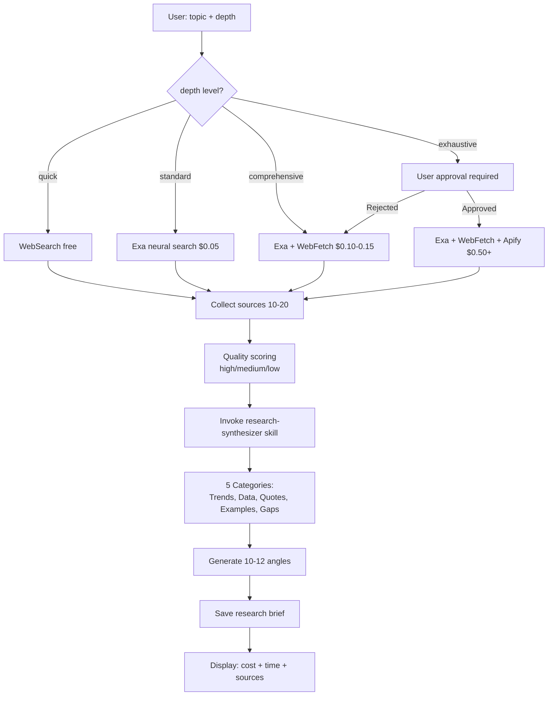
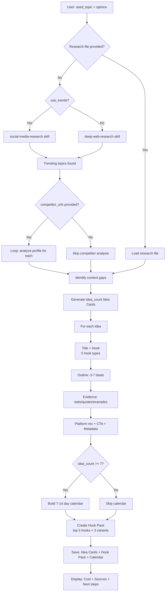

# Epic 1: Content Intelligence & Research Pipeline (JARVIS)

**Epic Goal:** Enable data-backed content research, profile analysis, competitive intelligence, and evidence-backed idea generation—transforming content strategy from guesswork to data-driven decision making with 2-5 minute research cycles instead of 30-60 minutes.

## Story 1.1: Deep Topic Research with Intelligent Tool Routing

**User Story:**
As a content creator,
I want to research any topic using intelligent tool selection (free WebSearch for quick, paid Exa for comprehensive),
so that I get high-quality research briefs with cited sources while optimizing costs.

**Acceptance Criteria:**

1. User invokes Jarvis `/jarvis` → selects `*research-topic` workflow
2. Workflow prompts for: topic, depth (quick/standard/comprehensive/exhaustive), focus_areas (optional)
3. **Step 1 (Intelligent Tool Routing):**
   - depth=quick → Uses WebSearch only (free, 10-20 results)
   - depth=standard → Uses Exa neural search ($0.05, 10 auto + 5 similar results)
   - depth=comprehensive → Uses Exa + WebFetch for detailed analysis ($0.10-0.15)
   - depth=exhaustive → Uses Exa + WebFetch + Apify scrapers ($0.50+, user approval required)
4. **Step 2 (Source Quality Scoring):**
   - Each source rated: high (academic/authoritative), medium (industry blogs), low (forums/social)
   - Sources include: URL, timestamp, reliability score, key quote
5. **Step 3 (Research Synthesis via research-synthesizer skill):**
   - Organizes findings into 5 categories: Trends, Data & Statistics, Expert Quotes, Examples & Case Studies, Content Gaps
   - Each finding linked to source for verification
6. **Step 4 (Content Angle Generation):**
   - Generates 10-12 specific content angles based on research
   - Each angle includes: hook, core argument, evidence backing, platform recommendation
7. Workflow saves research brief to: `outputs/{date}/{session}/research/{topic-slug}.md`
8. Research brief includes: Topic, depth used, tools called, cost breakdown, 5 finding categories, 10-12 angles, all sources cited
9. Cost tracking: depth=quick ($0), standard ($0.05), comprehensive ($0.10-0.15), exhaustive ($0.50+)
10. Execution time: quick (30-60s), standard (2-3 min), comprehensive (3-5 min), exhaustive (5-10 min)

**Mermaid Diagram:**

---

## Story 1.2: Social Media Profile Analysis

**User Story:**
As a content creator,
I want to analyze any social media profile (Instagram, TikTok, Twitter, LinkedIn, YouTube),
so that I understand their content patterns, top performers, hooks, and posting cadence to inform my strategy.

**Acceptance Criteria:**

1. User invokes Jarvis → `*analyze-profile` workflow
2. Workflow prompts for: profile_url, analysis_depth (quick 20 posts / deep 50-100 posts)
3. **Step 1 (Platform Detection & Scraper Selection):**
   - Instagram → Uses apify/instagram-reel-scraper
   - Twitter → Uses scraper_one/x-profile-posts-scraper ($0.02-0.04 for 100 tweets)
   - LinkedIn → Uses apimaestro/linkedin-profile-posts ($0.10-0.15 for 50 posts)
   - YouTube → Uses starvibe/youtube-transcripts ($0.05/video)
   - TikTok → Uses clockworks/tiktok-scraper
4. **Step 2 (Invoke profile-analysis skill):**
   - Skill extracts: posting frequency, content themes, engagement patterns, hooks used, proof styles
   - Generates: Top 5 performing posts with analysis (why they worked)
5. **Step 3 (Generate Profile Summary Report):**
   - Content Strategy: Main themes, posting cadence, content mix (educational/personal/promotional)
   - Hook Patterns: Question hooks, number hooks, story hooks, reveal hooks—with examples
   - Proof Style: Specificity ratio, personal experience %, data density
   - Timing Insights: Best performing days/times if data available
   - Top Performers: 5 posts with engagement metrics and success factor analysis
6. Workflow saves profile summary to: `outputs/{date}/{session}/research/profile-{username}.md`
7. Cost tracking: Instagram ~$0.05, Twitter ~$0.02-0.04, LinkedIn ~$0.10-0.15, YouTube ~$0.05/video
8. Execution time: 2-4 minutes depending on depth

---

## Story 1.3: Competitive Gap Analysis

**User Story:**
As a content creator,
I want to compare my profiles against 3-8 competitors,
so that I identify content gaps, differentiation opportunities, and strategic positioning.

**Acceptance Criteria:**

1. User invokes Jarvis → `*competitive-analysis` workflow
2. Workflow prompts for: your_profiles[] (1-2 URLs), competitor_profiles[] (max 8 URLs), platform
3. **Step 1 (Batch Profile Analysis):**
   - Invokes profile-analysis skill for each profile (your + competitors)
   - Runs in parallel where possible to minimize time
4. **Step 2 (Comparative Synthesis):**
   - Identifies: Content themes you cover vs gaps, Hook styles competitors use that you don't, Engagement patterns (what works for them)
   - Generates: Gap Analysis Matrix (themes × creators showing coverage)
5. **Step 3 (Strategic Recommendations):**
   - Suggests 5-7 specific content angles exploiting gaps
   - Each recommendation includes: Gap identified, Why it matters, Suggested approach, Evidence from competitor data
6. Workflow saves gap analysis to: `outputs/{date}/{session}/research/competitive-analysis-{date}.md`
7. Cost tracking: Number of profiles × per-profile cost (~$0.05-0.40 each = $0.40-3.60 total for 8 profiles)
8. Execution time: 5-10 minutes for 8 profiles

---

## Story 1.4: Evidence-Backed Idea Generation

**User Story:**
As a content creator,
I want to generate 5-10 content ideas backed by real research and trends,
so that every idea has evidence support and I'm not guessing what will resonate.

**Acceptance Criteria:**

1. User invokes Jarvis → `*generate-ideas` workflow
2. Workflow prompts for: seed_topic, target_platforms[], idea_count (5-10), use_trends (yes/no), use_research_file (optional), competitor_urls (optional)
3. **Step 1 (Gather Intelligence):**
   - If use_trends=yes → Invokes social-media-research skill to find trending topics related to seed_topic
   - If use_research_file provided → Loads existing research brief
   - If not provided → Invokes deep-web-research skill with depth=standard
   - If competitor_urls provided → Invokes analyze-profile workflow for each competitor
4. **Step 2 (Generate Idea Cards):**
   - For each idea (up to idea_count):
     - **Title & Hook** - 5 hook types (Question, Number, Story, Reveal, Pattern-breaking)
     - **Outline** - 3-7 beats showing content flow
     - **Evidence** - Specific stats, quotes, examples backing the idea
     - **Platform Recommendation** - Best fit platform(s) with rationale
     - **CTA Suggestions** - 2-3 call-to-action options
     - **Metadata** - Category, pillar, keywords, estimated effort
5. **Step 3 (Hook Pack Creation):**
   - Takes top 5 hooks from ideas
   - Generates 3 variants each (15 total hooks)
   - Formats for testing (A/B comparison)
6. **Step 4 (Optional: Content Calendar):**
   - If idea_count ≥ 7 → Generates 7-14 day content calendar
   - Maps ideas to posting schedule with platform distribution
7. Workflow saves to: `outputs/{date}/{session}/ideas/idea-cards-{topic}.md` + `hook-pack.md`
8. Each Idea Card includes evidence-tracker metadata (sources cited, claim strength, verification URLs)
9. Cost: Depends on intelligence gathering ($0 if research file provided, $0.05-0.50 if deep-web-research needed, $0.40-3.60 if competitive analysis)
10. Execution time: 3-7 minutes depending on intelligence steps

**Mermaid Diagram:**

---
