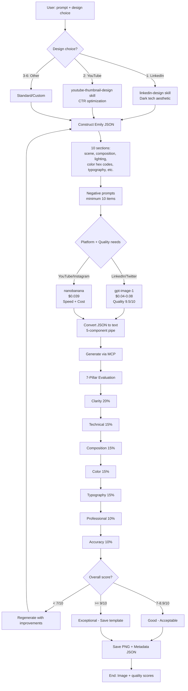
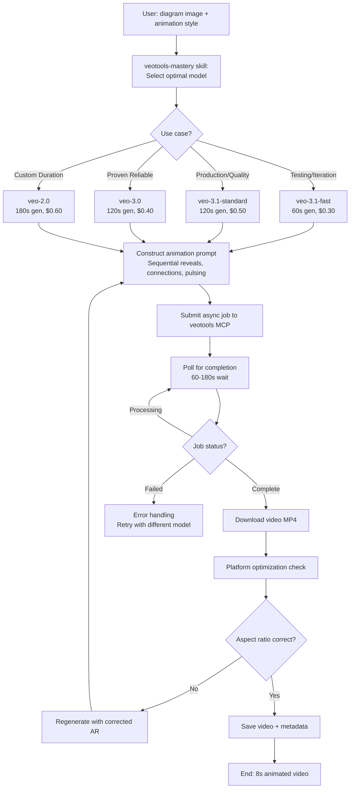

# Epic 3: Visual Content Production (ZOE - Merged Agent)

**Epic Goal:** Create professional images and videos using Emily JSON methodology for images (7-pillar quality ≥7/10 required) and Veo/HeyGen for videos, with intelligent tool selection optimizing for cost vs quality trade-offs.

## Story 3.1: Professional Image Generation with Emily JSON Methodology

**User Story:**
As a content creator,
I want to generate platform-optimized images (LinkedIn dark tech, YouTube CTR thumbnails, Instagram graphics) with quality validation,
so that I get publication-ready visuals in 30-60 seconds instead of 15-30 minutes in design tools.

**Acceptance Criteria:**

1. User invokes Zoe `/zoe` → selects `*create-single-image` workflow
2. Workflow prompts for: prompt_description, design_choice (1-6), aspect_ratio (auto-detected from design choice or manual)
3. **Design Choices Available:**
   - 1: LinkedIn Professional (dark monochrome tech aesthetic, 1200x627)
   - 2: YouTube Thumbnail (bold text CTR-optimized, 1280x720)
   - 3: Photorealistic Scene (natural lighting, detailed)
   - 4: Instagram Social (square 1080x1080, vibrant)
   - 5: Twitter Card (horizontal 1200x675, clean)
   - 6: Custom (user specifies full parameters)
4. **Step 1 (Design System Loading):**
   - Choice 1 → Invokes linkedin-design skill (loads dark tech palette, typography rules)
   - Choice 2 → Invokes youtube-thumbnail-design skill (loads MrBeast 6 pillars, Thomas Frank AIDA)
   - Choices 3-6 → Uses standard photorealistic or custom parameters
5. **Step 2 (Construct Emily JSON Prompt via create-image skill):**
   - **10+ JSON sections:**
     1. scene_description (detailed narrative)
     2. composition (rule of thirds, focal points, negative space)
     3. lighting (natural/studio/dramatic, direction, shadows)
     4. color_palette (hex codes: #1a1a1a, #00ffff for LinkedIn dark tech)
     5. typography (font style, size, placement, readability)
     6. camera_simulation (focal length, depth of field, angle)
     7. mood_atmosphere (professional/energetic/calm)
     8. technical_specs (resolution, aspect_ratio, format)
     9. style_references (minimalist/maximalist, photorealistic/illustrated)
     10. brand_consistency (design system adherence)
   - **Negative prompts library:** Minimum 10 items (no watermarks, no blurry text, no crowded composition, etc.)
6. **Step 3 (MCP Tool Selection via mcp-tool-selection logic):**
   - **gpt-image-1 (DALL-E 3)** selected when:
     - Platform = LinkedIn or Twitter (professional quality needed)
     - Text rendering critical (quality 9.5/10 for typography)
     - Cost: $0.04-0.08/image
   - **nanobanana (Gemini 2.5 Flash)** selected when:
     - Platform = YouTube, Instagram (social media volume)
     - Speed priority (generates in 10-15s vs 20-30s)
     - Cost: $0.039/image
7. **Step 4 (Convert JSON to Text Prompt):**
   - 5-component pipe structure: Scene | Composition | Lighting | Color | Technical
   - Example: "Modern tech workspace with laptop displaying code | Rule of thirds, laptop left third, negative space right | Soft natural window light from left | Dark palette #1a1a1a background, #00ffff accent | 1200x627, photorealistic, sharp focus"
8. **Step 5 (Generate Image via MCP):**
   - Calls selected tool with text prompt + negative prompts
   - Receives image PNG + metadata
9. **Step 6 (7-Pillar Quality Evaluation):**
   - **Pillar 1: Clarity** - Message understandable in <3 seconds? (weight: 20%)
   - **Pillar 2: Technical Quality** - Sharp focus, no artifacts, proper resolution? (weight: 15%)
   - **Pillar 3: Composition** - Good balance, effective use of space? (weight: 15%)
   - **Pillar 4: Color Harmony** - Matches hex codes, visually pleasing? (weight: 15%)
   - **Pillar 5: Typography** - Legible, proper hierarchy, readable? (weight: 15%)
   - **Pillar 6: Professionalism** - Enterprise-grade, publication-ready? (weight: 10%)
   - **Pillar 7: Prompt Accuracy** - All requested elements present? (weight: 10%)
   - Overall score calculated (weighted average)
10. **Step 7 (Quality Gate):**
    - Score <7/10 → Regenerate with improvements identified
    - Score 7-8.9/10 → Good quality, acceptable for publication
    - Score ≥9/10 → Exceptional, save as template for future reference
11. Workflow saves: Image PNG to `outputs/{date}/{session}/images/{design}-{topic}.png`
12. Metadata JSON includes: tool_used, cost, generation_time, design_choice, 7_pillar_scores, overall_score, prompt_json, negative_prompts
13. Workflow can iterate: if user requests changes, regenerate with refinements (multi-turn supported)
14. Cost: nanobanana $0.039, gpt-image-1 $0.04-0.08
15. Execution time: 30-60 seconds including quality evaluation

**Mermaid Diagram:**

---

## Story 3.2: Multi-Slide Carousel Generation

**User Story:**
As a content creator,
I want to generate 2-10 image carousels for LinkedIn or Instagram,
so that I create visual storytelling sequences without designing each slide individually.

**Acceptance Criteria:**

1. User invokes Zoe → `*create-carousel` workflow
2. Workflow prompts for: topic, slide_count (2-10), design_system (LinkedIn dark tech / Instagram vibrant / Custom), content_structure (numbered list / storytelling / comparison / tutorial)
3. **Step 1 (Content Planning):**
   - Breaks topic into slide_count logical beats
   - Example: "5 AI tools" → Slide 1: Hook/Intro, Slides 2-6: Each tool, Slide 7: Summary/CTA
4. **Step 2 (Design System Selection):**
   - LinkedIn → Invokes linkedin-design skill (dark monochrome, consistent typography, minimal)
   - Instagram → Uses vibrant colorful aesthetic, more dynamic
5. **Step 3 (Generate Each Slide via create-image skill):**
   - Loop slide_count times
   - Each slide: Consistent design system, progressive content, numbered if applicable
   - Tool selection: gpt-image-1 for LinkedIn (professional), nanobanana for Instagram (social)
6. **Step 4 (Consistency Validation):**
   - Checks: Same color palette across slides, consistent typography, visual hierarchy maintained, storytelling flow logical
   - Flags inconsistencies for regeneration
7. **Step 5 (Quality Evaluation per Slide):**
   - Each slide evaluated via 7-pillar framework
   - Minimum 7/10 per slide required
   - Overall carousel score = average of slide scores
8. Workflow saves: `outputs/{date}/{session}/images/carousel-{topic}/slide-{n}.png` for each slide
9. Summary JSON includes: slide_count, design_system, tool_used, cost_per_slide, total_cost, quality_scores[], storytelling_flow_assessment
10. Cost: slide_count × per-image cost (2-10 slides × $0.039-0.08 = $0.08-0.80 total)
11. Execution time: 1-3 minutes for 2-5 slides, 3-6 minutes for 6-10 slides

---

## Story 3.3: Image Editing and Refinement

**User Story:**
As a content creator,
I want to edit existing images (blur background, remove objects, enhance quality, style transfer),
so that I can refine generated or existing images without using separate design tools.

**Acceptance Criteria:**

1. User invokes Zoe → `*edit-image` workflow
2. Workflow prompts for: input_image_path, edit_prompt (description of desired changes)
3. **Step 1 (Load Input Image):**
   - Validates image exists and is valid format (PNG/JPG/WEBP)
   - Displays current image for reference
4. **Step 2 (Invoke edit-image skill):**
   - Uses nanobanana MCP in edit mode (pixel-perfect editing)
   - Supports operations: blur background, remove objects, color correction, style transfer, add/remove text, enhance quality
5. **Step 3 (Generate Edited Image):**
   - Preserves original dimensions and aspect ratio
   - Applies edits precisely per prompt
6. **Step 4 (Multi-Turn Refinement Support):**
   - User reviews edited image
   - Can provide additional edit prompts ("Now remove the watermark", "Enhance colors more")
   - Workflow loops, applying cumulative edits
7. **Step 5 (Quality Comparison):**
   - Compares original vs edited on 7-pillar framework
   - Ensures edits improve or maintain quality (no degradation)
8. Workflow saves: `outputs/{date}/{session}/images/edited-{original-name}-v{n}.png`
9. Metadata includes: original_image_path, edit_prompts[], iterations_count, quality_score_original vs quality_score_edited
10. Cost: $0.039 per edit iteration (can stack multiple edits)
11. Execution time: 20-40 seconds per iteration

---

## Story 3.4: Diagram Animation for Tutorial Videos

**User Story:**
As a technical content creator,
I want to animate static diagrams and workflows into 8-second videos,
so that I create engaging explainer content showing processes step-by-step.

**Acceptance Criteria:**

1. User invokes Zoe → `*animate-diagram` workflow (currently `generate-scene` with image-to-video)
2. Workflow prompts for: input_diagram_image, animation_style (sequential reveals / connection animations / pulsing highlights), aspect_ratio (16:9 YouTube / 9:16 Shorts)
3. **Step 1 (Invoke veotools-mastery skill for model selection):**
   - **veo-3.1-fast-generate-preview:** 60s generation, good for iteration/testing
   - **veo-3.1-generate-preview:** 120s generation, highest quality for production
   - **veo-3.0-generate-preview:** 120s generation, proven reliable fallback
   - **veo-2.0-generate-001:** 180s generation, custom duration/FPS control
4. **Step 2 (Construct Animation Prompt):**
   - Example: "Animate this architecture diagram. Start with all components faded. Sequentially reveal each component from left to right with a subtle fade-in effect. Then animate connection arrows lighting up in sequence showing data flow. End with gentle pulsing on the final component."
   - Includes: Animation sequence, timing cues, camera movement (if any), aspect ratio specification
5. **Step 3 (Generate via veotools MCP):**
   - Async job submission (returns job_id immediately)
   - Polls for completion (typical 60-180s depending on model)
   - Downloads video when complete
6. **Step 4 (Platform Optimization Check):**
   - Validates aspect ratio correct (16:9 or 9:16)
   - Checks duration (8s standard, custom if veo-2.0 used)
   - Verifies caption rendering if enabled
7. Workflow saves: `outputs/{date}/{session}/videos/animated-{diagram-name}.mp4`
8. Metadata includes: source_image, veo_model_used, generation_time, cost, aspect_ratio, animation_style
9. Video ready for: YouTube upload (via Zoro), Instagram/TikTok (if 9:16), or standalone use
10. Cost: $0.30-0.60 per 8-second video depending on Veo model
11. Execution time: 2-4 minutes (60-180s generation + 30s setup)

**Mermaid Diagram:**

---

## Story 3.5: YouTube Thumbnail Creation

**User Story:**
As a YouTube creator,
I want to generate CTR-optimized thumbnails using MrBeast/Thomas Frank psychology,
so that I maximize click-through rates without expensive design work.

**Acceptance Criteria:**

1. User invokes Zoe → `*create-youtube-thumbnail` workflow (currently part of generate-single with design_choice=2)
2. Workflow prompts for: video_topic, thumbnail_concept (from script's 3 suggestions or new), style (energetic/calm/professional)
3. **Step 1 (Invoke youtube-thumbnail-design skill for optimization):**
   - **MrBeast 6 Pillars:**
     1. Readable text (large font, high contrast, 6-8 words max)
     2. Expressive face (emotion visible, direct eye contact if human)
     3. High contrast (bright vs dark, pops in sidebar)
     4. Vibrant colors (saturated, not muted)
     5. Curiosity gap (incomplete information, "What happened next?")
     6. Pattern interruption (unexpected element, breaks scroll)
   - **Thomas Frank AIDA:**
     - Attention: Bold visual element (expressive face, surprising object)
     - Interest: Compelling text ("I Built This in 24 Hours")
     - Desire: Value proposition visible ("FREE Template Inside")
     - Action: Implied CTR (question, incomplete reveal)
4. **Step 2 (Construct Emily JSON with CTR Optimization):**
   - scene_description: Includes expressive human face or intriguing object
   - composition: Face/object in left or right third, text opposite side, negative space minimal
   - lighting: High contrast, dramatic if appropriate
   - color_palette: Vibrant saturated colors (#FF0000, #00FF00, #FFD700), avoid muted tones
   - typography: Sans-serif bold font, 72-96pt size, stroke outline for readability, 6-8 words max
   - mood_atmosphere: Energetic, curiosity-driven
5. **Step 3 (Generate via gpt-image-1):**
   - Uses DALL-E 3 for text rendering quality
   - 1280x720 resolution (YouTube standard)
6. **Step 4 (CTR Evaluation):**
   - Does it pass "3-second sidebar test"? (message clear when small)
   - Does it create curiosity gap? (viewer wants to know more)
   - Is text readable without squinting?
   - Does it pattern-interrupt? (stands out among generic thumbnails)
7. Workflow saves: `outputs/{date}/{session}/images/youtube-thumbnail-{topic}.png`
8. Metadata includes: 7_pillar_scores, ctr_evaluation (curiosity_score, readability_score, contrast_score), style_used
9. Cost: $0.04-0.08 (DALL-E 3 for quality)
10. Execution time: 40-60 seconds

---

## Story 3.6: Talking Head Video Generation

**User Story:**
As a content creator,
I want to generate talking head videos using HeyGen avatars,
so that I create presenter-style content without recording myself.

**Acceptance Criteria:**

1. User invokes Zoe → `*create-talking-head` workflow
2. Workflow prompts for: script_text, avatar_id, voice_id, aspect_ratio (16:9 / 9:16)
3. **Step 1 (Avatar Consent Verification):**
   - Checks if avatar_id is user's own avatar (consent granted)
   - Warns if using public avatar without rights
   - Requires explicit confirmation for avatar usage
4. **Step 2 (Voice Selection):**
   - Provides list of available HeyGen voices
   - User selects voice_id matching desired tone
5. **Step 3 (Generate via HeyGen MCP):**
   - Calls mcp__heygen__generate_avatar_video with: avatar_id, input_text (script), voice_id
   - Returns video_id for status checking
6. **Step 4 (Poll for Completion):**
   - HeyGen videos take 2-5 minutes to generate
   - Polls mcp__heygen__get_avatar_video_status every 30 seconds
   - Shows progress to user ("Generating... 45% complete")
7. **Step 5 (Download & Optimize):**
   - Downloads completed video
   - Validates aspect ratio matches request
   - Adds captions if enabled (default ON)
8. Workflow saves: `outputs/{date}/{session}/videos/talking-head-{topic}.mp4`
9. Metadata includes: avatar_id, voice_id, script_length, generation_time, cost, aspect_ratio
10. Cost: $0.20-0.50 per minute of video
11. Execution time: 3-6 minutes (2-5 min generation + 1 min setup)

---
